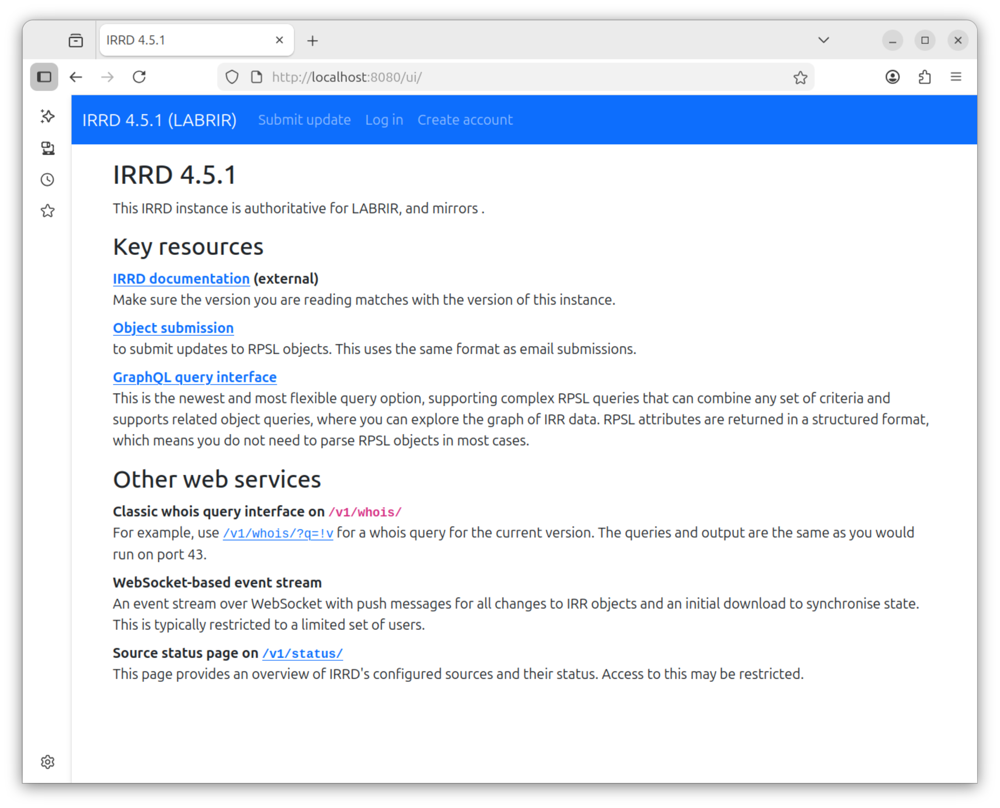

% Building IRRd and bgpq4 Docker Containers for Network Labs


To demonstrate basic BGP security practices in a network emulator in a way that emulates real-world conditions, researchers need to emulate an [Internet Routing Registry (IRR)](https://www.arin.net/resources/manage/irr/?utm_source=chatgpt.com#submitting-routing-information) database server running software like [IRRd](https://irrd.readthedocs.io) and a network management workstation running software utilities like [bgpq4](https://github.com/bgp/bgpq4). These tools enable the centralized registration of prefix information and the [generation of prefix filter lists](https://bgpfilterguide.nlnog.net/) from that information. I was not able to find ready-to-use container images that support either of these functions, so I created them.

In this post, I walk through the process of building reusable container images that can be dropped into any network emulator that supports Docker containers, such as [Containerlab](https://containerlab.dev/), [GNS3](https://www.gns3.com/), or [Kathará](https://www.kathara.org/), etc. I also show how I published the containers in a public repository. 

### IRRd and bgpq4

[IRRd (Internet Routing Registry daemon) version 4](https://irrd.readthedocs.io) is a widely used software program for maintaining and serving IRR data in the [RPSL format](https://www.ripe.net/manage-ips-and-asns/db/rpsl/). To experience IRRd, you can directly interact with the IRRd user interface at [ntt.net](https://rr.ntt.net/ui/), which is a tier-1 global IP backbone provider, and it also powers industry-standard registries like [RADB](https://www.radb.net/). 

[Bgpq4](https://github.com/bgp/bgpq4) is a command-line tool used by network engineers to query an IRR server and generate BGP prefix-list configurations for most router platforms.

#### Design decisions

The will build the IRRd container on top of a [lightweight Debian image](https://hub.docker.com/layers/library/debian/trixie-slim/) will bundle PostgreSQL, Redis, and IRRd in a single "all-in-one" image. This is not the recommended pattern for production, but we want the IRRd to appear to be one "node" in a network emulation lab. And, we want to make it available as a single image, with no Docker Compose file required.

I will also build the bgpq4 container on top of a lightweight Debian image that will include bgpq4 and common network utilities. This container will act as a network management workstation.

### Building the IRRd container image

The IRRd image requires four files: a Dockerfile, an entrypoint script, an IRRd configuration file, and a base RPSL data file. Create them, as described below, and place them all in a project directory (I used the drectory name *irrd-lab*).

```
$ mkdir irrd-lab
$ cd irrd-lab
```

#### The IRRd Dockerfile

The IRRd Dockerfile will build the Docker image that combines IRRd, PostgreSQL, and Redis into one container.

Create a Dockerfile named *Dockerfile.irrd*:

```
$ vi Dockerfile.irrd
```

Copy and paste the following text into the file:

```dockerfile
# All-in-one IRRd lab container

FROM python:3.14-slim-trixie

ENV DEBIAN_FRONTEND=noninteractive 

# Install PostgreSQL, Redis, and build dependencies for IRRd
RUN apt-get update && apt-get install -y --no-install-recommends \
        postgresql \
        redis-server \
        gnupg \
        iproute2 \
        net-tools \
        netcat-openbsd \
        procps \
        curl \
        gcc \
        libpq-dev \
        python3-dev \
        rustc \
        cargo \
        apache2-utils \
    && pip install --no-cache-dir irrd \
    && apt-get purge -y gcc python3-dev rustc cargo \
    && apt-get autoremove -y \
    && rm -rf /var/lib/apt/lists/*

# Create directories for IRRd
RUN mkdir -p /var/log/irrd /var/run/irrd /etc/irrd /var/lib/irrd/gnupg \
    && chmod 700 /var/lib/irrd/gnupg

# Make PostgreSQL binaries available on PATH
ENV PATH="/usr/lib/postgresql/17/bin:${PATH}"

# Copy configuration and entrypoint
COPY irrd.yaml /etc/irrd.yaml
RUN mkdir -p /etc/irrd/data
COPY lab-irr-base.rpsl /etc/irrd/data/lab-irr-base.rpsl
RUN ln -sf /etc/irrd/data/lab-irr-base.rpsl /etc/irrd/lab-irr-base.rpsl
COPY entrypoint.sh /entrypoint.sh
RUN chmod +x /entrypoint.sh

# (Optional) Bind-mount host directory with RPSL files to /etc/irrd/data
# VOLUME ["/etc/irrd/data"]

EXPOSE 43
EXPOSE 8080

HEALTHCHECK --interval=30s --timeout=5s --start-period=45s --retries=3 \
    CMD sh -ec "pg_isready -q && redis-cli ping | grep -q PONG && nc -z 127.0.0.1 43"

ENTRYPOINT ["/entrypoint.sh"]
```

Save the file.

The Dockerfile, above, starts from `python:3.14-slim-trixie`. The [IRRd deployment documentation](https://irrd.readthedocs.io/en/stable/admins/deployment/) states that IRRd requires PostgreSQL and Redis so the Dockerfile installs PostgreSQL and Redis from Debian packages, then installs IRRd from PyPI. It also installs some helpful utilities. The Dockerfile then temporarily installs build dependencies _gcc_ and _rustc_, and removes them after the IRRd build is completed to keep the image smaller.

The Dockerfile then creates directories for IRRd and adds the PostgreSQL application to the system path. It also copies the configuration files and startup script into the container. 

The Dockerfile also includes a _HEALTHCHECK_ instruction. Docker will periodically run it and flag the container unhealthy if it fails.

Every time the container starts, it initializes a new database and loads the base RPSL data so no persistent volumes are needed.

#### The entrypoint script

The entrypoint script is the startup script for the container. It starts each service in order, waits for dependencies, then runs IRRd in the foreground.

Because the database and Redis live in the same container, the script also bootstraps the `irrd` database, loads the base RPSL data and creates a Web UI admin account. Waiting for each dependency avoids race conditions during startup.

Create the *entrypoint.sh* script:

```
$ vi entrypoint.sh
```

Copy and paste the following text into the file:

```bash
#!/bin/bash
set -e

echo "=== IRRd Lab Container Starting ==="

if [ ! -x "/usr/lib/postgresql/17/bin/initdb" ]; then
    echo "ERROR: expected PostgreSQL binaries at /usr/lib/postgresql/17/bin, but initdb was not found or is not executable."
    exit 127
fi
mkdir -p /var/log/irrd
chown postgres:postgres /var/log/irrd

# ------------------------------------------------------------------
# Start PostgreSQL
# ------------------------------------------------------------------
echo "Starting PostgreSQL..."

# Initialize the database cluster if it doesn't exist yet
if [ ! -f "/var/lib/postgresql/data/PG_VERSION" ]; then
    install -d -o postgres -g postgres -m 0700 "/var/lib/postgresql/data"
    su - postgres -c "/usr/lib/postgresql/17/bin/initdb -D /var/lib/postgresql/data"
fi

# Tune PostgreSQL for minimal lab use
cat >> "/var/lib/postgresql/data/postgresql.conf" <<EOF
random_page_cost = 1.0
work_mem = 50MB
max_connections = 30
listen_addresses = 'localhost'
EOF

# Allow local connections without a password
cat > "/var/lib/postgresql/data/pg_hba.conf" <<EOF
local   all   all                 trust
host    all   all   127.0.0.1/32  trust
host    all   all   ::1/128       trust
EOF

su - postgres -c "/usr/lib/postgresql/17/bin/pg_ctl -D /var/lib/postgresql/data -l /var/log/irrd/postgresql.log start"

# Wait for PostgreSQL to be ready
echo "Waiting for PostgreSQL to accept connections..."
for i in $(seq 1 30); do
    if su - postgres -c "/usr/lib/postgresql/17/bin/pg_isready -q" 2>/dev/null; then
        break
    fi
    sleep 1
done

# Create the IRRd database and pgcrypto extension
echo "Creating IRRd database..."
su - postgres -c "/usr/lib/postgresql/17/bin/psql -tc \"SELECT 1 FROM pg_database WHERE datname='irrd'\" | grep -q 1" || \
    su - postgres -c "/usr/lib/postgresql/17/bin/createdb irrd"
su - postgres -c "/usr/lib/postgresql/17/bin/psql -d irrd -c 'CREATE EXTENSION IF NOT EXISTS pgcrypto;'"

# ------------------------------------------------------------------
# Start Redis (no persistence, low memory)
# ------------------------------------------------------------------
echo "Starting Redis..."
redis-server \
    --daemonize yes \
    --save "" \
    --appendonly no \
    --maxmemory 64mb \
    --logfile /var/log/irrd/redis.log

# Wait for Redis to be ready
for i in $(seq 1 15); do
    if redis-cli ping 2>/dev/null | grep -q PONG; then
        break
    fi
    sleep 1
done

# ------------------------------------------------------------------
# Build IRRd database tables
# ------------------------------------------------------------------
echo "Building IRRd database tables..."
irrd_database_upgrade --config /etc/irrd.yaml

# Load base RPSL data
irrd_load_database --config /etc/irrd.yaml --source LABRIR /etc/irrd/lab-irr-base.rpsl
echo "RPSL data loaded."


# ------------------------------------------------------------------
# Bootstrap a hard-coded Web UI admin user (because no e-mail available)
# ------------------------------------------------------------------
echo "Creating IRRd Web UI admin user: test@irrtest.com"
WEBUI_PASSWORD_HASH="$(htpasswd -bnBC 12 "" "mypassword" | tr -d ':\n')"

su - postgres -c "/usr/lib/postgresql/17/bin/psql -d irrd -v ON_ERROR_STOP=1 <<'SQL'
INSERT INTO auth_user (email, name, password, active, override)
VALUES ('test@irrtest.com', 'Lab Administrator', '$WEBUI_PASSWORD_HASH', true, true)
ON CONFLICT (email)
DO UPDATE SET
    name = EXCLUDED.name,
    password = EXCLUDED.password,
    active = EXCLUDED.active,
    override = EXCLUDED.override,
    updated = now();
SQL"

echo "Web UI user created/updated: test@irrtest.com (override=true)"

# ------------------------------------------------------------------
# Start IRRd in the foreground
# ------------------------------------------------------------------
echo "Starting IRRd..."
echo "=== IRRd Lab Container Ready ==="
exec irrd --config /etc/irrd.yaml --foreground
```

Save the file. 

As you can see from the entrypoint.sh file, the server startup sequence is: PostgreSQL → Redis → Schema creation → RPSL data load → Web user creation → Run IRRd in foreground. The code comments explain each step.

> **Note:** The [IRRd deployment docs](https://irrd.readthedocs.io/en/stable/admins/deployment/#postgresql-configuration) recommend creating a dedicated _irrd_ database role with a password and explicit grants. But, to keep things simple in this lab container, the entrypoint script connects to the database as the _postgres_ superuser without authentication. This is OK in a lab because our PostgreSQL database is local and disposable.

#### The IRRd configuration file

See the [full IRRd configuration reference](https://irrd.readthedocs.io/en/stable/admins/configuration/) for all IRRd configuration options. A lab instance needs very few features so our IRRd file is very simple. The _irrd.taml_ file below covers the basic database/Redis URLs, server listeners, authentication overrides and source definitions that are relevant to our simple setup.

Create the *irrd.yaml* file:

```
$ vi irrd.yaml
```

Copy and paste the following text to the *irrd.yaml* file:

```yaml
irrd:
    database_url: 'postgresql://postgres@localhost/irrd'
    redis_url: 'redis://localhost'
    piddir: /var/run/irrd/
    user: postgres
    group: postgres

    server:
        http:
            interface: '0.0.0.0'
            port: 8080
            url: 'http://localhost:8080/'
            workers: 1
        whois:
            interface: '0.0.0.0'
            port: 43
            max_connections: 5

    auth:
        gnupg_keyring: /var/lib/irrd/gnupg/
        override_password: '$1$test$4PzmqjLUwdD2j1Otz/LSw.' # password: mypassword
        set_creation:
            COMMON:
                prefix_required: false
                autnum_authentication: disabled

    email:
        from: 'test@irrtest.com'
        footer: ''
        smtp: 'localhost'

    log:
        level: INFO

    rpki:
        roa_source: null
    
    compatibility:
        inetnum_search_disabled: true

    sources_default:
        - LABRIR

    sources:
        LABRIR:
            authoritative: true
            keep_journal: true
            authoritative_non_strict_mode_dangerous: true
```

Then, save the file.

The key IRRd settings are:

- Both `server.http.interface` and `server.whois.interface` bind to `0.0.0.0` so other lab nodes can reach the IRR server.
- `server.whois.max_connections: 5` and `server.http.workers: 1`, to keep memory usage low (each WHOIS connection uses ~200 MB).
- `rpki.roa_source: null` disables RPKI integration. We don't need it in this filtering lab, and I will cover RPKI in a future post.
- `sources.LABRIR` is configured as authoritative with `authoritative_non_strict_mode_dangerous: true` to relax RPSL validation for lab objects.
- `auth.override_password` is the MD5 hash of "mypassword", used for bypassing authentication when loading data.

#### The base RPSL data file

IRRd needs at least a _mntner_ (maintainer) object to function as an authoritative source. This file seeds the IRRd database with a maintainer and an administrative contact.

Create the *lab-irr-base.rpsl* file:

```
$ vi lab-irr-base.rpsl
```

Then, copy and paste the following text into the file:

```
mntner:         LAB-MNT
descr:          Lab maintainer for all objects; password is "mypassword"
admin-c:        LAB-ADMIN
upd-to:         test@irrtest.com
auth:           MD5-PW $1$test$4PzmqjLUwdD2j1Otz/LSw.
mnt-by:         LAB-MNT
source:         LABRIR

person:         Lab Administrator
address:        Lab Network
phone:          +1-555-0100
nic-hdl:        LAB-ADMIN
mnt-by:         LAB-MNT
source:         LABRIR

```

Ensure that there us a blank line at the end of the file. RPSL requires that every object end with a blank line, including the last object in the file.

Save the file.

In the file above, the objects use *LAB-MNT* as their maintainer with the MD5 hash of "mypassword", matching the override password in *irrd.yaml*. The *source: LABRIR* value must exactly match the source name in the IRRd configuration. When you use the container in a lab, you will load additional route, aut-num, and as-set objects describing your lab's routing policy.

#### Building the IRRd image

Build the Docker image:

```
$ docker build -t irrd-lab -f Dockerfile.irrd .
```

This may take several minutes because it compiles some of its dependencies.

#### Checking container health

After building it, test the container by checking its health. First, run the new image in a container tagged _irrd-test_:

```
$ docker run -d -p 8080:8080 --name irrd-test irrd-lab:latest
```

Run the command below to see the _healthcheck_ status, which verifies PostgreSQL, Redis, and IRRd's WHOIS listener are all running. If you used the same docker build command, above, the container name will be _irrd-test_:

```
$ docker inspect --format '{{json .State.Health}}' irrd-test
```

A brief `starting` state or a few failed probes during initialization is normal. Eventually, you should see output similar to teh folloing:

```
{"Status":"healthy","FailingStreak":0,"Log":[{"Start":"2026-03-22T10:40:52.405173463-04:00","End":"2026-03-22T10:40:52.460239963-04:00","ExitCode":1,"Output":""},{"Start":"2026-03-22T10:40:57.461480257-04:00","End":"2026-03-22T10:40:57.51754926-04:00","ExitCode":0,"Output":"Connection to 127.0.0.1 43 port [tcp/whois] succeeded!\n"},{"Start":"2026-03-22T10:41:27.518192933-04:00","End":"2026-03-22T10:41:27.617904019-04:00","ExitCode":0,"Output":"Connection to 127.0.0.1 43 port [tcp/whois] succeeded!\n"}]}
```

#### Test the IRRd server

To check that the IRRd server is running, access the server's web UI in a web browser. Go to `https://localhost:8080`. You should see the IRRd page as shown below:



Try to login with userid: `test@irrtest.com` and password `mypassword`. If the login works, then the server is running properly.

#### Destroy the IRRd container

Later, we will test the IRRd container in a small network with the bgpq4 container. So, we need to stop and destroy the current container.

```
$ docker destroy irrd-test
$ docker rm irrd-test
```


### Build the _bgpq4_ utility container image

The _bgpq4_ utility container image is a lightweight Debian image that provides bgpq4 and common network tools. 

Create *Dockerfile.bgpq4*:

```
$ vi Dockerfile.bgpq4
```

Copy and paste the following text into the file:


```dockerfile
# Linux container with bgpq4 and other utilities

FROM debian:trixie-slim

RUN apt-get update && \
    apt-get install -y --no-install-recommends \
        bgpq4 \
        curl \
        iproute2 \
        traceroute \
        net-tools \
        netbase \
        netcat-openbsd \
        iputils-ping \
        whois \
    && rm -rf /var/lib/apt/lists/*

CMD ["sleep", "infinity"]
```

Save the file.

The bgpq4 Dockerfile uses the `sleep infinity` command so the bgpq4 container stays running in a lab topology, just like a real network management workstation would.

Build the image:

```bash
$ cd irrd-lab
$ docker build -t bgpq4-utils -f Dockerfile.bgpq4 .
```

To test it properly, the bgpq4 container needs to be in a network and must be able to reach an IRRd server. We'll set that up in the following section.

### Testing the containers together

Verify the containers work together using plain Docker (no network emulator required).

#### Start the containers

Create a Docker network and start both containers:

```bash
$ docker network create irr-test-net
$ docker run -d -p 8080:8080 --name irrd-test --network irr-test-net irrd-lab
$ docker run -d --name bgpq4-test --network irr-test-net bgpq4-utils
```

Wait for the IRRd container to finish initializing (15–30 seconds). Then, verify it is healthy:

```bash
$ docker inspect --format '{{json .State.Health}}' irrd-test
```

#### Verify the WHOIS service

Query the IRRd server from the bgpq4 container:

```bash
$ docker exec bgpq4-test sh -c 'echo "-i origin AS100" | nc irrd-test 43'
```

This query returns no results because only the base RPSL data is loaded (no route objects) — the important thing is that the connection succeeds. Verify the maintainer object is present:

```bash
$ docker exec bgpq4-test sh -c 'echo "LAB-MNT" | nc irrd-test 43'
```

This should return the `LAB-MNT` maintainer object like the following output:

```
mntner:         LAB-MNT
descr:          Lab maintainer for all objects; password is "mypassword"
admin-c:        LAB-ADMIN
upd-to:         test@irrtest.com
auth:           MD5-PW DummyValue  # Filtered for security
mnt-by:         LAB-MNT
source:         LABRIR
last-modified:  2026-03-22T15:18:21Z
```

This shows that the IRRd container and the bgpq4 container can interoperate over a Docker network (a Linux bridge). I will show how these containers may be used in more complex networks in a future post.

#### Clean up the test

```bash
$ docker stop irrd-test bgpq4-test
$ docker rm irrd-test bgpq4-test
$ docker network rm irr-test-net
```

### Publishing the images

Publish the images we created to a container registry so they will be easy to access and use. I show the procedure for [Docker Hub](https://hub.docker.com/) below; the process is similar for [GitHub Container Registry](https://ghcr.io/).

#### Tag and push to Docker Hub

Tag the images with a specific version.

Replace `yourusername` with your Docker Hub account name:

```bash
$ docker tag irrd-lab yourusername/irrd-lab:0.1
$ docker tag bgpq4-utils yourusername/bgpq4-utils:0.1
```

Push the tagged versions to Docker Hub:

```bash
$ docker login
$ docker push yourusername/irrd-lab:0.1
$ docker push yourusername/bgpq4-utils:0.1
```

Now, anyone can use these images in a network emulation lab by pulling them from Docker Hub.

### Conclusion

I built two Docker container images for network labs: an all-in-one IRRd server (WHOIS on port 43, web UI on port 8080) and a lightweight bgpq4 utility container. Both are self-contained and disposable, and are compatible with any Docker-capable network emulator. In a future post, I will use them to demonstrate a complete BGP prefix filtering lab.


