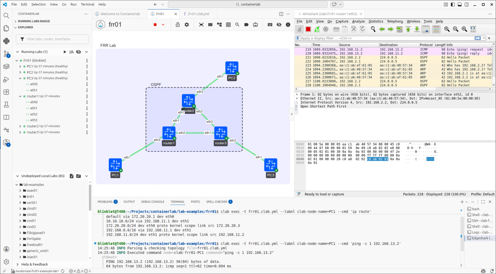
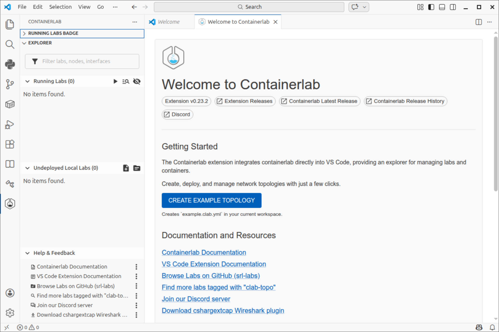
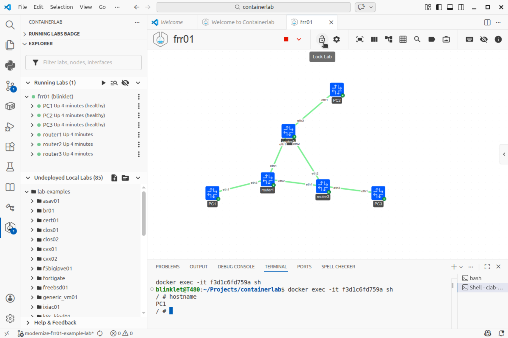
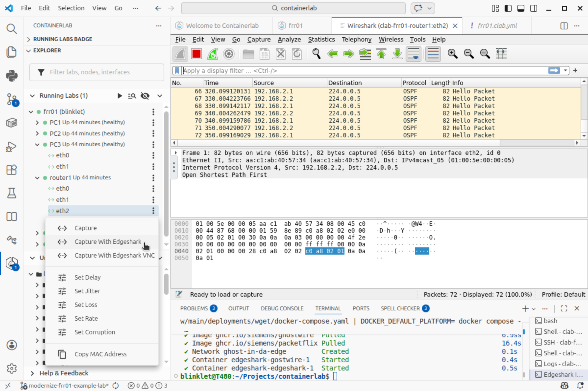
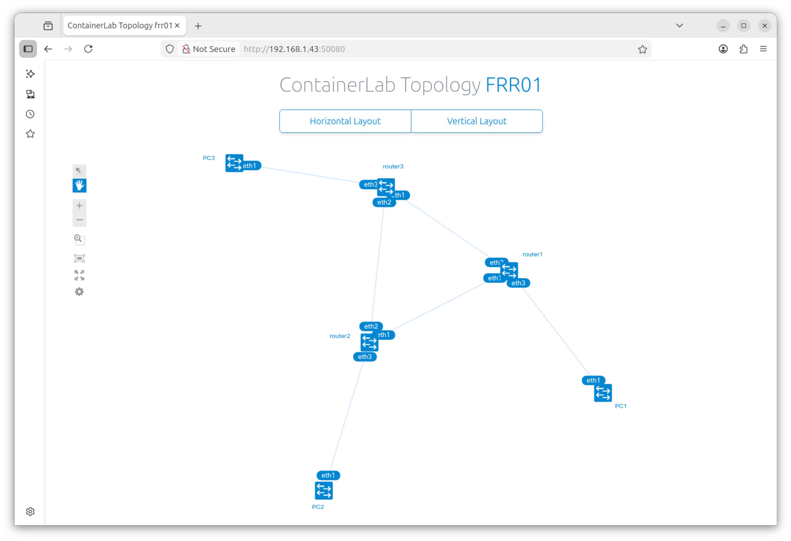
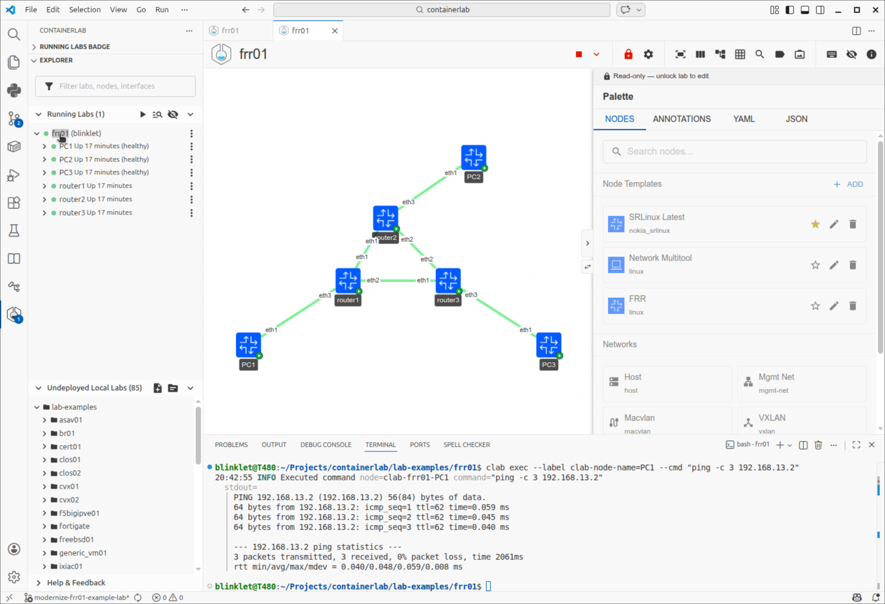
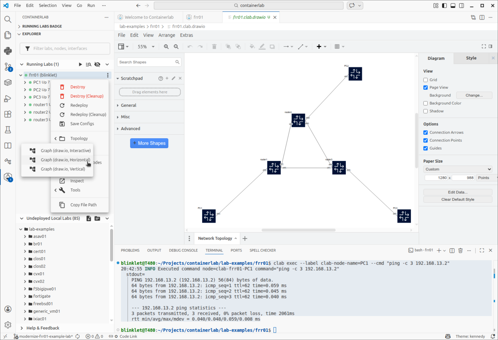

## Containerlab in 2026: What's Changed Since 2021

I first [reviewed Containerlab in 2021](https://www.brianlinkletter.com/2021/05/use-containerlab-to-emulate-open-source-routers/) when it was a promising but relatively new container-based network emulator. Five years later, [Containerlab](https://containerlab.dev) has matured into a polished, developer-friendly platform with a rich ecosystem of tools around it. In this post, I will revisit Containerlab and cover what has changed since my original review.



Back in 2021, Containerlab was a command-line tool that required `sudo` for every operation. It required the user to create shell scripts to configure nodes at startup. It's `graph` command provided only basic visualization of lab topologies. Users also needed to be very familiar with Docker commands and Linux networking commands to get the most out of the tool. 

Today, Containerlab offers rootless operation, declarative node configuration, a full-featured VSCode extension with a graphical topology editor, multiple graph export formats, integrated packet capture, and a thriving community lab catalog. This post will walk through the most significant improvements and show you how the Containerlab experience has changed over the past five years.

<!--more-->

### What is Containerlab?

[Containerlab](https://containerlab.dev) is an open-source, container-based network emulation platform that lets you build, run, and tear down realistic network topologies using simple, declarative YAML files. It uses lightweight containers and Linux networking to interconnect routers, switches, hosts, and tools into reproducible labs that behave like real networks. It also supports virtual machines, so it can run many commercial router images.

Containerlab integrates cleanly with automation tools such as Ansible, Nornir, and CI/CD pipelines, and emphasizes "lab-as-code" workflows. It is well suited for network automation development, validating designs and configuration changes, and learning about complex scenarios like BGP, EVPN, or data-center fabrics on a single workstation or server.

The project was originally developed by [Nokia](https://www.nokia.com/) engineers and is hosted on [GitHub](https://github.com/srl-labs/containerlab). It has grown into one of the most widely-used open-source network lab platforms, with an active community on [Discord](https://discord.gg/vAyddtaEV9) and a [dedicated documentation site](https://containerlab.dev).

### What's Changed Since 2021

Here are the most important changes to Containerlab over the past five years that will affect your day-to-day experience. 

#### MacOS and Windows Support

Containerlab now officially supports [macOS](https://containerlab.dev/macos/) (both ARM and Intel) and [Windows via WSL2](https://containerlab.dev/windows/). In 2021, the tool was Linux-only. While Linux remains the primary platform, the ability to run labs on a Mac or Windows machine broadens Containerlab's reach to more users.

#### Sudo-less Operation

In 2021, every Containerlab command required `sudo`. 

Containerlab now supports [sudo-less operation](https://containerlab.dev/rn/0.63/#sudo-less-containerlab). The installer sets up a `clab_admins` Unix group and the installed provides instructions to add your username to the group. Users in this group can run all Containerlab commands without `sudo`.

#### Declarative Node Configuration with _exec:_

In my 2021 review, configuring lab nodes required either logging into each container and manually running commands after deployment or writing shell scripts to run configuration commands. For example, to assign an IP address to a PC, I had to run the following commands in the CLI or in a shell script.

```
$ sudo docker exec -it clab-frrlab-PC1 /bin/ash
# ip link set eth1 up
# ip addr add 192.168.11.2/24 dev eth1
# ip route add 192.168.0.0/16 via 192.168.11.1 dev eth1
# exit
$
```

Containerlab [now supports an `exec:` key](https://containerlab.dev/rn/0.43/#execute-on-host) in the topology file that runs commands inside each container at startup. This means you can configure IP addresses, routes, and other settings declaratively, without separate scripts.

```yaml
topology:
  nodes:
    PC1:
      kind: linux
      image: wbitt/network-multitool:3.22.2
      exec:
        - ip link set eth1 up
        - ip addr add 192.168.11.2/24 dev eth1
        - ip route add 192.168.0.0/16 via 192.168.11.1 dev eth1
```

This improves the "lab-as-code" workflow because the entire lab state, such as topology, wiring, and node configuration, lives in a single YAML file (plus any router configuration files you bind-mount).

#### Imperative Node Configuration with `exec` CLI command

The [_clab exec_ CLI command](https://containerlab.dev/cmd/exec/) allows a user to execute a command inside one or more nodes in a lab emulation scenario. In 2021, users had to use the _docker exec_ CLI command to run commands in lab nodes, and they still can if they want to.

The _clab exec_ command is similar to _docker exec_, but it allows a user to run the same command across multiple lab nodes in the lab topology. Users can use command flags to specify the nodes upon which to execute the command, so it's useful for running the same command on a group of nodes.

#### Bridge Node Type

Containerlab [added the `kind: bridge` node type](https://containerlab.dev/rn/0.43/#execute-on-host), which creates a Linux bridge that acts as a shared Ethernet segment. This is useful for simulating scenarios like Internet Exchange Points (IXPs) where multiple routers peer over a common LAN.

In 2021, creating a shared segment required the user to configure external Linux bridges. Now, it is a first-class feature.

#### Integrated Link Impairment Commands

In 2021, users who wanted to cause impairments on network links had to use Linux IP networking commands. Today, Containerlab offers integrated CLI commands that enable users to emulate [network link impairments](https://containerlab.dev/manual/impairments/).

The new `clab tool netem` CLI command enables users to set link speed, corruption, delay, jitter, and loss.

#### Lab Examples Shipped with the Install

When you install Containerlab, it copies a set of ready-made lab examples to */etc/containerlab/lab-examples/*. More example labs available today, compared to 2021. These labs cover a variety of topologies and vendor combinations, from simple FRR labs to multi-vendor data center fabrics. 

The lab examples make it easy to explore different network scenarios and often serve as a good starting point for writing your own topology files.

#### Expanded Device Support

The list of [supported network operating systems](https://containerlab.dev/manual/kinds/) has grown significantly since 2021. Containerlab now has first-class `kind:` support for dozens of platforms, including:

- **Nokia**: SR Linux, SR OS (SR-SIM and vSIM)
- **Arista**: cEOS, vEOS
- **Cisco**: XRd, XRv9k, XRv, CSR1000v, Nexus 9000v, 8000, c8000v, IOL, VIOS, ASAv, FTDv, SD-WAN, Catalyst 9000v
- **Juniper**: cRPD, vMX, vQFX, vSRX, vJunos, cJunos
- **Others**: Cumulus VX, SONiC, MikroTik RouterOS, VyOS, OpenWRT, Ostinato, and more

When a device has first-class `kind:` support, Containerlab handles vendor-specific startup requirements (interface naming, management network setup, license handling, etc.) automatically. This is a big improvement over the generic `kind: linux` approach, which requires users to handle those details themselves.

##### Open-Source Router Support

For open-source routers, Containerlab still operates the same way it did in 2021, so users of open-source routing software like [FRR](https://frrouting.org/) still have to manage some setup commands, themselves. It still provides the `kind: linux` node type, which enables users to run open-source routing stacks like FRR, [BIRD](https://bird.network.cz/), [GoBGP](https://osrg.github.io/gobgp/), and [OpenBGPD](https://www.openbgpd.org/) in any Linux container. 

The good news is that the new `exec:` command in the topology file, makes it easier to set up and configure open-source routers based on Linux containers.

#### The _clab graph_ CLI Command

The `clab graph` CLI command has been improved and now supports multiple output formats: HTML, draw.io, Mermaid, Graphviz.

#### The Containerlab VSCode Extension

The most visible addition to the Containerlab ecosystem is the [VSCode extension](https://containerlab.dev/manual/vsc-extension/), which transforms VSCode into a full-featured Containerlab IDE. This extension was developed by the Containerlab community to complement Containerlab's CLI workflow with a graphical interface.



The extension adds a Containerlab icon to the VSCode activity bar. Clicking it opens an explorer panel with three sections:

- *Running labs*: Shows all deployed labs on the system. You can expand each lab to see its containers, and expand containers to see their interfaces — including IP addresses, MAC addresses, and MTU values.
- *Undeployed local labs*: Discovers all `*.clab.yml` files in your workspace so you can deploy them with a click.
- *Help & Feedback*: Quick links to documentation and community resources.

##### Graphical Topology Editor

The standout feature of the Containerlab VSCode extension is a graphical topology creator and viewer built directly into VSCode. The graphical viewer lets you create topologies visually. The lab topology file updates in real-time as you make changes. Creating a split-screen view of the graphical editor alongside the YAML file is a powerful way to design topologies.

When a lab is running, it displays the live topology with deployed node status. You can right-click on nodes to SSH into them, open a container shell, or view container logs, all without leaving VSCode.



##### Deploy, Destroy, and Manage Labs from VSCode

The extension provides multiple ways to manage lab lifecycle without opening a terminal. 
- *Deploy/Destroy buttons*: When a `.clab.yml` file is open, deploy and graph buttons appear in the editor title bar.
- *Command palette*: Press `Ctrl+Shift+P` and search for Containerlab commands (deploy, redeploy, destroy, graph)
- *Context menus*: Right-click on a lab nodes in the tree view in the side panel to access all operations

##### Integrated Packet Capture

In 2021, capturing packets required a multi-step process involving `ip netns exec`, `tcpdump`, and piping to Wireshark:

The VSCode extension now provides integrated packet capture. Wireshark runs in a container and streams its GUI directly into a VSCode tab via VNC. No local Wireshark installation is needed. You can start a capture by right-clicking any interface in the tree view and selecting "Start capture." Capture files can be saved to disk from within the Wireshark session.

##### Draw.io Integration

The extension can generate [draw.io](https://draw.io/) diagrams from your topology. The diagram opens inside a Draw.io editor in VSCode where you can further edit it and save it as a file. This is useful for documentation and presentations.

##### Installing the Extension

To install the extension, open the Extensions tab in VSCode and search for "Containerlab", or visit the [Visual Studio Marketplace](https://marketplace.visualstudio.com/items?itemName=srl-labs.vscode-containerlab). The extension is free and open-source.

#### Other Ecosystem Improvements

Beyond the VSCode extension and improved graph command, several other additions have improved the Containerlab experience.

##### Community Lab Catalog

The Containerlab community maintains a catalog of ready-made lab topologies at [clabs.netdevops.me](https://clabs.netdevops.me/). These community-contributed labs cover a wide range of scenarios — from basic routing protocols to complex multi-vendor data center fabrics. You can deploy many of these labs directly from the catalog, which makes it easy to explore unfamiliar technologies without building a topology from scratch.

##### Edgeshark Integration

[Edgeshark](https://edgeshark.siemens.io/) is a container networking visualization and diagnostic tool that Containerlab integrates with for packet capture. The Containerlab VSCode extension uses Edgeshark's capture backend for both its integrated Wireshark VNC mode and the local Wireshark mode.



##### Clabernetes: Containerlab on Kubernetes

[Clabernetes](https://containerlab.dev/manual/clabernetes/) is a newer project that lets you run Containerlab topologies on Kubernetes clusters. This enables scaling labs across multiple nodes in a cluster and running labs in cloud environments. While this is beyond what most individual users need, it shows how far the Containerlab ecosystem has grown.

##### Link Impairments

Containerlab can now simulate [network impairments](https://containerlab.dev/manual/impairments/) (delay, jitter, packet loss, corruption) on links between nodes. This is useful for testing how applications and protocols behave under degraded network conditions.


### Install Containerlab

The Containerlab project offers [multiple install methods](https://containerlab.dev/install/). The two most common approaches are the package repository and the quick-install script.

#### Prerequisites

To install and run Containerlab, you need a Linux host — this can be bare metal, a virtual machine, or Windows Subsystem for Linux (WSL2). Ensure you have at least 4 cores or vCPUs and 8 GB of RAM. The exact resources you need depend on the lab you intend to run; small labs with a few FRR containers will run fine with less, but commercial router images can be more demanding.

Containerlab's main dependency is [Docker](https://docs.docker.com/engine/install/). Install Docker and verify it is running before you proceed:

```
$ sudo systemctl is-active docker
```

You should see the following output:

```
active
```

If Docker is not installed, refer to the [Docker installation guide](https://docs.docker.com/engine/install/) for your distribution.

After installing Docker, add your user to the *docker* group so you can run Docker commands without `sudo`:

```
$ sudo usermod -aG docker $USER
$ newgrp docker
```

##### Install Containerlab

The Containerlab project offers [multiple install methods](https://containerlab.dev/install/). I chose to install it from a package:

```
$ echo "deb [trusted=yes] https://netdevops.fury.site/apt/ /" | \
  sudo tee -a /etc/apt/sources.list.d/netdevops.list
$ sudo apt update
$ sudo apt install containerlab
```

After the installer finishes, add your username to the _clab\_admins_ group.

```
$ sudo usermod -aG clab_admins $USER
$ newgrp clab_admins
```

Restart your computer. Then, check the version to ensure the binary is on your path:

```
$ clab version
```

You should see the following output:

```
  ____ ___  _   _ _____  _    ___ _   _ _____ ____  _       _     
 / ___/ _ \| \ | |_   _|/ \  |_ _| \ | | ____|  _ \| | __ _| |__  
| |  | | | |  \| | | | / _ \  | ||  \| |  _| | |_) | |/ _` | '_ \ 
| |__| |_| | |\  | | |/ ___ \ | || |\  | |___|  _ <| | (_| | |_) |
 \____\___/|_| \_| |_/_/   \_\___|_| \_|_____|_| \_\_|\__,_|_.__/ 

    version: 0.73.0
     commit: 611350001
       date: 2026-02-08T13:22:45Z
     source: https://github.com/srl-labs/containerlab
 rel. notes: https://containerlab.dev/rn/0.73/
```

##### Install the VSCode extension (optional)

If you use VSCode, I recommend installing the Containerlab extension. Open the Extensions tab in VSCode (`Ctrl+Shift+X`), search for "Containerlab", and install the extension published by *SR Labs*. You can also install it from the [Visual Studio Marketplace](https://marketplace.visualstudio.com/items?itemName=srl-labs.vscode-containerlab).

### Deploy and Test a Sample Lab

With Containerlab and Docker installed, let's deploy a sample lab to verify that everything works. We will use the *frr01* example lab that ships with Containerlab and run some tests.

#### Deploy the *frr01* lab

When you installed Containerlab, it copied a set of ready-made lab examples to the directory */etc/containerlab/lab-examples/*. The [*frr01* lab](https://containerlab.dev/lab-examples/frr01/) is a small topology with three FRR routers arranged in a triangle, each with a "PC" (a lightweight Linux container) attached to it.

Navigate to the lab directory and deploy:

```
$ cd /etc/containerlab/lab-examples/frr01
$ clab deploy
```

You will see output indicating that container images are being pulled (on the first run), containers started, links created, and configurations applied. When the deployment finishes, Containerlab prints a summary table:

```
╭────────────────────┬─────────────────────────────────┬─────────┬───────────────────╮
│        Name        │            Kind/Image           │  State  │   IPv4/6 Address  │
├────────────────────┼─────────────────────────────────┼─────────┼───────────────────┤
│ clab-frr01-PC1     │ linux                           │ running │ 172.20.20.5       │
│                    │ wbitt/network-multitool:3.22.1  │         │ 3fff:172:20:20::5 │
├────────────────────┼─────────────────────────────────┼─────────┼───────────────────┤
│ clab-frr01-PC2     │ linux                           │ running │ 172.20.20.6       │
│                    │ wbitt/network-multitool:3.22.1  │         │ 3fff:172:20:20::6 │
├────────────────────┼─────────────────────────────────┼─────────┼───────────────────┤
│ clab-frr01-PC3     │ linux                           │ running │ 172.20.20.4       │
│                    │ wbitt/network-multitool:3.22.1  │         │ 3fff:172:20:20::4 │
├────────────────────┼─────────────────────────────────┼─────────┼───────────────────┤
│ clab-frr01-router1 │ linux                           │ running │ 172.20.20.3       │
│                    │ quay.io/frrouting/frr:10.5.1    │         │ 3fff:172:20:20::3 │
├────────────────────┼─────────────────────────────────┼─────────┼───────────────────┤
│ clab-frr01-router2 │ linux                           │ running │ 172.20.20.2       │
│                    │ quay.io/frrouting/frr:10.5.1    │         │ 3fff:172:20:20::2 │
├────────────────────┼─────────────────────────────────┼─────────┼───────────────────┤
│ clab-frr01-router3 │ linux                           │ running │ 172.20.20.7       │
│                    │ quay.io/frrouting/frr:10.5.1    │         │ 3fff:172:20:20::7 │
╰────────────────────┴─────────────────────────────────┴─────────┴───────────────────╯
```

All six containers are running. The routers use the FRR image and the PCs use the *wbitt/network-multitool* image, a lightweight Alpine-based container with common network tools.

#### Test connectivity

The frr01 lab comes pre-configured with OSPF routing, so all PCs should be able to reach each other through the router mesh. Run a quick ping from PC1 to PC3 to verify:

```
$ clab exec --label clab-node-name=PC1 --cmd "ping -c 3 192.168.13.2"
20:42:55 INFO Executed command node=clab-frr01-PC1 command="ping -c 3 192.168.13.2"
  stdout=
  │ PING 192.168.13.2 (192.168.13.2) 56(84) bytes of data.
  │ 64 bytes from 192.168.13.2: icmp_seq=1 ttl=62 time=0.059 ms
  │ 64 bytes from 192.168.13.2: icmp_seq=2 ttl=62 time=0.045 ms
  │ 64 bytes from 192.168.13.2: icmp_seq=3 ttl=62 time=0.040 ms
  │ 
  │ --- 192.168.13.2 ping statistics ---
  │ 3 packets transmitted, 3 received, 0% packet loss, time 2061ms
  │ rtt min/avg/max/mdev = 0.040/0.048/0.059/0.008 ms
```

> **Note:** We use `clab exec` to run the ping command because the FRR and multitool containers are based on Alpine Linux and do not include an SSH server. For containers that support SSH, Containerlab provides a built-in `ssh` command.

The pings succeed, which confirms that Containerlab deployed the containers, created the virtual links between them, and applied the routing configuration correctly.

##### Test OSPF Adjacencies

The `clab exec` CLI command can run commands on multiple nodes, and you can select the nodes using labels. For example, the [*frr01.clab.yml* topology file](https://raw.githubusercontent.com/srl-labs/containerlab/refs/heads/main/lab-examples/frr01/frr01.clab.yml) organizes nodes into two groups: *routers* and *hosts*.

To show the OSPF neighbour status on all routers using one command, run the following:

```
$ clab exec --label clab-node-group=routers --cmd "vtysh -c 'show ip ospf neighbor'"
22:11:26 INFO Executed command node=clab-frr01-router1 command="vtysh -c show ip ospf neighbor"
  stdout=
  │ 
  │ Neighbor ID     Pri State           Up Time         Dead Time Address         Interface                        RXmtL RqstL DBsmL
  │ 10.10.10.2        1 Full/DR         1h29m27s          32.842s 192.168.1.2     eth1:192.168.1.1                     0     0     0
  │ 10.10.10.3        1 Full/DR         1h29m27s          32.842s 192.168.2.2     eth2:192.168.2.1                     0     0     0
  │ 

22:11:26 INFO Executed command node=clab-frr01-router2 command="vtysh -c show ip ospf neighbor"
  stdout=
  │ 
  │ Neighbor ID     Pri State           Up Time         Dead Time Address         Interface                        RXmtL RqstL DBsmL
  │ 10.10.10.1        1 Full/Backup     1h29m27s          32.932s 192.168.1.1     eth1:192.168.1.2                     0     0     0
  │ 10.10.10.3        1 Full/DR         1h29m22s          32.932s 192.168.3.2     eth2:192.168.3.1                     0     0     0
  │ 

22:11:26 INFO Executed command node=clab-frr01-router3 command="vtysh -c show ip ospf neighbor"
  stdout=
  │ 
  │ Neighbor ID     Pri State           Up Time         Dead Time Address         Interface                        RXmtL RqstL DBsmL
  │ 10.10.10.1        1 Full/Backup     1h29m27s          32.885s 192.168.2.1     eth1:192.168.2.2                     0     0     0
  │ 10.10.10.2        1 Full/Backup     1h29m22s          32.886s 192.168.3.1     eth2:192.168.3.2                     0     0     0
  │ 
```

#### Visualize the topology with _containerlab graph_

Now let's try the improved `graph` command. While still in the *frr01* lab directory, run:

```
$ clab graph
```

Containerlab starts a local web server on port 50080. Open your browser and navigate to `http://localhost:50080`. You will see an interactive topology diagram showing the six nodes and the links between them. The graph displays node names, link endpoints, and — because the lab is running — live data such as management IP addresses.



Press `Ctrl+C` in the terminal to stop the graph web server when you are done.

You can also export the topology to other formats without starting a web server. For example, generate a [dot file](https://graphviz.org/doc/info/lang.html) for use in [Graphviz](https://graphviz.org/):

```
$ clab graph --dot
```

Or generate a [Mermaid diagram](https://mermaid.ai/open-source/) for use in Markdown documentation:

```
$ clab graph --mermaid
```

#### Visualize the topology in VSCode

If you installed the Containerlab VSCode extension, you can visualize the topology directly inside your editor.

Start VSCode and open the folder containing the lab topology file. The Containerlab extension will automatically detect a running lab.

##### TopoViewer

Double-click on the `frr01.clab.yml` topology file in VSCode. This opens the [TopoViewer](https://github.com/asadarafat/topoViewer) panel with an interactive diagram of the running lab. You can right-click on nodes to SSH into them or open a container shell.



##### Draw.io view

You can also use Draw.io, if you prefer. 

In the Containerlab sidebar panel, right-click on the running lab and hover over *Graph Lab (draw.io)*. Choose a layout mode (horizontal, vertical, or interactive) and a Draw.io diagram opens inside VSCode.



You can save the Draw.io graph as a file and import it into other programs that support that format.

#### Tear down the lab

When you are finished exploring, destroy the lab to clean up all containers and virtual links:

```
$ clab destroy
```

You should see output confirming that each container has been removed. At this point, you have confirmed that Containerlab, Docker networking, visualization tools, and your user permissions are all working correctly.

#### Perform more network emulation experiments

At this point, you have a running lab that you may use for learning or validation. You can add configurations to any node and experiment with IP networking functionality.

Some experiments you might try are: 

* Verify the routing table from the PCs
* Watch OSPF routes on the routers
* Break a link and observe OSPF convergence
* Add delay, jitter, or loss to links and test the impact
* Capture packets on a link
* ...and more

### Conclusion

Five years after my original review, Containerlab has matured from a promising CLI tool into a polished, developer-friendly network lab platform with a rich ecosystem surrounding it. 

The most visible change is the tooling that now surrounds Containerlab. The VSCode extension turns your editor into a full lab management environment — you can design topologies graphically with TopoViewer, deploy and destroy labs with keyboard shortcuts, capture packets with integrated Wireshark, and generate diagrams for documentation. Tools like Edgeshark, the community lab catalog at [clabs.netdevops.me](https://clabs.netdevops.me/), and Clabernetes for Kubernetes deployment round out an ecosystem that did not exist five years ago.

If you have not tried Containerlab recently, or if you have never tried it at all, I encourage you to install it and deploy one of the bundled example labs. The barrier to entry is lower than ever, and the experience is much smoother than what I described in 2021.

