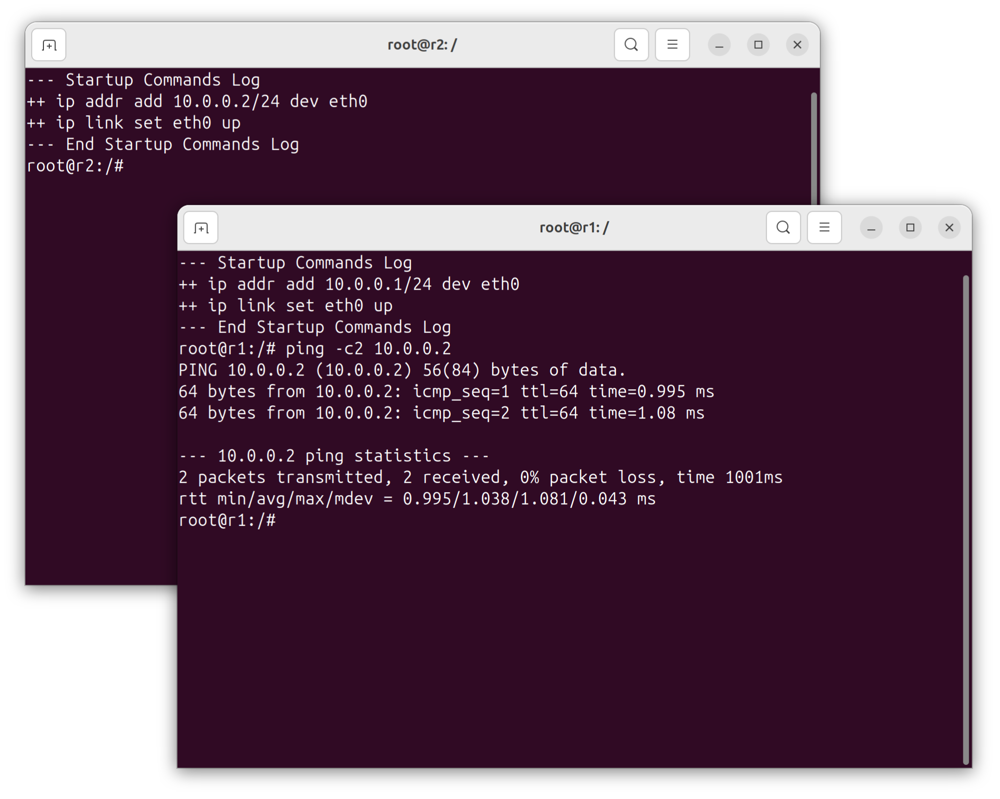

% Recreating a Real-World BGP Hijack with Kathara Network Emulator

[Kathará](https://www.kathara.org/) is a container-based network emulator developed by researchers at Roma Tre University in Italy as a modern successor to the [Netkit network emulator](https://opensourcenetworksimulators.com/tag/netkit/). Coincidentally, Roma Tre University is also the [same organization that developed BGPlay](https://massimocandela.com/bgplay-doc/Kathará), a tool used to investigate BGP incidents. 

Kathará uses Docker containers to emulate network devices rather than full virtual machines. This approach enables users to create complex topologies comprised of dozens of routers on a modest laptop. Kathará uses simple text-based configuration files that are easy to version control and share. It's open source, actively maintained, and runs on Linux, Windows, and MacOS.

In this post, I will use the *Kathará* network emulator to recreate one of the most famous BGP hijacking incidents in Internet history. By building a small network topology and simulating the [2008 Pakistan YouTube hijack](https://www.ripe.net/publications/news/industry-developments/youtube-hijacking-a-ripe-ncc-ris-case-study), I expect to learn both the fundamentals of Kathará and to gain hands-on experience with BGP security concepts.

## Why Emulate BGP Hijacks?

[BGP hijacks](https://manrs.org/2020/09/what-is-bgp-prefix-hijacking-part-1/) and [route leaks](https://datatracker.ietf.org/doc/html/rfc7908) are among the most significant threats to Internet routing security. [Understanding how these incidents occur](https://www.kentik.com/blog/a-brief-history-of-the-internets-biggest-bgp-incidents/) helps network engineers implement proper safeguards. By recreating these scenarios in a safe, isolated lab environment, one can observe exactly how prefix hijacks propagate through a network and experiment with mitigation techniques without affecting real infrastructure.

## Install Kathará

First, we will install Kathará and test it by setting up a basic lab environment.

### Install Docker

Kathará uses Docker as its container runtime. Install Docker on your Linux system using the [official Docker installation guide](https://docs.docker.com/engine/install/).

After that, add your user to the `docker` group so you can run containers without `sudo`:

```bash
$ sudo usermod -aG docker $USER
```

Log out and log back in for the group change to take effect. Verify Docker is working:

```bash
$ docker run hello-world
```

You should see a message confirming Docker is installed correctly.

### Install Kathará

The [install instructions on the Kathará wiki](https://github.com/KatharaFramework/Kathara/wiki/Linux) **are outdated**[^1] and do not work in Ubuntu 24.04 because they use the deprecated _apt-key_ command. You can skip the _apt-key_ command. Instead, follow the [Kathara instructions on the Launchpad platform](https://launchpad.net/~katharaframework/+archive/ubuntu/kathara) to add the Kathará PPA to Ubuntu, then install Kathará. 

I summarize the modified install commands, below:

```bash
$ sudo add-apt-repository ppa:katharaframework/kathara
$ sudo apt update
$ sudo apt install kathara
```

Verify the installation:

```bash
$ kathara --version
```

You should see output showing the Kathará version, which was 3.8.0 when I wrote this post.

### Verify Your Setup

Run a the _check_ command to proactively [download the Kathará base container](https://hub.docker.com/r/kathara/base) and the [Kathará network plugin container](https://hub.docker.com/r/kathara/katharanp/tags), and validate that Kathará can communicate with Docker:

```text
$ kathara check
```

With your environment ready, we can move on to configuring Kathará.

### Set the Terminal Emulator

Run the _kathara settings_ command and set the terminal emulator used by emulated devices to be the _Gnome Terminal_. Alternatively, you could install xterm, because it is the default used by Kathará.

```text
$ kathara settings
```

In the menu that appears, select _5_, for _Choose terminal_:

```text
  ╔═════════════════════════════════════════════════════════════════════════╗
  ║                                                                         ║
  ║                            Kathara Settings                             ║
  ║                                                                         ║
  ╠═════════════════════════════════════════════════════════════════════════╣
  ║                                                                         ║
  ║                      Choose the option to change.                       ║
  ║                                                                         ║
  ╠═════════════════════════════════════════════════════════════════════════╣
  ║                                                                         ║
  ║    1 - Choose default manager                                           ║
  ║    2 - Choose default image                                             ║
  ║    3 - Automatically open terminals on startup                          ║
  ║    4 - Choose device shell to be used                                   ║
  ║    5 - Choose terminal emulator to be used                              ║
  ║    6 - Choose Kathara prefixes                                          ║
  ║    7 - Choose logging level to be used                                  ║
  ║    8 - Print Startup Logs on device startup                             ║
  ║    9 - Enable IPv6                                                      ║
  ║   10 - Choose Docker Network Plugin version                             ║
  ║   11 - Automatically mount /hosthome on startup                         ║
  ║   12 - Automatically mount /shared on startup                           ║
  ║   13 - Docker Image Update Policy                                       ║
  ║   14 - Enable Shared Collision Domains                                  ║
  ║   15 - Configure a remote Docker connection                             ║
  ║   16 - Exit                                                             ║
  ║                                                                         ║
  ║                                                                         ║
  ╚═════════════════════════════════════════════════════════════════════════╝
  >> 5

```

Then, choose _2_, to select _gnome-terminal_:

```text
  ╔═════════════════════════════════════════════════════════════════════════╗
  ║                                                                         ║
  ║                   Choose terminal emulator to be used                   ║
  ║                                                                         ║
  ║                         Current: /usr/bin/xterm                         ║
  ║                                                                         ║
  ╠═════════════════════════════════════════════════════════════════════════╣
  ║                                                                         ║
  ║     Terminal emulator application to be used for device terminals.      ║
  ║   **The application must be correctly installed in the host system!**   ║
  ║                      Default is `/usr/bin/xterm`.                       ║
  ║                                                                         ║
  ╠═════════════════════════════════════════════════════════════════════════╣
  ║                                                                         ║
  ║    1 - /usr/bin/xterm                                                   ║
  ║    2 - /usr/bin/gnome-terminal                                          ║
  ║    3 - TMUX                                                             ║
  ║    4 - Choose another terminal emulator                                 ║
  ║    5 - Return to Kathara Settings                                       ║
  ║                                                                         ║
  ║                                                                         ║
  ╚═════════════════════════════════════════════════════════════════════════╝
  >> 2
```

Then select _16_ to _Exit_.

### Pull the FRR Docker Image

We'll use the [*kathara/frr* Docker image](https://hub.docker.com/r/kathara/frr), which includes FRRouting, an open-source routing suite that supports BGP, OSPF, and other protocols. Pull it now to save time later:

```bash
$ docker pull kathara/frr
```

### Test a very simple lab

To verify that Kathará is working, and to get an initial view of how Kathara labs are created and nodes are configured, let's create a minimal lab with two FRR routers connected to each other and test connectivity between them.

First, create a directory for your test lab:

```bash
$ mkdir -p ~/Kathara/kathara-test
$ cd ~/Kathara/kathara-test
```

Create the *lab.conf* file that defines two routers connected by a shared network segment:

```bash
$ cat > lab.conf << 'EOF'
LAB_NAME="Simple Two-Router Test"
r1[0]="link1"
r1[image]="kathara/frr"
r2[0]="link1"
r2[image]="kathara/frr"
EOF
```

Create startup scripts to assign IP addresses to each router:

```bash
$ cat > r1.startup << 'EOF'
ip addr add 10.0.0.1/24 dev eth0
ip link set eth0 up
EOF
```

```bash
$ cat > r2.startup << 'EOF'
ip addr add 10.0.0.2/24 dev eth0
ip link set eth0 up
EOF
```

The lab directory should now contain:

```
kathara-test/
├── lab.conf
├── r1.startup
└── r2.startup
```

Start the lab:

```bash
$ kathara lstart
```

Kathara reads the _lab.conf_ file and the two _startup_ files to set up and configure the lab. You should see output indicating both routers have started:

```
┌─────────────────────────────────────────────────────────────────────────────────────┐
│                              Starting Network Scenario                              │
└─────────────────────────────────────────────────────────────────────────────────────┘
┌─────────────────────────────────────────────────────────────────────────────────────┐
│ Name: Simple Two-Router Test                                                        │
└─────────────────────────────────────────────────────────────────────────────────────┘
[Deploying collision domains]   ━━━━━━━━━━━━━━━━━━━━━━━━━━━━━━━━━━━━━━━━━━━━━━━━━━━ 1/1
[Deploying devices]   ━━━━━━━━━━━━━━━━━━━━━━━━━━━━━━━━━━━━━━━━━━━━━━━━━━━━━━━━━━━━━ 2/2
```

And, you should see two new terminal windows. Each one is connected to one of the routers in the lab. By default, Kathara starts terminals with the Bash shell:



Inside the r1 container's terminal window, ping r2's IP address:

```bash
root@r1:/# ping -c2 10.0.0.2
PING 10.0.0.2 (10.0.0.2) 56(84) bytes of data.
64 bytes from 10.0.0.2: icmp_seq=1 ttl=64 time=0.995 ms
64 bytes from 10.0.0.2: icmp_seq=2 ttl=64 time=1.08 ms

--- 10.0.0.2 ping statistics ---
2 packets transmitted, 2 received, 0% packet loss, time 1001ms
rtt min/avg/max/mdev = 0.995/1.038/1.081/0.043 ms
root@r1:/# 
```

We demonstrated that a simple lab with two routers works as expected. Clean up the lab:

```bash
$ kathara lclean
```

This removes all containers and networks created for the lab. 

```
┌─────────────────────────────────────────────────────────────────────────────────────┐
│                              Stopping Network Scenario                              │
└─────────────────────────────────────────────────────────────────────────────────────┘
[Deleting devices]   ━━━━━━━━━━━━━━━━━━━━━━━━━━━━━━━━━━━━━━━━━━━━━━━━━━━━━━━━━━━━━━ 2/2
[Deleting collision domains]   ━━━━━━━━━━━━━━━━━━━━━━━━━━━━━━━━━━━━━━━━━━━━━━━━━━━━ 1/1
```

With Kathará working correctly, we're ready to build more complex topologies.

## Understanding BGP Hijacks and Route Leaks

Before we start our lab, let's examine the different ways malicious actors can compromise [BGP routing](https://www.catchpoint.com/blog/what-is-bgp).

### Types of BGP Routing Incidents

BGP routing incidents generally fall into three categories, each with different characteristics and impacts: origin hijacks, more-specific prefix hijacks, and route leaks.

#### Origin Hijack

An origin hijack occurs when an AS announces a prefix it doesn't legitimately own. The hijacking AS claims to be the origin of the route, essentially saying "I own this IP address range" when it doesn't.

For example, if AS400 legitimately owns the prefix 40.40.0.0/16, an origin hijack would occur if AS300 started announcing that same prefix as if it originated there. Routers receiving both announcements would choose between them based on BGP path selection rules. Depending on network topology, some parts of the Internet might start sending traffic for 40.40.0.0/16 toward AS300 instead of the legitimate owner, AS400.

Origin hijacks can be accidental or malicious. Accidental hijacks occur when a misconfigured router announces prefixes it shouldn't. Malicious hijacks occur when an attacker deliberately announces someone else's prefixes to intercept or blackhole traffic.

#### More-Specific Prefix Hijack

More-specific prefix hijack is a variant of origin hijacking. Instead of announcing the same prefix as the victim, the attacker announces a more-specific, or longer, prefix that falls within the victim's address space.

BGP routers always prefer more-specific routes. If AS400 announces 40.40.0.0/16 and an attacker announces 40.40.0.0/17 and 40.40.128.0/17, the attacker's more-specific /17 routes will be preferred everywhere in the Internet, completely overriding the legitimate /16 announcement.

This attack is harder to defend against because the victim's route is never withdrawn. It is simply overshadowed by the more-specific announcements.

#### Route Leak

A route leak occurs when an AS violates the expected routing policies by redistributing routes in ways that break the traditional customer-provider-peer relationships on the Internet. Unlike origin hijacks or more-specific prefix hijacks, the origin AS information remains correct. The problem is that the route is propagated where it shouldn't be.

Route leaks are almost always accidental and are usually caused by misconfiguration, but their effects can be severe. When a small customer AS suddenly appears to offer a shortcut to major networks, traffic can flood through infrastructure that was never designed to handle it.

### The 2008 Pakistan YouTube Hijack

The incident we'll recreate is the famous YouTube hijacking that occurred on February 24, 2008, when Pakistan Telecom ([AS17557](https://www.peeringdb.com/asn/17557)) accidentally blocked YouTube globally. This event has become a textbook example of how BGP vulnerabilities can have worldwide impact and is [well-documented by RIPE NCC](https://www.ripe.net/publications/news/industry-developments/youtube-hijacking-a-ripe-ncc-ris-case-study) and other organizations.

This incident is ideal for a lab exercise because:
- It's a straightforward more-specific prefix attack with no other complications like AS-path manipulation
- It demonstrates both the attack and the mitigation
- It shows the importance of transit provider filtering

#### What Happened

The Pakistan Telecommunication Authority ordered local ISPs to block access to YouTube due to content the government deemed offensive. Pakistan Telecom attempted to comply by creating a blackhole route for YouTube's IP addresses within their own network. However, instead of keeping this route internal, they accidentally announced it to the global Internet through their upstream provider PCCW (AS3491).

The key players were:
- _YouTube (AS36561)_: The victim, legitimately announcing 208.65.152.0/22
- _Pakistan Telecom (AS17557)_: The hijacker, who announced 208.65.153.0/24
- _PCCW (AS3491)_: Pakistan Telecom's upstream provider who propagated the hijack
- _Various upstream providers_: Who received and further propagated the bogus route

#### Why the Hijack Worked

This incident demonstrates the power of more-specific prefix hijacking. YouTube was announcing their address space as a /22 prefix (208.65.152.0/22), which covers IP addresses from 208.65.152.0 to 208.65.155.255. Pakistan Telecom announced a /24 prefix (208.65.153.0/24), which is a subset of YouTube's range.

BGP's "longest prefix match" rule means routers always prefer more-specific routes. A /24 prefix is more specific than a /22, so routers receiving both announcements would send traffic for 208.65.153.0/24 toward Pakistan Telecom where it was blackholed. This affected global YouTube traffic because PCCW propagated the announcement to their peers and transit providers, who propagated the more-specific prefixes worldwide.

YouTube responded to the attack by announcing even-more-specific prefixes 208.65.153.128/25 and 208.65.153.0/25. Routers that receives these announcements would prefer the more-specific prefix and send the traffic to YouTube. The YouTube communicated with PCCW who properly resolved the problem.

The incident lasted approximately two hours.

### What We'll Build

In our lab, we'll create a simplified 4-AS topology that mirrors the structure of this incident:


```
                    +----------+
                    | upstream |
                    |  AS400   |
                    +----+-----+
                         |
                         | 10.0.3.0/24
                         |
                    +----+-----+
                    | transit  |
                    |  AS300   |
                    +----+-----+
                    /           \
       10.0.1.0/24 /             \ 10.0.2.0/24
                  /               \
           +-----+----+      +-----+-----+
           | youtube  |      | pakistan  |
           |  AS100   |      |  AS200    |
           +----------+      +-----------+
           (Victim)          (Hijacker)
```

In this topology:
- *AS100 (YouTube)* is the victim, legitimately announcing 100.100.0.0/22
- *AS200 (Pakistan Telecom)* is the hijacker, who will announce a more-specific 100.100.0.0/24
- *AS300 (Transit/PCCW)* is the transit provider connecting both ASes to the Internet
- *AS400 (Upstream)* represents upstream providers who observe the hijack propagation

We'll first configure this topology with normal BGP operations where only AS100 announces its prefix. Then we'll introduce the hijack by having AS200 announce a more-specific prefix, and observe how it overrides the legitimate route. Finally, we'll demonstrate how AS100 can counter the hijack using even more-specific announcements.

Now that you understand the theory behind what we're recreating, let's build the lab.

## Kathará BGP Lab Setup

When you start a lab, Kathará reads the lab configuration files in the lab folder, creates Docker containers for each device, and sets up virtual network interfaces to connect them. The [Kathará man pages](https://www.kathara.org/man-pages/kathara.1.html) provide information about how to use the command line interface and the [Kathará Lab man pages](https://www.kathara.org/man-pages/kathara-lab.conf.5.html) provide information about building lab configuration files. 

The *kathara/frr* image we pulled earlier contains [FRRouting](https://frrouting.org/), giving us fully-featured routers capable of running BGP, OSPF, IS-IS, and other routing protocols. Kathará also provides base images for simple hosts, and you can use other [Kathara device images](https://hub.docker.com/u/kathara/) or any other Docker image that suits your needs.

### Lab Structure

As you saw in our simple test, above, a Kathará lab is simply a directory containing configuration files that describe your network topology and configuration. The lab file and directory structure is straightforward. The _lab.conf_ file is mandatory. Other files or folders are optional, as required by your lab topology.

| File/Directory | Purpose |
|----------------|---------|
| _lab.conf_ | Main configuration file that defines devices and network connections |
| _lab.dep_ | Optional network scenario dependencies defines the order in which devices start |
| _lab.ext_ | Optional direct connections between virtual lab devices and physical host interfaces |
| _\<device\>/_ | Directory for each device containing configuration files (optional)|
| _\<device\>.startup_ | Shell script that runs when a device starts (optional)|

### Lab Configuration File Syntax

The best way to learn the lab configuration file syntax is to [look at the example labs](https://github.com/KatharaFramework/Kathara-Labs) provided by the Kathará team. 

If you want to see all options that are available, the Kathará team provides man-pages documentation for the syntax of each lab configuration file. See the links below:

* **[lab.conf](https://www.kathara.org/man-pages/kathara-lab.conf.5.html)**: mandatory configuration file syntax manual
* **[lab.dep](https://www.kathara.org/man-pages/kathara-lab.dep.5.html)** optional configuration file syntax manual
* **[lab.ext](https://www.kathara.org/man-pages/kathara-lab.ext.5.html)** optional configuration file syntax manual

### Device Directories and Lab Structure

For each device in your lab, you will usually create a directory with the same name. Files in this directory are copied into the container's filesystem when the lab starts. This is how you provide configuration files to your devices.

In this lab example, you will create a directory structure like the one shown below:

```
bgp-youtube-hijack/
├── lab.conf
├── youtube/
│   └── etc/
│       └── frr/
│           ├── daemons
│           └── frr.conf
├── youtube.startup
├── pakistan/
│   └── etc/
│       └── frr/
│           ├── daemons
│           └── frr.conf
├── pakistan.startup
├── transit/
│   └── etc/
│       └── frr/
│           ├── daemons
│           └── frr.conf
├── transit.startup
├── upstream/
│   └── etc/
│       └── frr/
│           ├── daemons
│           └── frr.conf
└── upstream.startup
```

The contents of `youtube/etc/frr/` will appear at `/etc/frr/` inside the _youtube_ container. This allows you to pre-configure FRR's routing daemons with the required BGP settings.

### BGP Lab Config File

To emulate a small network in which we can "replay" the famous YouTube BGP Hijack incident, we create a _lab.conf_ file that creates four routers connected as shown in the diagram below:


First, create the lab directory

```bash
$ mkdir -p ~/Kathara/bgp-youtube-hijack
$ cd ~/Kathara/bgp-youtube-hijack
```

Create the _lab.conf_ file in your favorite editor and enter the following configuration information:

```
# ~/bgp-youtube-hijack/lab.conf

LAB_NAME="YouTube BGP Hijack 2008" 
LAB_DESCRIPTION="This lab recreates the famous February 24, 2008 incident where Pakistan Telecom (AS17557) hijacked YouTube's traffic by announcing a more-specific prefix within YouTube's allocated IP address space."
LAB_VERSION=1.0

# YouTube (Victim) - AS100
youtube[0]="link_youtube_transit"
youtube[image]="kathara/frr"

# Pakistan Telecom (Hijacker) - AS200
pakistan[0]="link_pakistan_transit"
pakistan[image]="kathara/frr"

# Transit/PCCW - AS300
transit[0]="link_youtube_transit"
transit[1]="link_pakistan_transit"
transit[2]="link_transit_upstream"
transit[image]="kathara/frr"

# Upstream Observer - AS400
upstream[0]="link_transit_upstream"
upstream[image]="kathara/frr"
```

The syntax follows a simple pattern: `device[interface]="collision_domain"`, where "collision domain" is simply the name you assign a network segment. All devices with interfaces on the same network segment can communicate directly with each other.

The `[image]` property specifies which Docker image to use for each device. In this example, we are using the [kathara/frr](https://hub.docker.com/r/kathara/frr) image for all routers, but you could use different images like [kathara/bird](https://hub.docker.com/r/kathara/bird) or [vyos](https://containerlab.dev/manual/kinds/vyosnetworks_vyos/#), if you wish.

### IP Addressing Scheme

Before we configure the routers, we must first establish the IP addressing plan:

| Link | Network | Device | Interface | IP Address |
|------|---------|--------|-----------|------------|
| YouTube ↔ Transit | 10.0.1.0/30 | youtube | eth0 | 10.0.1.1/30 |
| | | transit | eth0 | 10.0.1.2/30 |
| Pakistan ↔ Transit | 10.0.2.0/30 | pakistan | eth0 | 10.0.2.1/30 |
| | | transit | eth1 | 10.0.2.2/30 |
| Transit ↔ Upstream | 10.0.3.0/30 | transit | eth2 | 10.0.3.1/30 |
| | | upstream | eth0 | 10.0.3.2/30 |

Each AS will have a loopback address that is reachable within its advertised prefix. The key prefixes for this hijack scenario are:

| AS | Role | Loopback | Announced Prefix |
|----|------|----------|------------------|
| AS100 (YouTube) | Victim | 100.100.100.1/32 | 100.100.0.0/22 (the /22 aggregate) |
| AS200 (Pakistan) | Hijacker | 200.200.200.1/32 | 100.100.0.0/24 (hijacked more-specific) |
| AS300 (Transit) | PCCW | 30.30.30.1/32 | 30.30.0.0/16 |
| AS400 (Upstream) | Observer | 40.40.40.1/32 | 40.40.0.0/16 |

Notice that YouTube announces 100.100.0.0/22 while Pakistan will (after we trigger the hijack) announce 100.100.0.0/24, which is a more-specific prefix within YouTube's range.

### FRR Daemons Configuration

Each router needs a *daemons* file to tell FRR which routing protocols to enable. Create the directory structure and daemons file for each device. The content is identical for all routers:

```bash
$ mkdir -p youtube/etc/frr
$ mkdir -p pakistan/etc/frr
$ mkdir -p transit/etc/frr
$ mkdir -p upstream/etc/frr
```

Create the *daemons* file for each router. Here's the content (same for all four):

For the YouTube router, create the [_daemons_ file](https://docs.frrouting.org/en/latest/setup.html#daemons-configuration-file). In this lab scenario, the _/etc/frr/daemons_ file copied to each router will contain the following configuration:

```
# /etc/frr/daemons
zebra=yes
bgpd=yes
vtysh_enable=yes
zebra_options="  -A 127.0.0.1 -s 90000000"
bgpd_options="   -A 127.0.0.1"
```

Save this content to:

* *youtube/etc/frr/daemons*
* *pakistan/etc/frr/daemons*
* *transit/etc/frr/daemons*
* *upstream/etc/frr/daemons*

### frr.conf Files

Each router is pre-configured with an [_frr.conf_ file](https://docs.frrouting.org/en/latest/basic.html#integrated-config-file).

#### YouTube Configuration (AS100) — The Victim

The following FRR configuration file sets up BGP with AS number 100 (representing YouTube's AS36561), peers with Transit at 10.0.1.2 (AS300), and announces the 100.100.0.0/16 prefix (representing YouTube's 208.65.152.0/22).

Create *youtube/etc/frr/frr.conf*:

```
frr version 8.4
frr defaults traditional
hostname youtube
log syslog informational
no ipv6 forwarding
service integrated-vtysh-config
!
! Interface configuration
interface eth0
 ip address 10.0.1.1/24
 description Link to Transit
exit
!
interface lo
 ip address 100.100.0.1/32
 description Loopback - within announced /22 prefix
exit
!
router bgp 100
 bgp router-id 100.100.0.1
 no bgp ebgp-requires-policy
 !
 ! Peer with Transit (AS300)
 neighbor 10.0.1.2 remote-as 300
 neighbor 10.0.1.2 description Transit-PCCW
 !
 address-family ipv4 unicast
  ! YouTube's prefix - the /22 block (covers 100.100.0.0 - 100.100.3.255)
  network 100.100.0.0/22
  neighbor 10.0.1.2 activate
 exit-address-family
exit
!
! Create a route for the announced prefix
ip route 100.100.0.0/22 Null0
!
end
```

This lab scenario, YouTube is the legitimate owner of the 100.100.0.0/22 prefix.  


#### Pakistan Telecom Configuration (AS200) — The Hijacker

Initially, Pakistan Telecom will NOT announce the hijacked prefix. We'll add that later to demonstrate the hijack. For now, it only announces its own legitimate prefix.

Create *pakistan/etc/frr/frr.conf*:

```
frr version 8.4
frr defaults traditional
hostname pakistan
log syslog informational
no ipv6 forwarding
service integrated-vtysh-config
!
! Interface configuration
interface eth0
 ip address 10.0.2.2/24
 description Link to Transit
exit
!
interface lo
 ip address 200.200.0.1/32
 description Loopback - within announced /16 prefix
exit
!
router bgp 200
 bgp router-id 200.200.0.1
 no bgp ebgp-requires-policy
 !
 ! Peer with Transit (AS300)
 neighbor 10.0.2.1 remote-as 300
 neighbor 10.0.2.1 description Transit-PCCW
 !
 address-family ipv4 unicast
  ! Pakistan's legitimate prefix
  network 200.200.0.0/16
  neighbor 10.0.2.1 activate
 exit-address-family
exit
!
! Route for Pakistan's legitimate prefix
ip route 200.200.0.0/16 Null0
!
! NOTE: To simulate the hijack, add these commands:
! configure terminal
! router bgp 200
!  address-family ipv4 unicast
!   network 100.100.0.0/24
! ip route 100.100.0.0/24 Null0
!
end
```

#### Transit/PCCW Configuration (AS300)

Transit represents PCCW (AS3491), the provider that connected both YouTube and Pakistan Telecom and inadvertently propagated the hijack. It peers with all three other ASes and provides transit.

Create *transit/etc/frr/frr.conf*:

```
frr version 8.4
frr defaults traditional
hostname transit
log syslog informational
no ipv6 forwarding
service integrated-vtysh-config
!
! Interface configuration
interface eth0
 ip address 10.0.1.2/24
 description Link to YouTube
exit
!
interface eth1
 ip address 10.0.2.1/24
 description Link to Pakistan
exit
!
interface eth2
 ip address 10.0.3.1/24
 description Link to Upstream
exit
!
interface lo
 ip address 30.30.0.1/32
 description Loopback - within announced /16 prefix
exit
!
router bgp 300
 bgp router-id 30.30.0.1
 no bgp ebgp-requires-policy
 !
 ! Peer with YouTube (AS100)
 neighbor 10.0.1.1 remote-as 100
 neighbor 10.0.1.1 description YouTube
 !
 ! Peer with Pakistan (AS200)
 neighbor 10.0.2.2 remote-as 200
 neighbor 10.0.2.2 description Pakistan-Telecom
 !
 ! Peer with Upstream (AS400)
 neighbor 10.0.3.2 remote-as 400
 neighbor 10.0.3.2 description Upstream
 !
 address-family ipv4 unicast
  ! Transit's own prefix
  network 30.30.0.0/16
  neighbor 10.0.1.1 activate
  neighbor 10.0.2.2 activate
  neighbor 10.0.3.2 activate
 exit-address-family
exit
!
! Route for Transit's prefix
ip route 30.30.0.0/16 Null0
!
end
```

Note that Transit has **no outbound filtering**—it simply propagates all routes it learns. This is the configuration weakness that allowed the real-world hijack to spread globally.


#### Upstream Configuration (AS400)

Upstream represents the broader Internet—a provider that will receive and observe routes from Transit. This is where we'll see the hijack propagate.

Create *upstream/etc/frr/frr.conf*:

```
frr version 8.4
frr defaults traditional
hostname upstream
log syslog informational
no ipv6 forwarding
service integrated-vtysh-config
!
! Interface configuration
interface eth0
 ip address 10.0.3.2/24
 description Link to Transit
exit
!
interface lo
 ip address 40.40.0.1/32
 description Loopback - within announced /16 prefix
exit
!
router bgp 400
 bgp router-id 40.40.0.1
 no bgp ebgp-requires-policy
 !
 ! Peer with Transit (AS300)
 neighbor 10.0.3.1 remote-as 300
 neighbor 10.0.3.1 description Transit-PCCW
 !
 address-family ipv4 unicast
  ! Upstream's own prefix
  network 40.40.0.0/16
  neighbor 10.0.3.1 activate
 exit-address-family
exit
!
! Route for Upstream's prefix
ip route 40.40.0.0/16 Null0
!
end
```


### Startup Files

The `<device>.startup` file is a shell script that runs inside the container when it starts. This is where you configure network interfaces, start services, or run any initialization commands. 

#### How Kathara Creates Ethernet Interfaces

Before each node's startup script runs, Kathara creates network interfaces on each node based on the _lab.conf_ file. So, to avoid conflicts or weird behaviour, we should not create interfaces in the device startup files or by copying network interface configuration files into the node container.

When the `kathara lstart` command is run, Kathara creates the Docker container for a node, creates virtual ethernet interfaces like _eth0_, _eth1_, etc. and attaches them to the container, connects each interface to the specified collision domain (virtual network bridge), and then runs the node's startup script.

The interfaces exist and are in "DOWN" state when your startup script begins.

#### Interface Naming Convention

The Ethernet device numbering convention matches the numbers defines in the *lab.conf* file. For example, the *Transit* router's interfaces would be mapped from teh configuration file to the container as follows:

* transit[0] → eth0
* transit[1] → eth1
* transit[2] → eth2


#### youtube.startup

Create the file _youtube.startup_ and add the following startup commands:

```
#!/bin/bash

ip link set eth0 up

/etc/init.d/frr start
```

Save the file in the lab directory, _~/bgp-youtube-hijack/_.

The startup file executes after the device directory contents are copied into the container, so you can reference any configuration files you've provided.

#### pakistan.startup

Create *pakistan.startup*:

```
#!/bin/bash

ip link set eth0 up

/etc/init.d/frr start
```

#### transit.startup

Create *transit.startup*:

```
#!/bin/bash

ip link set eth0 up
ip link set eth1 up
ip link set eth2 up

/etc/init.d/frr start
```

#### upstream.startup

Create *upstream.startup*:

```
#!/bin/bash

ip link set eth0 up

/etc/init.d/frr start
```

### Ready to start

Now we have a Kathará lab directory that contains a _lab.conf_ file, router startup files, and sub-directories containing the configuration files for each router. We are ready to use the Kathará command-line interface.

## Kathará Command Line Interface

Kathará provides a simple set of commands to manage your labs. Here are the ones you'll use most often:

### Starting the Lab

To start a lab, navigate to the lab directory and run:

```bash
$ kathara lstart
```

Kathará reads *lab.conf*, creates the necessary containers and networks, and executes each device's startup script. You'll see output as each device comes online:

```
┌─────────────────────────────────────────────────────────────────────────────────────┐
│                              Starting Network Scenario                              │
└─────────────────────────────────────────────────────────────────────────────────────┘
[Deploying collision domains]   ━━━━━━━━━━━━━━━━━━━━━━━━━━━━━━━━━━━━━━━━━━━━━━━━━━━ 3/3
[Deploying devices]   ━━━━━━━━━━━━━━━━━━━━━━━━━━━━━━━━━━━━━━━━━━━━━━━━━━━━━━━━━━━━━ 4/4
```

You will also see four terminal windows appear. each one is connected to a different router in the lab.

### Connecting to a Device

If you closed a router's terminal window, you can open another terminal session on a running device. Open a terminal window and enter the command:

```bash
$ kathara connect router1
```

This drops you into a shell inside the router container where you can run commands, check routing tables, or configure the device interactively. To exit, type `exit` or press Ctrl+D.

### Checking Lab Status

To see information about a running lab:

```bash
$ kathara linfo
```

This displays details about all running devices, their interfaces, and which collision domains they're connected to.

```
┌──────────────────────┬──────────┬─────────────────────┬─────────┬────────────────────┬──────┬───────────┬─────────────────────┬─────────────┬───────────────────┬──────────────────────┐
│ NETWORK SCENARIO ID  │ NAME     │ USER                │ STATUS  │ IMAGE              │ PIDS │ CPU USAGE │ MEM USAGE           │ MEM PERCENT │ NET USAGE         │ INTERFACES           │
╞══════════════════════╪══════════╪═════════════════════╪═════════╪════════════════════╪══════╪═══════════╪═════════════════════╪═════════════╪═══════════════════╪══════════════════════╡
│ GBhCCLpizE6xM9yUZKj… │ pakistan │ blinklet-hlipcf4s0… │ running │ kathara/frr:latest │ 17   │ 0.02%     │ 22.77 MB / 62.55 GB │ 0.04 %      │ 1.77 KB / 1.66 KB │ 0:link_pakistan_tra… │
├──────────────────────┼──────────┼─────────────────────┼─────────┼────────────────────┼──────┼───────────┼─────────────────────┼─────────────┼───────────────────┼──────────────────────┤
│ GBhCCLpizE6xM9yUZKj… │ youtube  │ blinklet-hlipcf4s0… │ running │ kathara/frr:latest │ 17   │ 0.02%     │ 22.75 MB / 62.55 GB │ 0.04 %      │ 1.77 KB / 1.66 KB │ 0:link_youtube_tran… │
├──────────────────────┼──────────┼─────────────────────┼─────────┼────────────────────┼──────┼───────────┼─────────────────────┼─────────────┼───────────────────┼──────────────────────┤
│ GBhCCLpizE6xM9yUZKj… │ upstream │ blinklet-hlipcf4s0… │ running │ kathara/frr:latest │ 17   │ 0.03%     │ 22.81 MB / 62.55 GB │ 0.04 %      │ 1.77 KB / 1.66 KB │ 0:link_transit_upst… │
├──────────────────────┼──────────┼─────────────────────┼─────────┼────────────────────┼──────┼───────────┼─────────────────────┼─────────────┼───────────────────┼──────────────────────┤
│ GBhCCLpizE6xM9yUZKj… │ transit  │ blinklet-hlipcf4s0… │ running │ kathara/frr:latest │ 17   │ 0.02%     │ 24.87 MB / 62.55 GB │ 0.04 %      │ 5.25 KB / 5.04 KB │ 0:link_youtube_tran… │
│                      │          │                     │         │                    │      │           │                     │             │                   │ 1:link_pakistan_tra… │
│                      │          │                     │         │                    │      │           │                     │             │                   │ 2:link_transit_upst… │
└──────────────────────┴──────────┴─────────────────────┴─────────┴────────────────────┴──────┴───────────┴─────────────────────┴─────────────┴───────────────────┴──────────────────────┘
```

### Stopping and Cleaning Up

When you're done with a lab, clean up all containers and networks:

```
$ kathara lclean
```

This stops and removes all containers created for the lab. Always run this before starting a modified version of your lab to ensure you're working with a fresh environment.

With these fundamentals covered, you now understand how Kathará structures labs and how to interact with them. 

In the next sections, we'll use the virtual routers that have been created and interconnected by Kathará, as described in the *lab.cong* file and the router configuration files, to explore how the 2008 YouTube Hijack occurred and how it was mitigated.


## Verifying BGP Peering

First, we will establish the "normal" state of the lab. On each router, verify that the BGP sessions are established and YouTube's prefix is being announced correctly to "upstream" systems.

#### Check Upstream (Observer)

We'll start with Upstream since this is where we'll observe the hijack's effect. Connect and check the BGP table on the router named *upstream*. A terminal window connected to *upstream* should already be open on your desktop. If not, use Kathará's *connect* command:

```
$ kathara connect upstream
```

The, start the FRR CLI, *vtysh*, and check BGP status:

```
root@upstream:/# vtysh
upstream# show ip bgp summary
```

You should see output showing the BGP session with Transit (AS300) is established:

```
IPv4 Unicast Summary (VRF default):
BGP router identifier 40.40.40.1, local AS number 400 vrf-id 0
BGP table version 4
RIB entries 7, using 672 bytes of memory
Peers 1, using 20 KiB of memory

Neighbor        V         AS   MsgRcvd   MsgSent   TblVer  InQ OutQ  Up/Down State/PfxRcd   PfxSnt Desc
10.0.3.1        4        300        11        12        4    0    0 00:04:42            3        4 Transit-PCCW

Total number of neighbors 1
```

Check the BGP route table to see the routes:

```bash
upstream# show ip bgp
```

This is the crucial view. See below that:

* 100.100.0.0/22 is YouTube's legitimate prefix, learned via AS path "300 100" (Transit → YouTube)
* 200.200.0.0/16 is Pakistan Telecom's own prefix
* 30.30.0.0/16 is Transit's prefix

```
BGP table version is 4, local router ID is 40.40.40.1, vrf id 0
Default local pref 100, local AS 400
Status codes:  s suppressed, d damped, h history, * valid, > best, = multipath,
               i internal, r RIB-failure, S Stale, R Removed
Nexthop codes: @NNN nexthop's vrf id, < announce-nh-self
Origin codes:  i - IGP, e - EGP, ? - incomplete
RPKI validation codes: V valid, I invalid, N Not found

    Network          Next Hop            Metric LocPrf Weight Path
 *> 30.30.0.0/16     10.0.3.1                 0             0 300 i
 *> 40.40.0.0/16     0.0.0.0                  0         32768 i
 *> 100.100.0.0/22   10.0.3.1                               0 300 100 i
 *> 200.200.0.0/16   10.0.3.1                               0 300 200 i

Displayed  4 routes and 4 total paths
```

There is no more-specific /24 route for YouTube's address space yet. This is the normal, pre-hijack state.

#### Check Transit

Verify *Transit* is properly peering with all neighbors. Use the terminal window connected to the *transit* router:

```bash
root@transit:/# vtysh
transit# show ip bgp summary
```

We see *Transit* BGP has three peers, as expected. Sessions are established with YouTube (AS100), Pakistan (AS200), and Upstream (AS400): 

```
IPv4 Unicast Summary (VRF default):
BGP router identifier 30.30.30.1, local AS number 300 vrf-id 0
BGP table version 4
RIB entries 7, using 672 bytes of memory
Peers 3, using 60 KiB of memory

Neighbor        V         AS   MsgRcvd   MsgSent   TblVer  InQ OutQ  Up/Down State/PfxRcd   PfxSnt Desc
10.0.1.1        4        100        15        15        4    0    0 00:08:59            1        4 YouTube
10.0.2.2        4        200        15        15        4    0    0 00:08:59            1        4 Pakistan-Telecom
10.0.3.2        4        400        15        15        4    0    0 00:08:59            1        4 Upstream

Total number of neighbors 3
```

Check the BGP route table to see the routes:

```bash
upstream# show ip bgp
```

See below that *Transit* is receiving:

* 1 prefix from Upstream (AS400): its 40.40.0.0/16
* 1 prefix from YouTube (AS100): the 100.100.0.0/22
* 1 prefix from Pakistan (AS200): its legitimate 200.200.0.0/16

```
BGP table version is 4, local router ID is 30.30.30.1, vrf id 0
Default local pref 100, local AS 300
Status codes:  s suppressed, d damped, h history, * valid, > best, = multipath,
               i internal, r RIB-failure, S Stale, R Removed
Nexthop codes: @NNN nexthop's vrf id, < announce-nh-self
Origin codes:  i - IGP, e - EGP, ? - incomplete
RPKI validation codes: V valid, I invalid, N Not found

    Network          Next Hop            Metric LocPrf Weight Path
 *> 30.30.0.0/16     0.0.0.0                  0         32768 i
 *> 40.40.0.0/16     10.0.3.2                 0             0 400 i
 *> 100.100.0.0/22   10.0.1.1                 0             0 100 i
 *> 200.200.0.0/16   10.0.2.2                 0             0 200 i

Displayed  4 routes and 4 total paths
```

#### Check YouTube

Verify *YouTube* is properly peering with all neighbors.

```bash
root@youtube:/# vtysh
youtube# show ip bgp summary
```

We see *YouTube* BGP has one BGP peer, as expected. It has established a BGP session with *Transit* (AS300): 

```
IPv4 Unicast Summary (VRF default):
BGP router identifier 100.100.100.1, local AS number 100 vrf-id 0
BGP table version 4
RIB entries 7, using 672 bytes of memory
Peers 1, using 20 KiB of memory

Neighbor        V         AS   MsgRcvd   MsgSent   TblVer  InQ OutQ  Up/Down State/PfxRcd   PfxSnt Desc
10.0.1.2        4        300        40        41        4    0    0 00:33:25            3        4 Transit-PCCW

Total number of neighbors 1
```

Verify *YouTube* is announcing its prefix correctly:

```bash
root@youtube:/# vtysh
youtube# show ip bgp
```

As shown below, YouTube sees:

* Its own 100.100.0.0/22 (locally originated)
* Routes to other ASes via Transit

```
BGP table version is 4, local router ID is 100.100.100.1, vrf id 0
Default local pref 100, local AS 100
Status codes:  s suppressed, d damped, h history, * valid, > best, = multipath,
               i internal, r RIB-failure, S Stale, R Removed
Nexthop codes: @NNN nexthop's vrf id, < announce-nh-self
Origin codes:  i - IGP, e - EGP, ? - incomplete

   Network          Next Hop            Metric LocPrf Weight Path
*> 30.30.0.0/16     10.0.1.2                 0             0 300 i
*> 40.40.0.0/16     10.0.1.2                               0 300 400 i
*> 100.100.0.0/22   0.0.0.0                  0         32768 i
*> 200.200.0.0/16   10.0.1.2                               0 300 200 i

Displayed  4 routes and 4 total paths
```

#### Check Pakistan

Verify *Pakistan* is properly peering with all neighbors.

```bash
root@transit:/# vtysh
transit# show ip bgp summary
```

We see *Pakistan* BGP has established a BGP peering session with *Transit*: 

```
IPv4 Unicast Summary (VRF default):
BGP router identifier 200.200.200.1, local AS number 200 vrf-id 0
BGP table version 4
RIB entries 7, using 672 bytes of memory
Peers 1, using 20 KiB of memory

Neighbor        V         AS   MsgRcvd   MsgSent   TblVer  InQ OutQ  Up/Down State/PfxRcd   PfxSnt Desc
10.0.2.1        4        300        35        36        4    0    0 00:28:18            3        4 Transit-PCCW

Total number of neighbors 1
```

Check the BGP route table to see the routes:

```bash
pakistan# show ip bgp
```

See below that *Pakistan* is receiving:

* 1 prefix from Transit (AS300): its 30.30.0.0/16
* 1 prefix from Upstream (AS400): its 40.40.0.0/16
* 1 prefix from YouTube (AS100): the 100.100.0.0/22

```
BGP table version is 4, local router ID is 200.200.200.1, vrf id 0
Default local pref 100, local AS 200
Status codes:  s suppressed, d damped, h history, * valid, > best, = multipath,
               i internal, r RIB-failure, S Stale, R Removed
Nexthop codes: @NNN nexthop's vrf id, < announce-nh-self
Origin codes:  i - IGP, e - EGP, ? - incomplete
RPKI validation codes: V valid, I invalid, N Not found

    Network          Next Hop            Metric LocPrf Weight Path
 *> 30.30.0.0/16     10.0.2.1                 0             0 300 i
 *> 40.40.0.0/16     10.0.2.1                               0 300 400 i
 *> 100.100.0.0/22   10.0.2.1                               0 300 100 i
 *> 200.200.0.0/16   0.0.0.0                  0         32768 i

Displayed  4 routes and 4 total paths
```


### Verifying Connectivity

Let's test connectivity to YouTube's address space. From _Upstream's_ loopback interface, ping _YouTube's_ loopback address *100.100.0.1*:

```bash
root@upstream:/# ping -I 40.40.0.1 -c 3 100.100.0.1
PING 100.100.0.1 (100.100.0.1) from 40.40.0.1 : 56(84) bytes of data.
64 bytes from 100.100.0.1: icmp_seq=1 ttl=63 time=1.70 ms
64 bytes from 100.100.0.1: icmp_seq=2 ttl=63 time=2.06 ms
64 bytes from 100.100.0.1: icmp_seq=3 ttl=63 time=1.80 ms

--- 100.100.0.1 ping statistics ---
3 packets transmitted, 3 received, 0% packet loss, time 2004ms
rtt min/avg/max/mdev = 1.704/1.853/2.058/0.149 ms
```

Traffic from Upstream, which represents traffic from Internet users in this lab example, reaches YouTube correctly. This is the normal, pre-hijack state.

Use the `traceroute` command to check the path that the traffic between _Upstream_ and _Youtube_ follows:

```bash
root@upstream:/# traceroute -s 40.40.0.1 100.100.0.1
traceroute to 100.100.0.1 (100.100.0.1), 30 hops max, 60 byte packets
 1  10.0.3.1 (10.0.3.1)  0.730 ms  1.239 ms  1.827 ms
 2  100.100.0.1 (100.100.0.1)  2.428 ms  3.025 ms  3.541 ms
 ```


### Lab Status Summary

At this point, we have a fully functional 4-AS BGP topology with normal routing:

| AS | Can Reach AS | Via Path |
|------|-----------|----------|
| Upstream (AS400) | YouTube (AS100) | AS400 → AS300 → AS100 |
| Upstream (AS400) | Pakistan (AS200) | AS400 → AS300 → AS200 |
| YouTube (AS100) | Upstream (AS400) | AS100 → AS300 → AS400 |
| Pakistan (AS200) | YouTube (AS100) | AS200 → AS300 → AS100 |

YouTube's /22 prefix is the only route to the Youtube's IPv4 address space, 100.100.0.1 to 100.100.3.255. 

In the next section, we'll introduce Pakistan Telecom's more-specific /24 hijack and observe how it overrides YouTube's legitimate route.


## Recreating the Prefix Hijack

Now we will introduce the more-specific prefix announcement that hijacks YouTube's traffic, recreating the 2008 Pakistan incident. This demonstrates how BGP's longest-prefix-match rule can be exploited, even unintentionally.

### Understanding What We're About to Do

In the real incident, Pakistan Telecom was trying to block YouTube internally by creating a blackhole route. The problem was that this route was accidentally announced to their upstream provider PCCW, who propagated it globally.

The key technical factor is that Pakistan Telecom announced a */24 prefix* (208.65.153.0/24) that fell within YouTube's */22 prefix* (208.65.152.0/22) and was more attractive to other BGP routers because it was more specific. 

In our lab YouTube announces *100.100.0.0/22*, which covers 100.100.0.0 - 100.100.3.255, and Pakistan will announce *100.100.0.0/24*, which covers 100.100.0.0 - 100.100.0.255.

The /24 is more specific than the /22, so routers will prefer it for any traffic destined to addresses in the 100.100.0.x range.

### The Before State

Before making changes, let's confirm YouTube's route is the only one for the 100.100.x.x address space. In the Upstream terminal window:

```
root@upstream:/# vtysh
upstream# show ip bgp 100.100.0.1
```

When we query BGP for the specific IP 100.100.0.1, we see that it matches the /22 prefix owned by YouTube (AS100). The AS path "300 100" shows the route comes via Transit (AS300) from YouTube (AS100).

```
BGP routing table entry for 100.100.0.0/22, version 3
Paths: (1 available, best #1, table default)
  Advertised to non peer-group peers:
  10.0.3.1
  300 100
    10.0.3.1 from 10.0.3.1 (30.30.0.1)
      Origin IGP, valid, external, best (First path received)
      Last update: Sat Jan 31 16:31:16 2026
```


### Introducing the Hijack

Now we'll simulate Pakistan Telecom announcing the more-specific prefix. In the Pakistan terminal window:

```bash
root@pakistan:/# vtysh
pakistan# configure terminal
```

First, we need to create a blackhole route for the prefix we're about to announce, just like Pakistan Telecom did when trying to block YouTube:

```bash
pakistan(config)# ip route 100.100.0.0/24 blackhole
```

Now, add the more-specific prefix to BGP:

```bash
pakistan(config)# router bgp 200
pakistan(config-router)# address-family ipv4 unicast
pakistan(config-router-af)# network 100.100.0.0/24
pakistan(config-router-af)# exit
pakistan(config-router)# exit
pakistan(config)# exit
```

Verify the new route is in Pakistan's BGP table:

```bash
pakistan# show ip bgp
```

```
BGP table version is 3, local router ID is 200.200.200.1, vrf id 0
Default local pref 100, local AS 200
Status codes:  s suppressed, d damped, h history, * valid, > best, = multipath,
               i internal, r RIB-failure, S Stale, R Removed
Nexthop codes: @NNN nexthop's vrf id, < announce-nh-self
Origin codes:  i - IGP, e - EGP, ? - incomplete

   Network          Next Hop            Metric LocPrf Weight Path
*> 30.30.0.0/16     10.0.2.2                 0             0 300 i
*> 40.40.0.0/16     10.0.2.2                               0 300 400 i
*> 100.100.0.0/22   10.0.2.2                               0 300 100 i
*> 100.100.0.0/24   0.0.0.0                  0         32768 i
*> 200.200.0.0/16   0.0.0.0                  0         32768 i

Displayed  5 routes and 5 total paths
```

Notice two routes for YouTube's address space:
- **100.100.0.0/22** — YouTube's legitimate announcement (learned via Transit)
- **100.100.0.0/24** — Our hijacked announcement (locally originated)

The hijack is now being advertised to Transit. Exit Pakistan:

```bash
pakistan# exit
root@pakistan:/# exit
```

### Observing the Hijack Propagation

Let's see how the hijack propagates through the network. First, check Transit:

```bash
$ kathara connect transit
```

```bash
root@transit:/# vtysh
transit# show ip bgp
```

```
BGP table version is 6, local router ID is 30.30.30.1, vrf id 0
Default local pref 100, local AS 300
Status codes:  s suppressed, d damped, h history, * valid, > best, = multipath,
               i internal, r RIB-failure, S Stale, R Removed
Nexthop codes: @NNN nexthop's vrf id, < announce-nh-self
Origin codes:  i - IGP, e - EGP, ? - incomplete

   Network          Next Hop            Metric LocPrf Weight Path
*> 30.30.0.0/16     0.0.0.0                  0         32768 i
*> 40.40.0.0/16     10.0.3.2                 0             0 400 i
*> 100.100.0.0/22   10.0.1.1                 0             0 100 i
*> 100.100.0.0/24   10.0.2.1                 0             0 200 i
*> 200.200.0.0/16   10.0.2.1                 0             0 200 i

Displayed  5 routes and 5 total paths
```

**The hijack has reached Transit!** It now has two routes covering YouTube's address space:
- 100.100.0.0/22 from YouTube (AS100) via 10.0.1.1
- 100.100.0.0/24 from Pakistan (AS200) via 10.0.2.1

Transit will forward the hijacked route to its other neighbors, including Upstream. Exit Transit:

```bash
transit# exit
root@transit:/# exit
```

Now check Upstream—the observer that represents the broader Internet:

```bash
$ kathara connect upstream
```

```bash
root@upstream:/# vtysh
upstream# show ip bgp
```

```
BGP table version is 6, local router ID is 40.40.40.1, vrf id 0
Default local pref 100, local AS 400
Status codes:  s suppressed, d damped, h history, * valid, > best, = multipath,
               i internal, r RIB-failure, S Stale, R Removed
Nexthop codes: @NNN nexthop's vrf id, < announce-nh-self
Origin codes:  i - IGP, e - EGP, ? - incomplete

   Network          Next Hop            Metric LocPrf Weight Path
*> 30.30.0.0/16     10.0.3.1                 0             0 300 i
*> 40.40.0.0/16     0.0.0.0                  0         32768 i
*> 100.100.0.0/22   10.0.3.1                               0 300 100 i
*> 100.100.0.0/24   10.0.3.1                               0 300 200 i
*> 200.200.0.0/16   10.0.3.1                               0 300 200 i

Displayed  5 routes and 5 total paths
```

**The hijack has propagated to Upstream!** Notice the two routes:
- **100.100.0.0/22** with AS path "300 100" (Transit → YouTube) — the legitimate route
- **100.100.0.0/24** with AS path "300 200" (Transit → Pakistan) — the hijacked route

### Understanding the Impact

Now let's see what happens when Upstream tries to reach an IP address in the hijacked range:

```bash
upstream# show ip bgp 100.100.0.1
```

```
BGP routing table entry for 100.100.0.0/24, version 5
Paths: (1 available, best #1, table default)
  Advertised to non peer-group peers:
  10.0.3.1
  300 200
    10.0.3.1 from 10.0.3.1 (30.30.30.1)
      Origin IGP, metric 0, valid, external, best (First path received)
      Last update: Sat Feb 24 18:47:00 2008
```

**This is the hijack in action!** When querying for IP 100.100.0.1:
- Before the hijack: matched the /22 route to YouTube
- After the hijack: matches the /24 route to Pakistan

The more-specific /24 prefix "wins" due to BGP's longest-prefix-match rule. Traffic for 100.100.0.x is now being sent toward Pakistan instead of YouTube.

Let's verify with a traceroute. Exit vtysh first:

```bash
upstream# exit
```

Now trace the path to an address in the hijacked range:

```bash
root@upstream:/# traceroute -n 100.100.0.1
traceroute to 100.100.0.1 (100.100.0.1), 30 hops max, 60 byte packets
 1  10.0.3.1  0.123 ms  0.089 ms  0.076 ms
 2  10.0.2.1  0.234 ms  0.198 ms  0.187 ms
 3  * * *
```

The traceroute shows:
1. First hop: Transit (10.0.3.1)
2. Second hop: Pakistan (10.0.2.1)
3. Then nothing—because Pakistan is blackholing the traffic!

This is exactly what happened in 2008: YouTube traffic flowed toward Pakistan where it was dropped, causing a global YouTube outage.

Compare this to an address outside the hijacked /24 but still within YouTube's /22:

```bash
root@upstream:/# traceroute -n 100.100.0.1
traceroute to 100.100.0.1 (100.100.0.1), 30 hops max, 60 byte packets
 1  10.0.3.1  0.123 ms  0.089 ms  0.076 ms
 2  10.0.1.1  0.234 ms  0.198 ms  0.187 ms
 3  * * *
```

Traffic to 100.100.0.1 still reaches YouTube (via 10.0.1.1) because that address is covered by the /22 but NOT by the hijacked /24.

Exit Upstream:

```bash
root@upstream:/# exit
```

### YouTube's Counter-Attack

In the real incident, YouTube responded by announcing their own more-specific prefixes to compete with Pakistan's hijack. Let's simulate this defense.

Connect to YouTube:

```bash
$ kathara connect youtube
```

```bash
root@youtube:/# vtysh
youtube# configure terminal
```

YouTube announces /25 prefixes—even more specific than Pakistan's /24:

```bash
youtube(config)# ip route 100.100.0.0/25 blackhole
youtube(config)# ip route 100.100.0.128/25 blackhole
youtube(config)# router bgp 100
youtube(config-router)# address-family ipv4 unicast
youtube(config-router-af)# network 100.100.0.0/25
youtube(config-router-af)# network 100.100.0.128/25
youtube(config-router-af)# exit
youtube(config-router)# exit
youtube(config)# exit
```

Verify YouTube is now announcing the counter-attack routes:

```bash
youtube# show ip bgp
```

```
BGP table version is 6, local router ID is 100.100.100.1, vrf id 0
Default local pref 100, local AS 100
Status codes:  s suppressed, d damped, h history, * valid, > best, = multipath,
               i internal, r RIB-failure, S Stale, R Removed
Nexthop codes: @NNN nexthop's vrf id, < announce-nh-self
Origin codes:  i - IGP, e - EGP, ? - incomplete

   Network          Next Hop            Metric LocPrf Weight Path
*> 30.30.0.0/16     10.0.1.2                 0             0 300 i
*> 40.40.0.0/16     10.0.1.2                               0 300 400 i
*> 100.100.0.0/22   0.0.0.0                  0         32768 i
*> 100.100.0.0/24   10.0.1.2                               0 300 200 i
*> 100.100.0.0/25   0.0.0.0                  0         32768 i
*> 100.100.0.128/25 0.0.0.0                  0         32768 i
*> 200.200.0.0/16   10.0.1.2                               0 300 200 i

Displayed  7 routes and 7 total paths
```

YouTube is now announcing /25s that will override Pakistan's /24!

Exit YouTube:

```bash
youtube# exit
root@youtube:/# exit
```

Check Upstream to see the effect:

```bash
$ kathara connect upstream
```

```bash
root@upstream:/# vtysh
upstream# show ip bgp
```

```
BGP table version is 8, local router ID is 40.40.40.1, vrf id 0
Default local pref 100, local AS 400
Status codes:  s suppressed, d damped, h history, * valid, > best, = multipath,
               i internal, r RIB-failure, S Stale, R Removed
Nexthop codes: @NNN nexthop's vrf id, < announce-nh-self
Origin codes:  i - IGP, e - EGP, ? - incomplete

   Network          Next Hop            Metric LocPrf Weight Path
*> 30.30.0.0/16     10.0.3.1                 0             0 300 i
*> 40.40.0.0/16     0.0.0.0                  0         32768 i
*> 100.100.0.0/22   10.0.3.1                               0 300 100 i
*> 100.100.0.0/24   10.0.3.1                               0 300 200 i
*> 100.100.0.0/25   10.0.3.1                               0 300 100 i
*> 100.100.0.128/25 10.0.3.1                               0 300 100 i
*> 200.200.0.0/16   10.0.3.1                               0 300 200 i

Displayed  7 routes and 7 total paths
```

Now there are three routes covering the 100.100.0.x range:
- 100.100.0.0/24 from Pakistan (AS200)
- 100.100.0.0/25 from YouTube (AS100) — **more specific!**
- 100.100.0.128/25 from YouTube (AS100) — **more specific!**

Let's verify traffic now goes to YouTube:

```bash
upstream# show ip bgp 100.100.0.1
```

```
BGP routing table entry for 100.100.0.0/25, version 6
Paths: (1 available, best #1, table default)
  Advertised to non peer-group peers:
  10.0.3.1
  300 100
    10.0.3.1 from 10.0.3.1 (30.30.30.1)
      Origin IGP, metric 0, valid, external, best (First path received)
      Last update: Sat Feb 24 20:18:00 2008
```

**YouTube has reclaimed control!** The /25 routes from YouTube (AS100) override Pakistan's /24 route. Traffic for 100.100.0.1 now correctly flows to YouTube.

Exit:

```bash
upstream# exit
root@upstream:/# exit
```

### Summary: The Attack and Defense

This exercise demonstrated the complete lifecycle of the Pakistan YouTube hijack:

| Phase | What Happened | Effect |
|-------|---------------|--------|
| **Normal** | YouTube announces 100.100.0.0/22 | Traffic flows correctly to YouTube |
| **Hijack** | Pakistan announces 100.100.0.0/24 | Traffic for .1.x range goes to Pakistan (blackholed) |
| **Counter** | YouTube announces /25 prefixes | Traffic restored to YouTube |

The key lesson: in the BGP "longest prefix match" game, the most specific route wins. This can be exploited for hijacking, but can also be used defensively.

### Cleanup

When you're finished experimenting with the hijack scenario:

```bash
$ kathara lclean
```

This removes all containers and networks, giving you a clean slate for future labs.

## Mitigating BGP Prefix Hijacks

Now that you've seen how a prefix hijack works, let's discuss the techniques network operators use to prevent them. The Pakistan YouTube incident highlighted critical weaknesses in BGP that the industry has been working to address ever since.

### Prefix Filtering with Prefix Lists and Route Maps

The most fundamental protection against prefix hijacks is explicit prefix filtering. Transit providers can configure their routers to only accept announcements from customers for prefixes the customer is authorized to announce.

#### The Defense-in-Depth Approach

Proper BGP hygiene requires filtering at multiple points:

1. **Inbound filtering on transit routers**: Transit providers should validate that customers only announce prefixes they're authorized to announce. In the Pakistan YouTube case, PCCW (AS3491) could have blocked the hijack by filtering inbound announcements from Pakistan Telecom.

2. **Max-prefix limits**: Providers can limit the number of prefixes a customer can announce, detecting sudden increases that might indicate a hijack or misconfiguration.

3. **Prefix length limits**: Many providers reject prefixes longer than /24 for IPv4 (the "minimum allocation" size). This limits how specific a hijack prefix can be.

Here's an example of how a transit provider could implement inbound filtering:

```
! On Transit - inbound filter for Pakistan (AS200)
ip prefix-list PAKISTAN_ALLOWED seq 10 permit 200.200.0.0/16

route-map FROM_PAKISTAN permit 10
 match ip address prefix-list PAKISTAN_ALLOWED
exit

router bgp 300
 neighbor 10.0.2.2 route-map FROM_PAKISTAN in
 neighbor 10.0.2.2 maximum-prefix 100 warning-only
```

With this configuration, even if Pakistan announces YouTube's prefix (100.100.0.0/22 or any of its more-specifics), Transit would reject it. The hijacked routes would never propagate beyond Pakistan's immediate neighbor.

#### Maintaining Prefix Lists

The challenge with prefix filtering is maintenance. In a small lab with four ASes and a handful of prefixes, it's easy to keep track of everything. In the real Internet, providers have thousands of customers, each with their own legitimate prefixes that may change over time.

Most providers maintain prefix filters using one of these approaches:

- **Internet Routing Registry (IRR)**: Databases like RADB, RIPE, and ARIN contain records of which ASes are authorized to originate which prefixes. Tools like *bgpq4* can automatically generate prefix lists from IRR data.

- **Manual coordination**: Smaller providers may manually maintain prefix lists based on customer contracts and periodic reviews.

- **RPKI (discussed below)**: The modern cryptographic approach that's increasingly replacing IRR-based filtering. RPKI provides authoritative, signed records of prefix ownership.

### BGP Communities for Policy Control

BGP communities provide another layer of control by tagging routes with metadata that influences how they're processed. While communities don't prevent prefix hijacks directly, they enable more sophisticated routing policies.

#### How Communities Work

A BGP community is a 32-bit value attached to a route, typically written as two 16-bit numbers (e.g., `65000:100`). Networks agree on community meanings and use them to signal routing intent.

Common community uses include:

- **Customer/peer/transit tagging**: Mark routes based on where they were learned, then use route-maps to control re-advertisement
- **Geographic tagging**: Indicate where a route was learned (useful for large networks with multiple regions)
- **Action communities**: Request specific behaviors from upstream providers (like "don't announce to peers")

#### Well-Known Communities

BGP defines several well-known communities that all implementations should recognize:

| Community | Meaning |
|-----------|---------|
| `NO_EXPORT` | Don't advertise outside the local AS |
| `NO_ADVERTISE` | Don't advertise to any BGP peer |
| `NO_EXPORT_SUBCONFED` | Don't advertise outside the local confederation |

These communities can help contain the propagation of routes, but they rely on BGP peers honoring the community—they're not cryptographic guarantees.

### RPKI and Route Origin Validation

Resource Public Key Infrastructure (RPKI) represents a fundamental shift in BGP security. Instead of relying on trust and manual coordination, RPKI provides cryptographic proof of route authorization. RPKI would have prevented the Pakistan YouTube hijack—if it had existed in 2008.

#### How RPKI Works

RPKI consists of two main components:

1. **Route Origin Authorizations (ROAs)**: Cryptographically signed statements that say "AS X is authorized to originate prefix Y with a maximum length of Z." ROAs are published in distributed repositories maintained by Regional Internet Registries (RIRs).

2. **Route Origin Validation (ROV)**: The process of checking whether a received BGP route matches a valid ROA. Routes can be classified as:
   - **Valid**: The origin AS matches a ROA for that prefix
   - **Invalid**: A ROA exists but specifies a different origin AS
   - **Not Found**: No ROA exists for this prefix

#### RPKI and the Pakistan Hijack

Had RPKI been deployed in 2008, YouTube could have created a ROA stating:
- AS36561 is authorized to announce 208.65.152.0/22
- Maximum prefix length: /24 (or /22 to reject more-specifics)

When Pakistan Telecom announced 208.65.153.0/24, routers performing ROV would see:
- Origin AS: 17557 (Pakistan Telecom)
- ROA says: Only AS36561 can announce prefixes from this range
- Result: **Invalid** — drop the route

The hijack would have been automatically rejected by any network performing RPKI validation.

#### RPKI in Practice

When a router performs ROV, it can take action based on the validation state:

```
! Example RPKI configuration (conceptual)
router bgp 100
 rpki cache 192.0.2.1 port 8323
 
 address-family ipv4 unicast
  neighbor 10.0.1.2 route-map RPKI_POLICY in
  
route-map RPKI_POLICY deny 10
 match rpki invalid
!
route-map RPKI_POLICY permit 20
```

This configuration rejects routes that fail RPKI validation while accepting valid and not-found routes.

#### RPKI Adoption

RPKI adoption has grown dramatically since the Pakistan YouTube incident. Major networks including Cloudflare, Google, Amazon, and many tier-1 providers now validate routes and drop RPKI-invalid announcements. According to NIST's RPKI Monitor, over 50% of the Internet's routes now have valid ROAs.

However, RPKI has limitations:

- **Incomplete coverage**: Many prefixes still lack ROAs, meaning they're classified as "not found" and typically accepted.

- **Max-length complexity**: ROA max-length settings must be carefully chosen. Setting max-length to /24 allows legitimate more-specific announcements but also allows more-specific hijacks. Setting it to /22 (exact match) blocks more-specific hijacks but prevents legitimate traffic engineering.

- **Deployment challenges**: Creating and maintaining ROAs requires coordination with RIRs and careful attention to avoid accidentally creating ROAs that invalidate legitimate routes.

#### BGPsec: The Next Step

BGPsec extends RPKI to provide path validation, cryptographically signing each AS hop in the path. While RPKI validates the origin AS, BGPsec would validate the entire path, detecting route leaks and path manipulation attacks. However, BGPsec faces significant deployment challenges:

- Every AS in the path must support BGPsec
- Computational overhead for signing and verification
- Partial deployment provides limited benefit

As of 2025, BGPsec remains largely experimental, though work continues on improving its feasibility.

### Best Practices Summary

Based on what we've learned, here are the key practices for preventing prefix hijacks:

| Layer | Technique | Protection Level |
|-------|-----------|------------------|
| **Transit** | Inbound prefix filtering (IRR/manual) | Blocks unauthorized announcements |
| **Transit** | Max-prefix limits | Detects sudden announcement increases |
| **Global** | Prefix length limits (/24 max) | Limits hijack specificity |
| **RPKI** | Route Origin Validation | Cryptographic origin verification |
| **Future** | BGPsec | Full path validation |

No single technique provides complete protection. The most resilient networks implement multiple layers, recognizing that any individual control can fail due to misconfiguration, software bugs, or malicious intent.

The Pakistan YouTube incident was a wake-up call for the Internet community. Since 2008, RPKI adoption has accelerated, filtering practices have improved, and monitoring systems have been deployed to detect hijacks quickly. While BGP remains fundamentally trust-based, the industry has made significant progress in adding security layers.

### Further Reading

For deeper exploration of BGP security, I recommend these resources:

- [RIPE NCC Case Study: Pakistan YouTube Hijack](https://www.ripe.net/publications/news/industry-developments/youtube-hijacking-a-ripe-ncc-ris-case-study): Detailed analysis of the 2008 incident with routing data
- [NIST BGP Security Guidelines (SP 800-189)](https://csrc.nist.gov/publications/detail/sp/800-189/final): Comprehensive guidance on securing BGP infrastructure
- [MANRS (Mutually Agreed Norms for Routing Security)](https://www.manrs.org/): Industry initiative promoting routing security best practices
- [Cloudflare's BGP Security Series](https://blog.cloudflare.com/tag/bgp/): Accessible explanations of BGP incidents and mitigations
- [RPKI Documentation at ARIN/RIPE/APNIC](https://www.arin.net/resources/manage/rpki/): Guides for creating and managing ROAs

## Conclusion

In this post, I've walked you through using Kathará to recreate the 2008 Pakistan YouTube BGP prefix hijack. By building a 4-AS topology and deliberately introducing a malicious announcement, you've seen firsthand how prefix hijacks occur and propagate—and more importantly, how to detect and counter them.

Here's what we covered:

- **Kathará fundamentals**: How to structure labs with *lab.conf*, device directories, and startup files; essential commands like `kathara lstart`, `lclean`, and `connect`
- **BGP security concepts**: The differences between origin hijacks, more-specific prefix hijacks, and route leaks; how the longest-prefix-match rule enables hijacking
- **Hands-on lab work**: Building a complete 4-AS topology with FRRouting, configuring BGP peering, and simulating both the attack and YouTube's counter-attack
- **Mitigation techniques**: Prefix filtering, max-prefix limits, and RPKI/ROV as layers of defense

The beauty of network emulation is that you can experiment freely without risking production infrastructure. I encourage you to extend this lab—try adding more ASes, experiment with different attack scenarios, or simulate other types of BGP incidents like route leaks.

### Next Steps with Kathará

If you want to continue exploring BGP scenarios with Kathará, the project maintains an excellent collection of ready-to-use labs:

- **[Kathará Labs Repository](https://github.com/KatharaFramework/Kathara-Labs)**: The official collection of example labs covering various networking topics
- **[Interdomain Routing Labs with FRR](https://github.com/KatharaFramework/Kathara-Labs/tree/main/main-labs/interdomain-routing/frr)**: Specifically focused on BGP scenarios using FRRouting, including eBGP/iBGP configurations, route reflection, and more complex multi-AS topologies
- **[Kathará Wiki](https://github.com/KatharaFramework/Kathara/wiki)**: Comprehensive documentation covering advanced features like bridged networking, custom Docker images, and integration with other tools

### Final Thoughts

BGP hijacks remain one of the Internet's persistent vulnerabilities. While the 2008 Pakistan YouTube incident lasted only a few hours before being resolved, it affected millions of users worldwide and demonstrated how easily a single misconfigured or malicious router could disrupt global Internet services. As network engineers, understanding these vulnerabilities—not just theoretically, but through hands-on practice—is essential for building more resilient infrastructure.

The good news is that the tools for preventing and detecting hijacks are improving. RPKI adoption has grown substantially since 2008, major providers implement stricter filtering, and monitoring systems now detect anomalies within minutes. By practicing with tools like Kathará, you're building the skills needed to contribute to a more secure Internet.

Happy labbing!


[^1] https://github.com/KatharaFramework/Kathara/wiki/Linux