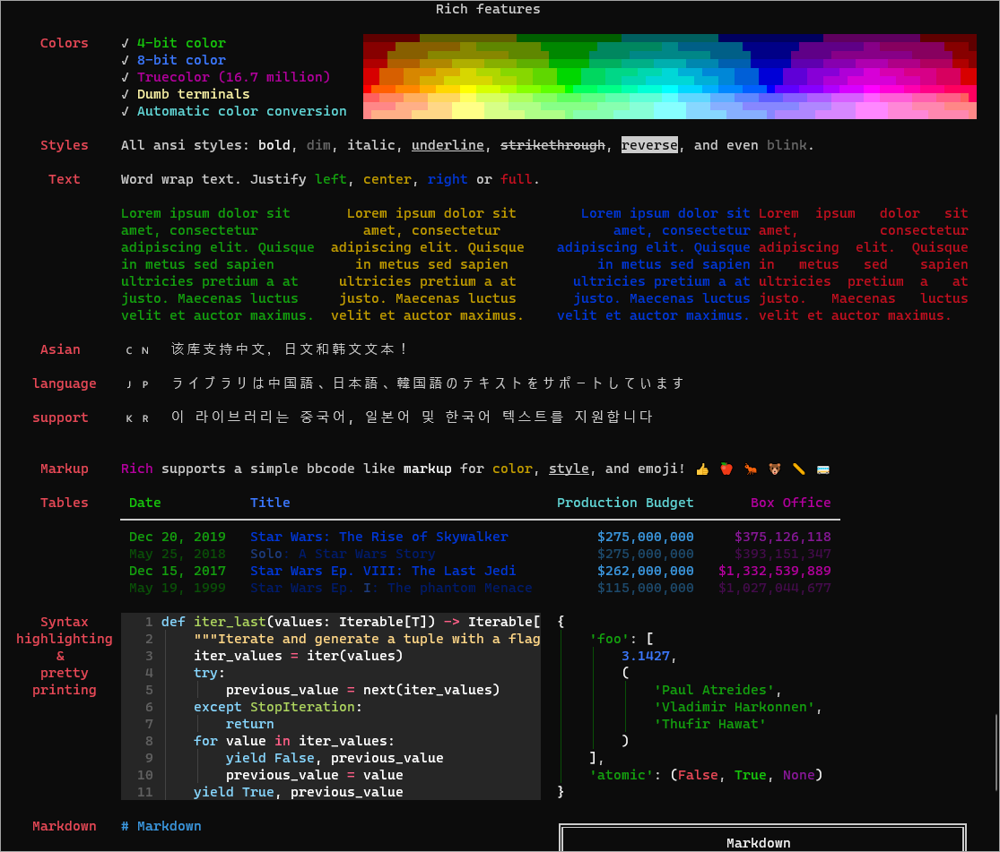
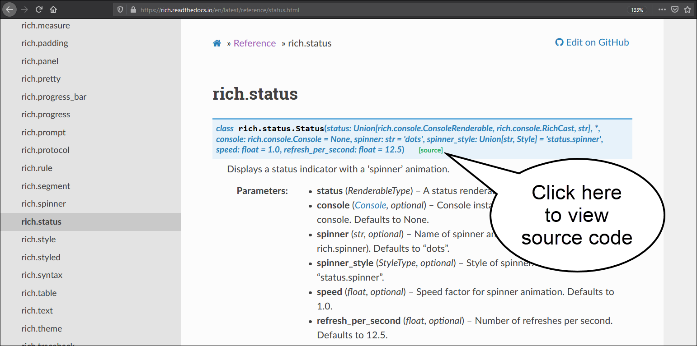
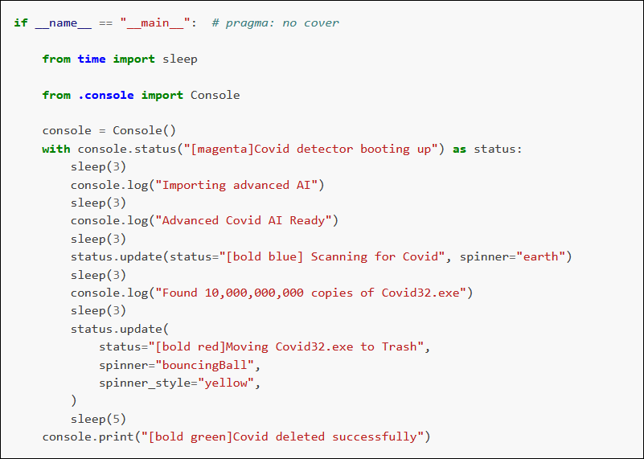

# Using the Python Rich library progress indicators

I recently added a status update indicator to my [*azruntime* application](https://github.com/blinklet/azure-scripts/tree/main/azruntime). If users have a lot of VMs in their subscriptions, the *azruntime* application can take a long time to run. Users will appreciate seeing the status so they know the program is still running and is not hung up.


I used the [Rich library](https://github.com/willmcgugan/rich) to implement a status indicator. I had to learn more about Python context managers to understand how the Rich library's progress bar and status indicators work. The [Rich library's documentation](https://rich.readthedocs.io/en/stable/index.html) is aimed at intermediate-to-advanced programmers and the Rich tutorials I found on the web did not cover using the Rich library's spinners and status updates.

In this post, I will share what I learned while figuring out how to add a status indicator to my program and show you how to implement the same in your projects.

<!--more-->

# Rich library overview

The Rich library makes it easy to add color and style to terminal output. Rich can also render pretty tables, progress bars, markdown, syntax highlighted source code, tracebacks, and more. ((From the [Rich GitHub README](https://github.com/willmcgugan/rich) page, accessed March 2, 2021)) 

This post focuses only on creating a progress indicator. To learn more about what Rich can do for you, I encourage you to read one of the excellent Rich overiews available on the Internet. I list a few below:

* [Python Rich - The BEST way to add Colors, Emojis, Tables and More (video)](https://www.youtube.com/watch?v=JrGFQp9njas)
* [Building Rich Console Interfaces in Python](https://medium.com/trabe/building-rich-console-interfaces-in-python-16338cc30eaa)

Another way to see how Rich can improve text output in your Python console applications is to run the sample code provided by teh Rich package. Run the following to see most of what Rich can do:

```
(env) $ pip install rich
(env) $ python -m rich
```

This will output a sample screen, as shown below:



## Finding Rich sample code

The Rich project provides sample code for all its features. I found that the sample code was the best way to understand how to use each feature. First, I run the sample code to see what the output looks like. Then I open the file and look at the code.

All the Rich library modules are listed in the Rich library documentation's [Reference section](https://rich.readthedocs.io/en/stable/reference.html). 

Run the sample code by running the module. For example, I was looking for a way to create a status update. I saw the module named *rich.update* and decided to try it. I ran the command:

```
(env) $ python -m rich.status
```

I saw that part of the output looks like the kind of status updates I wanted. See the output below: 


I saw a spinner icon next to some text that changes as the program runs. Next, I clicked on the [rich.status module](https://rich.readthedocs.io/en/latest/reference/status.html) on the Rich documentation's References page. I saw the usage information. To see example in the source code, I clicked on the source code link, as shown below:



In the module's source code, I scrolled to the bottom to find the test code in the *if \_\_name\_\_ == "\_\_main\_\_":* block. As shown below, I can compare the code with the results I saw when I previously ran the module.



## Implementing the *rich.status* module

After looking at the *rich.status* module's output, it's reference page, and its source code, I now see how I can implement a "spinner"-style status indicator for my *azruntime* application.

I need to first create a console object from the Rich Console class. Then, I create a context manager using the console object's *status* method and set an initial status message in it. Finally, each time I want to change the status message in the running context, I use the *status.update* method.

All this sounds intimidating to a begiining Python developer like me. I am adding this functionality to an existing program and I had never used context managers or the *with* statement before. 

Before I go further, I need  to explain more about Python context managers.

# Python context managers

The Rich library's status module is part of the Console class. It must be implemented using the [*with* statement](https://dbader.org/blog/python-context-managers-and-with-statement), which tells Python to use the context manager code built into the Console class.

[Context managers](https://www.python.org/dev/peps/pep-0343/) are an advanced Python topic that I did not think I would ever have to use because I write simple scripts that use small sets of resources. Also, only a few classes in the Python standard library implement the [context management protocol](https://martinheinz.dev/blog/34). If they want to use contect managers, programmers need to remember which objects provide them. 

When beginning Python programming, network engineers like me may not use the *with* statement because Python eventually closes resources such as files when they are no longer used. However, as network engineers work on more complex Python projects, they will find cases where they need to ensure resources are released as soon as they are no longer used.

To handle these more complex cases, network engineers will use the *with* statement when calling a function that opens a file, a network connection, or a database connection. In those cases, the [context manager built into the called function](https://stackabuse.com/python-context-managers/) will ensure the file or connection is closed if an error occurs or as soon as the code block that used the file or connection is completed.

# Using the *with* statement

Most beginner Python programmers have seen the *with* statement in examples and in tutorials. It is commonly used when [working with files](https://realpython.com/lessons/with-open-pattern/). A typical example is shown below:

```
with open('example.txt','r') as reader:
    print(reader.read())
```

In the above example, the *with* statement calls the *open()* function and assigns the returned object, which is a file object, to a variable named *reader*. The next line prints everything returned by the file object's *read()* method. The context manager code built into the file object closes the *example.txt* file as soon as the last statement in the code block, which in this case is the *print()* function, completes. 

If you do not use the with statement, as shown below, Python will eventually close the *example.txt* file but not necessarily immediately. 

```
reader = open('example.txt','r')
print(reader.read())
```

In the above example, the file object returned by the *open()* function is assigned to a variable named *reader*. The next line prints everything returned by the file object's *read()* method. In this case, the programmer must remember to explicitly close the file using the file object's *close()* method, as shown below.

```
reader.close()
```

If the programmer does not close the file, it remains open until either all remaining code in the script finishes running or the *reader* variable is assigned to another object. Python's garbage collection feature will free up the memory used by the file object and close the file. 

Then the programmer needs to consider what might happen if an error occurs before they close the file. They may need check for errors and close the file using *try/finally* statements but the *with* statement also ensures resources are closed after use or when errors occur, and results in easier-to-read code.

Using the *with* statement has become the "Pythonic" way to open files or other shared resoures like network connections. 


Learning Python, 5th edition, Chapter 33, pp 1152-1156

Rich library

Spinners
(not documented)
Live class
Spinners class
cannot nest

Progress bars 
does not work with generators
track() function in rich.rogress module
https://rich.readthedocs.io/en/latest/progress.html#basic-usage
useful with lists and other iteratables.

Combination bars
add a spinner, status updates and progress bar