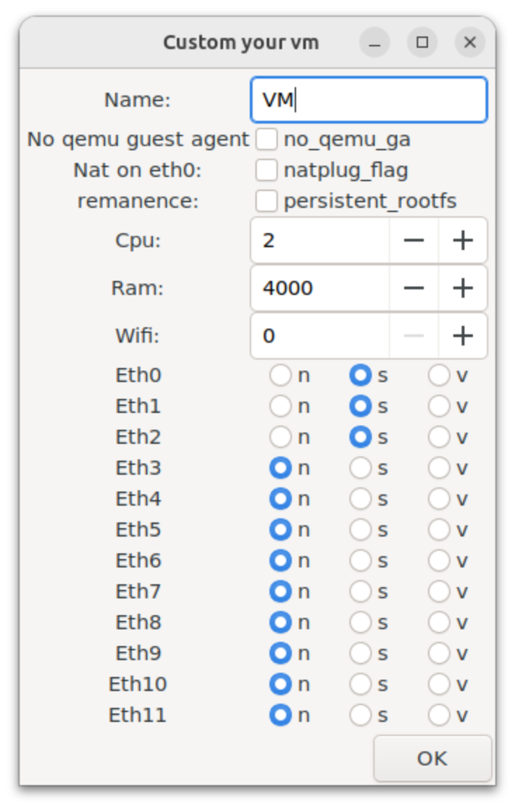
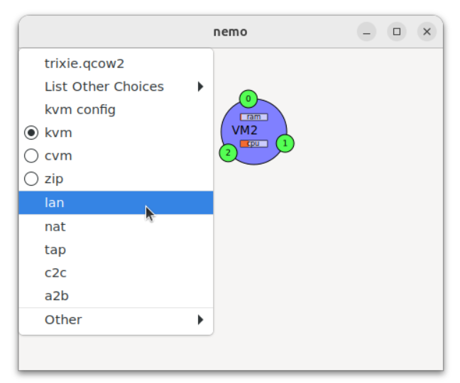
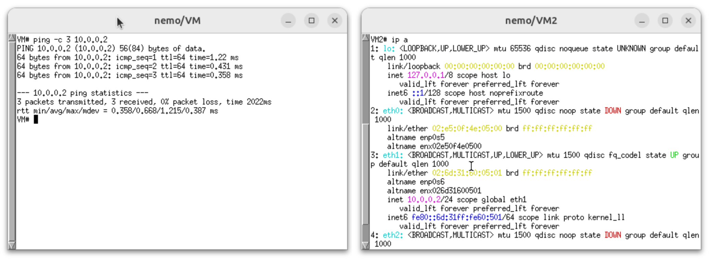
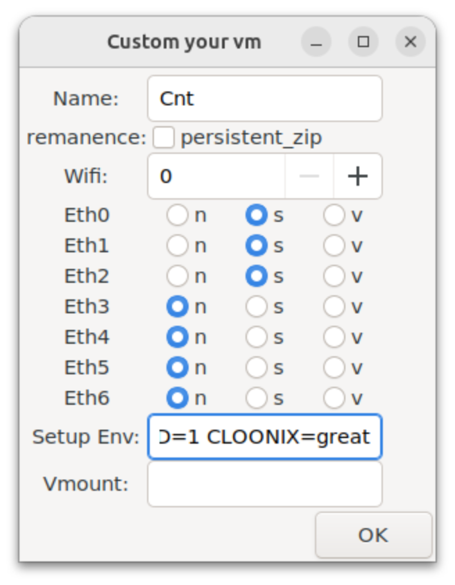
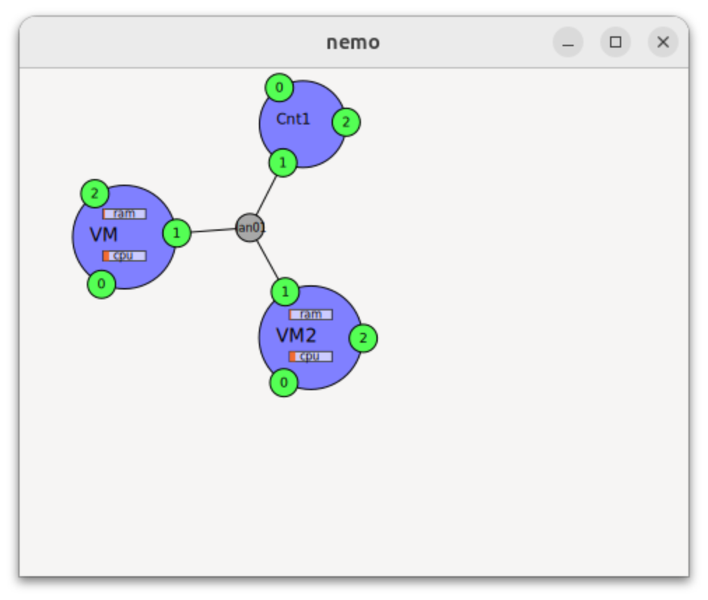
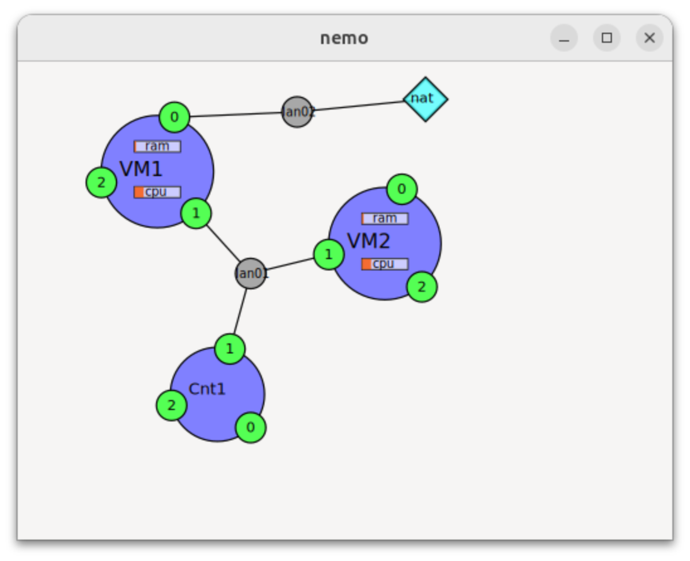

% Cloonix Network Emulator Updated to Version 53

The [Cloonix network emulator](http://clownix.net/) continues to be actively developed. In version 53, it provides container support, a rootless installation option, experimental support for WiFi emulation, and a simplified user experience. 


In this post, I will review Cloonix v53 and walk through some hands-on exercises with the new features.

<!--more-->

## What's New in Cloonix v53

The [Cloonix network emulator](http://clownix.net/) has evolved significantly since I [last wrote about it](https://brianlinkletter.com/tag/cloonix/) in 2017.

I list the major changes, since I last looked at Cloonix, below:

### Container Support

One of the most significant additions is native container support, using [crun](https://github.com/containers/crun). Cloonix feature support for containers is, however, limited. For example, one cannot save a container's filesystem and containers do not support Spice connections so they can't run a desktop environment.

Cloonix containers start faster and use fewer resources than KVM virtual machines, or even Docker containers, making them ideal for scenarios where you need many lightweight nodes. I imagine containers in Cloonix will be used to create many clients in a network simulation scenario.

Cloonix continues to support virtual machines using qemu-kvm, and you can mix containers and KVM VMs in the same Cloonix topology.

### Rootless Installation Option

Cloonix v53 introduces a "cloonix-toy" installation that runs entirely in user space without requiring root privileges. This is particularly useful for quick evaluations without modifying the host system or for using Cloonix on systems where you don't have administrator access.

The rootless "cloonix-toy" version uses a container to isolate Cloonix from the host system while still providing full functionality. 

In this post, I cover the full installation. I'll cover the rootless "cloonix-toy" version in a future post.

### WiFi Emulation

Cloonix v53 adds WiFi emulation support on qemu-kvm virtual machines using [vwifi](https://github.com/Raizo62/vwifi). This allows you to create wireless network scenarios in Cloonix. WiFi emulation is an experimental feature in Cloonix v53.

### Web Interface

Cloonix now includes a web interface built with [noVNC](https://github.com/novnc/noVNC) that allows you to access the Cloonix GUI from a web browser. This is useful for remote access or when running Cloonix on a headless server.

## Installing Cloonix

Before installing Cloonix, ensure your system meets the requirements. The following procedures were tested on my laptop running Ubuntu 24.04:

### Hardware Virtualization

Cloonix uses KVM for virtual machines. Check that your CPU supports hardware virtualization:

```bash
$ egrep -c '(vmx|svm)' /proc/cpuinfo
```

If the result is greater than zero, your CPU supports virtualization. If not, you may need to enable it in your BIOS settings.

### Install virtualization tools

Cloonix uses _qemu-kvm_ and other virtualization tools that are not installed by default in the Ubuntu Desktop system. Install virtualization tools with the commands:

```bash
$ sudo apt update
$ sudo apt install -y qemu-kvm \
                      libvirt-daemon-system \
                      libvirt-clients \
                      bridge-utils \
                      virt-manager
```

Installing the virtualization tools should also set up your PC to support the virtualization features required by Cloonix. If virtualization is not enabled, read the Cloonix documentation to see the steps required to [enable virtualization for your Linux PC](https://clownix.net/doc_stored/build-53/singlehtml/index.html#host-system-required-customisation).

### Install the _mac80211_hwsim_ kernel module

The _mac80211_hwsim_ is used in WiFi simulation scenarios. Check that the _mac80211_hwsim_ kernel module is installed:

```bash
$ lsmod | grep mac80211_hwsim
```

If it is not installed, install it with the command:

```bash
$ sudo modprobe mac80211_hwsim
```

### Cloonix Full Installation (Recommended)

The full installation procedure is shown below:

```bash
$ cd
$ wget http://clownix.net/downloads/cloonix-53/cloonix-bundle-53.tar.gz
$ tar xvf cloonix-bundle-53.tar.gz
$ rm cloonix-bundle-53.tar.gz
$ cd cloonix-bundle-53
$ sudo ./install_cloonfs
```

This installs Cloonix to the following directories:

* `/usr/bin/cloonix_*` — User interface scripts
* `/usr/libexec/cloonix` — Binaries and libraries
* `/var/lib/cloonix` — Storage for VM images

Removing Cloonix from your system is easy; you just delete the directories that the Cloonix install script created. See the Cloonix documentation for more details about [uninstalling Cloonix](https://clownix.net/doc_stored/build-53/singlehtml/index.html#howto-erase-cloonix-from-host). 

### Guest filesystems

Before you can use Cloonix, you need to have filesystems installed in the _/var/lib/cloonix/bulk_ directory.

Download guest filesystem images in KVM and container formats. Cloonix offers different systems in their website's [downloads page for Cloonix v53](https://clownix.net/downloads/cloonix-53/bulk/). I chose to use the images based on Debian 13 "Trixie".

```bash
$ cd /var/lib/cloonix/bulk
$ wget http://clownix.net/downloads/cloonix-53/bulk/trixie.qcow2.gz
$ gunzip trixie.qcow2.gz
$ wget https://clownix.net/downloads/cloonix-53/bulk/trixie_gnome.qcow2.gz
$ gunzip trixie_gnome.qcow2.gz
$ wget http://clownix.net/downloads/cloonix-53/bulk/trixie.zip
$ wget http://clownix.net/downloads/cloonix-53/bulk/trixie.tar.gz
$ tar zxvf trixie.tar.gz
$ rm trixie.tar.gz
```

Cloonix filesystems are based on standard Linux distributions, with _[qemu-guest-agent](https://wiki.qemu.org/Features/GuestAgent)_ and _cloonix-agent_ pre-installed.


### Fix AppArmor settings (Ubuntu)

I run Ubuntu 24.04 and ran into an [AppArmor problem with Cloonix](https://clownix.net/doc_stored/build-53/html/doc/system.html#qemu-guest-agent) because Ubuntu restricts unprivileged user namespaces by default.

To see if you have the same problem, just run the help command:

```bash
$ cloonix_cli nemo help
```

You should see a help screen that displays a list of Cloonix commands. If nothing happens, you probably have a problem with AppArmor and Cloonix.

To verify if AppArmor is a problem, check the kernel ring buffer for "denied" appaarmor operations:

```bash
$ sudo dmesg | grep -i denied
```

If you see messages like the following, then you have the same problem I had:

```text
[   54.172165] audit: type=1400 audit(1767126460.057:244): apparmor="DENIED" operation="capable" class="cap" profile="unprivileged_userns" pid=5282 comm="cloonix-hide-di" capability=21  capname="sys_admin"
```

The AppArmor issue with Cloonix on Ubuntu 24.04 relates to how Cloonix uses unprivileged user namespaces for container isolation. Starting with Ubuntu 23.10 and continuing in 24.04, Ubuntu added a new AppArmor restriction specifically targeting unprivileged user namespaces. This was a security hardening measure because unprivileged user namespaces have historically been a source of privilege escalation vulnerabilities.

To fix this, edit the `/etc/sysctl.conf` file:

```bash
$ sudo nano /etc/sysctl.conf
```

Add the following two lines to the end of the file:

```text
kernel.unprivileged_userns_clone=1
kernel.apparmor_restrict_unprivileged_userns=0
```

Save the file. Then, apply the changes:

```bash
$ sudo sysctl -p
```

These settings reduce some security restrictions on your system. Unprivileged user namespaces can potentially be exploited in container escape or privilege escalation attacks. If you're running Cloonix on a dedicated lab machine or VM, the security trade-off may be acceptable.


## Your First Cloonix v53 Network

To test that the basics of Cloonix are working, let's create a simple network with two virtual machines connected by a LAN.

### Start Cloonix

Start the Cloonix server and GUI:

```bash
$ cloonix_net nemo
```

Remember, you always have to start the Cloonix server before anything else. The "nemo" tag is the name of the Cloonix server. The Cloonix server names and parameters were defined in the [Cloonix configuration file](https://clownix.net/doc_stored/build-53/singlehtml/index.html#cloonix-configuration), which is installed in your system in the file _/usr/libexec/cloonix/cloonfs/etc/cloonix.cfg_.

Then, you can start the Cloonix GUI or issue Cloonix CLI commands. In this exercise, let's start the GUI:

```bash
$ cloonix_gui nemo
```

If you see an error message stating that something _Failed to load module "canberra-gtk-module"_, you can ignore it. It is warning about a module used to generate sound and I don't feel like messing with the audio on my laptop.

### Create Virtual Machines

Before creating VMs, configure the VM settings by right-clicking and selecting *kvm_config*. 


The KVM config you set will be used to create the next virtual machine. If you need virtual mnachines with different configurations, set the config first, then start the virtual machine.

In this example, I will create two VMs with the same configurations, shown below:

- **VM name**: Leave as default or customize. I set it to "VM".
- **RAM**: 4000 MB (adjust based on your system)
- **CPU**: 2
- **eth**: `sss` (three spyable interfaces that can interact with Wireshark)

The config window will look like the screenshot below:



Click _OK_ to accept the configuration.

In the Cloonix GUI, right-click on the canvas to open the menu. Select the *kvm* radio button show the KVM options and select the filesystem _trixie.qcow2_ to start a new virtual machine.


A new VM will appear on the canvas. Repeat the process again to create a second VM.


>**Note:** I noticed that if I changed the name to anything besides "Cloon", Cloonix stops automatically numbering VMs ("Cloon1", "Cloon2", etc.). I had to open the KVM config panel before creating each new VM so I could give it a unique name.

### Create a LAN

Right-click on the canvas and select _lan_ to create a LAN. 



A small circle representing the LAN switch will appear. It is labeled _lan01_.


### Connect VMs to the LAN

Double-click on the LAN object _lan01_. It will turn purple, indicating it's selected for connection. Then click on the _eth1_ port (the small circle labeled "1") on the VM named _VM_. A line will connect the VM's _eth1_ interface to the LAN.

Repeat the process. Double-click on the LAN. Click on _VM2's eth1_ port.

Now both VMs are connected to the same LAN.


### Configure IP Addresses

Double-click on _VM_ to open a terminal window. Configure its network interface:

```text
VM# ip addr add 10.0.0.1/24 dev eth1
VM# ip link set eth1 up
```

Double-click on _VM2_ and configure it:

```text
VM2# ip addr add 10.0.0.2/24 dev eth1
VM2# ip link set eth1 up
```

### Test Connectivity

From _VM_, ping _VM2_:

```text
VM# ping -c 3 10.0.0.2
```

You should see output similar to the screenshot below:



Congratulations! You've created your first Cloonix v53 network. 

You can close both terminal windows by typing `exit` in each.

### SSH to VMs

The terminal windows that open up when you double-click the VM lack some terminal features, like copy-and-paste via keyboard shortcuts. For a better user experience, I suggest that you run Cloonix CLI commands to SSH into any node running on a Cloonix server.

For example, in my PC's terminal application, I can type the Cloonix CLI command to SSH into _VM2_:

```text
$ cloonix_ssh nemo VM2
```

This enables me to interact with _VM2_ in my PC's terminal application.

## Using Containers in Cloonix

To create a Cloonix node based on a container, you must first choose which container type you will use. The "zip" containers are very lightweight but, currently, do not have the option to install packages or save a persistent filesystem. The "cvm" containers are a bit heavier weight, but still lighter and faster than Docker containers, and they allow packages to be installed. In this example, I chose to use the "zip" container type.

Right-click on the Cloonix GUI canvas and click on the _zip_ radio button to activate the container options for crun zip containers. Then, select _zip config_ to configure the next container.


Configure the container. Choose a name for the node that will be created, the number of interfaces, etc.



Then, select the _trixie.zip_ file system to create your container.


Now you have added a node based on a container to your topology. Cloonix shows you it's a container by rendering it as a smaller circle on the canvas.

### Connect the Container

Connect the container to the same LAN as your VMs:

1. Double-click on the existing LAN, _lan01_.
2. Click on the container _Cnt1_'s _eth1_ port.

Now you should see all three nodes connected to the same LAN:



### Access the Container

Double-click on the container to open a shell, or run the following command in your terminal app:

```bash
$ cloonix_ssh nemo Cnt1
```

Configure _Cnt1_'s network:

```text
# ip addr add 10.0.0.3/24 dev eth1
# ip link set eth1 up
```

You now have a mixed environment with both KVM VMs and containers on the same network. Test that the connection work with the command:

```txt
# ping -c 3 10.0.0.1
```

You should see output like:

```txt
PING 10.0.0.1 (10.0.0.1) 56(84) bytes of data.
64 bytes from 10.0.0.1: icmp_seq=1 ttl=64 time=0.508 ms
64 bytes from 10.0.0.1: icmp_seq=2 ttl=64 time=0.319 ms
64 bytes from 10.0.0.1: icmp_seq=3 ttl=64 time=0.827 ms

--- 10.0.0.1 ping statistics ---
3 packets transmitted, 3 received, 0% packet loss, time 2046ms
rtt min/avg/max/mdev = 0.319/0.551/0.827/0.209 ms
Cnt1#
```

Exit the SSH session with the `exit` command.

## Using Wireshark to Capture Traffic

Cloonix includes a customized version of Wireshark for packet capture and analysis.

### Enable Packet Capture

In the Cloonix GUI, look at the _eth1_ port on one of your nodes. If it's green, it's "spyable" and you can capture packets on it.

Double-click on the green _eth1_ port on _Cnt1_. A Wireshark window will open and begin capturing packets.

### Generate Traffic

From _VM2_'s terminal, ping _Cnt1_:

```txt
VM2# ping -c 5 10.0.0.1
```

Watch the Wireshark window — you'll see the ICMP echo request and reply packets.


### Save the Capture

The customized Wireshark in Cloonix v53 is a simplified version. For full analysis capabilities, save the `.pcap` file and open it with a complete Wireshark installation on your host.

First, stop the capture. In Wireshark's menu, go to _Capture_ --> _Stop_. Then, save the .pcap file. 
Go to _File_ --> _Save As_ and choose a location.


## Adding Internet Access with NAT

Cloonix provides a variety of filesystems for use in the Cloonix network simulator. In version 53, these root filesystem only have the most basic software packages installed and will not support advanced network configuration.

To create a network simulation that runs real-world networking software, we need to install new software on the root filesystems we will use in Cloonix. In this example, we chose to start with the Debian Trixie filesystem and we will install some new packages on it as a demonstration.

Let's connect our network to the Internet using Cloonix's NAT component.

### Troubleshooting NAT problems

If you already have Docker installed on your Linux PC, it might cause problems with the Cloonix NAT interface.

The Cloonix developer configured the NAT device to default to using the `172.17.0.0/24` address space. However, this conflicts with the address space `172.17.0.0/16` used by the Docker daemon, if you have Docker installed.

I have Docker installed so I changed the default network space used by Docker to `172.30.0.0/16` and restarted my computer.

#### Docker address space

For my future self, here is the procedure to change the Docker address space:

First, on your host PC, temporarily stop Docker services:

```bash
$ sudo systemctl stop docker.socket
$ sudo systemctl stop docker
```

Next create or edit Docker's _daemon.json_ config file:

```bash
$ sudo nano /etc/docker/daemon.json
```

Set the Docker IP in the file. Add, or edit, the following stanza:

```json
{
  "bip": "172.30.0.1/16"
}
```

Save the file and then start docker again:

```bash
$ sudo systemctl restart docker
```

Now, you should see that the _docker0_ interface uses the `172.30.0.0/16` address space.

```txt
$ ip a show docker0
6: docker0: <NO-CARRIER,BROADCAST,MULTICAST,UP> mtu 1500 qdisc noqueue state DOWN group default 
    link/ether 82:1c:f2:ca:c6:af brd ff:ff:ff:ff:ff:ff
    inet 172.30.0.1/16 brd 172.30.255.255 scope global docker0
       valid_lft forever preferred_lft forever
```

### Create and connect NAT Object

To connect a Cloonix node to a NAT object so it can communicate with the host system and with the Internet, follow the steps below:

* Right-click on the Cloonix GUI canvas and select _nat_. A NAT object will appear.
* Right-click and select _lan_ to create a new LAN (e.g., lan02).
* Double-click on the new LAN to select it
* Click on the NAT object to connect it
* Double-click on the LAN again
* Click on an unused port on _VM1_ (e.g., _eth0_)

You should see that the Cloonix canvas now looks similar to the screenshot below:



### Configure the VM for NAT

On _VM1_, configure the interface connected to the NAT and request an IP address via DHCP. The Cloonix v53 documentation says to use the `dhclient` command but that utility is not installed in the root Trixie filesystem that comes with Cloonix. So, let's set up DHCP manually on _VM1_.

Create a file named after the interface, e.g.:

```text
VM1# nano /etc/network/interfaces.d/eth0
```

In the _eth0_ file, add the following lines:

```txt
auto eth0
iface eth0 inet dhcp
```

Save the file, then bring up the interface:

```text
VM1# ifup eth0
```

The VM _VM1_ should successfully connect with the DHCP server running on the NAT and request an IP address. In my case, it was assigned the IP address, `172.17.0.10/24`.

### Test Internet Connectivity

Try to ping an external host:

```text
VM# ping -c 3 google.com
```

If your host has Internet connectivity, the ping should succeed. In my case, pings failed but I still had Internet connectivity. The NAT object seems to be corrupting ICMP packets. Pinging the NAT interface at `172.17.0.2` will not work, and using Wireshark to check the packets on the _eth1_ interface shows that the ICMP replies from `172.17.0.2` have invalid checksums.

This is a minor issue, because the actual functionality that we need still works. I can download repository info from the Internet and, after installing it, I can use _curl_ to get web page information from the Internet.

#### Get repository updates

I tried running the _apt_ command to update the repository information but the Trixie root file system that comes with Cloonix has only a local mirror configured and, since I am not running a local Debian mirror, it does not work. I had to edit the _/etc/apt/sources.list_ file and add in the Debian repos.

```txt
VM1# nano /etc/apt/sources.list
```

Delete the line that already exists in the file and add in the following line:

```text
deb http://deb.debian.org/debian trixie main contrib non-free
```

Save the file, then update the repository:

```txt
VM1# apt clean
VM1# apt update
```

Install _curl_ on the VM _VM1_:

```text
VM1# apt install curl
```

Now, you can use _curl_ to test other Internet connectivity, like downloading a web page:

```text
VM1# curl https://www.example.com
<!doctype html><html lang="en"><head><title>Example Domain</title><meta name="viewport" content="width=device-width, initial-scale=1"><style>body{background:#eee;width:60vw;margin:15vh auto;font-family:system-ui,sans-serif}h1{font-size:1.5em}div{opacity:0.8}a:link,a:visited{color:#348}</style><body><div><h1>Example Domain</h1><p>This domain is for use in documentation examples without needing permission. Avoid use in operations.<p><a href="https://iana.org/domains/example">Learn more</a></div></body></html>
```

### Configuring containers to connect to NAT

Containers can be connected to the NAT object, the same as VMs. However, in Cloonix v53, both the _cvm_ and _zip_ versions of the Trixie filesystem are designed to be extremely minimal. They do not support DHCP. 

Manually set up an IP address and default route:

```txt
Cnt1# ip addr add 172.17.0.50/24 dev eth0
Cnt1# ip route add default via 172.17.0.2 dev eth0
```

Then, configure the nameserver. Edit the _/etc/resolv.conf_ file:

```txt
Cnt1# vi /etc/resolv.conf
```

Replace the nameserver with:

```txt
nameserver 172.17.0.3
```

Save the file. 

#### Install packages in CVM-type containers

It is not possible to install packages on the _zip_-type containers. But, if you use the _cvm_-type containers, you can install packages. To enable the apt repository, edit the _/etc/apt/sources.list_ file:

```txt
Cvm2# vi /etc/apt/sources.list
```

Delete the existing line, and replace it with:

```txt
deb http://deb.debian.org/debian trixie main contrib non-free
```

Save the file. Now, CVM-type containers can install new packages.

## Using the Command-Line Interface

The `cloonix_cli` command allows you to automate topology creation with scripts. See the Cloonix documentation for CLI commands. You can do everything in the CLI that you can do in the GUI.

I'll cover more about the Cloonix v53 CLI in a future post.

### Stop Cloonix

When finished with a simulation, stop the Cloonix server:

```bash
$ cloonix_cli nemo kil
```

This terminates all VMs, containers, and cleans up resources.

## Running a Demo Script

Cloonix includes demo scripts that create pre-configured network scenarios.

Demo scripts are available on the Cloonix web site. They make good examples of how to build a script that creates a customized simulation scenario.

Let's get the demo scripts so we can use them to play with Cloonix:

```bash
$ cd
$ cd cloonix-bundle-53
$ mkdir demos
$ cd demos
$ wget https://clownix.net/downloads/cloonix-53/demos/eth_cvm.sh
$ wget https://clownix.net/downloads/cloonix-53/demos/eth_kvm.sh
$ wget https://clownix.net/downloads/cloonix-53/demos/eth_zip.sh
$ wget https://clownix.net/downloads/cloonix-53/demos/wpa_cvm.sh
$ wget https://clownix.net/downloads/cloonix-53/demos/wpa_kvm.sh
$ wget https://clownix.net/downloads/cloonix-53/demos/wpa_zip.sh
$ chmod +x *
```

To run a demo script, run the following commands:

```bash
$ cd
$ cd cloonix-bundle-53/demos
$ ./eth_kvm.sh
```

## Conclusion

Cloonix v53 represents the continued evolution of the Cloonix network emulator. The addition of container support and WiFi emulation show the potential to significantly expands its capabilities, as these features are improved in future releases. The simplified installation process and improved user interface make Cloonix more accessible than ever.

Cloonix is actively developed and it continues to be a valuable tool in the network emulation landscape.

## Links

- [Cloonix Website](http://clownix.net/)
- [Cloonix Documentation (v53)](https://clownix.net/doc_stored/build-53/singlehtml/index.html)
- [Cloonix on GitHub](https://github.com/clownix/cloonix)
- [My Previous Cloonix Posts](https://brianlinkletter.com/tag/cloonix/)
