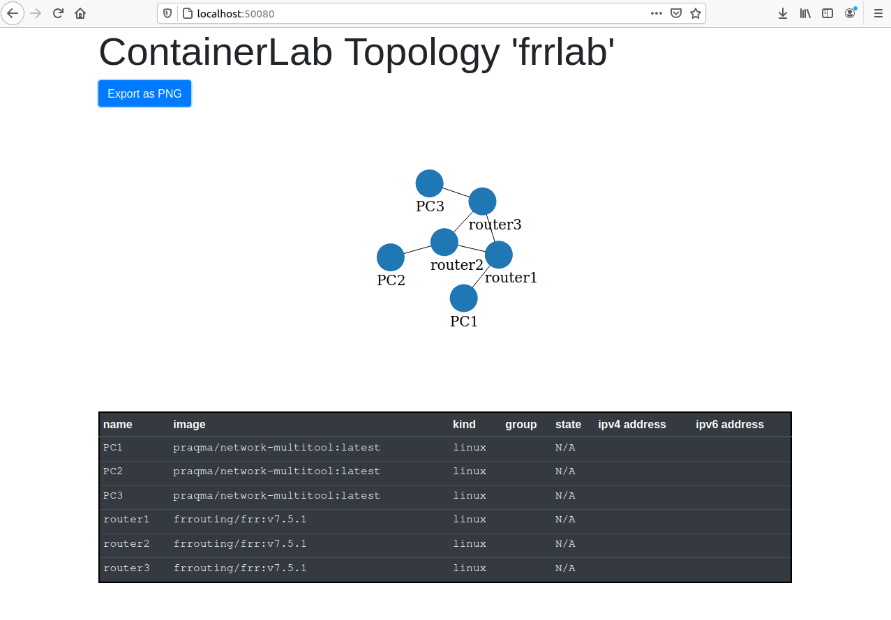

## Prerequisites:

[Install Docker](https://www.digitalocean.com/community/tutorials/how-to-install-and-use-docker-on-ubuntu-20-04)

```
sudo apt install apt-transport-https
sudo apt install ca-certificates
sudo apt install -y curl
sudo apt install -y software-properties-common
curl -fsSL https://download.docker.com/linux/ubuntu/gpg | sudo apt-key add -
sudo add-apt-repository "deb [arch=amd64] https://download.docker.com/linux/ubuntu focal stable"
sudo apt update
apt-cache policy docker-ce
sudo apt install -y docker-ce
```

Create a temporary directory in which to download the Containerlab files

```
mkdir /tmp/containerlab
cd /tmp/containerlab
```


In a web browser, go to the [latest release of Containerlab on GitHub](https://github.com/srl-labs/containerlab/releases/latest) at the following URL:

```
https://github.com/srl-labs/containerlab/releases/latest
```

See latest release (in this example, it is 0.13.0)


Download the latest release binary:

```
wget https://github.com/srl-labs/containerlab/releases/download/v0.13.0/containerlab_0.13.0_Linux_amd64.tar.gz
```

Unpack the archive

```
tar xf containerlab_0.13.0_Linux_amd64.tar.gz
rm containerlab_0.13.0_Linux_amd64.tar.gz
```

Move binary to path

```
sudo mv containerlab /usr/bin/
```

Move examples and templates to */etc/containerlab*.

```
sudo mkdir /etc/containerlab
sudo mv lab-examples /etc/containerlab/
sudo mv templates /etc/containerlab/
```

Test it starts

```
$ sudo containerlab version
```
```                         _                   _       _
                 _        (_)                 | |     | |
 ____ ___  ____ | |_  ____ _ ____   ____  ____| | ____| | _
/ ___) _ \|  _ \|  _)/ _  | |  _ \ / _  )/ ___) |/ _  | || \
( (__| |_|| | | | |_( ( | | | | | ( (/ /| |   | ( ( | | |_) )
\____)___/|_| |_|\___)_||_|_|_| |_|\____)_|   |_|\_||_|____/

version: 0.13.0
 commit: fa230f6
   date: 2021-04-13T17:37:22Z
 source: https://github.com/srl-labs/containerlab
```
 
Create symlink so users can use the "clab" command as a shortcut when using containerlab. This will ensure that any example commands you copy-and-paste from the Containerlab user guide will work.

```
sudo ln -s /usr/bin/containerlab /usr/bin/clab
```

Use the [FRR container from DockerHub](https://hub.docker.com/r/frrouting/frr).

Now, try a sample lab. 

The [topology definition files](https://containerlab.srlinux.dev/manual/topo-def-file/) use a simple YAML syntax. 

The file starts with the name of the lab, followed by the lab topology. The topology consists of nodes and links.

In this example, we will use [FRR](https://hub.docker.com/r/frrouting/frr) containers and [network-multitool](https://hub.docker.com/r/praqma/network-multitool) containers. 

Create a directory for the network emulation scenario's files:

```
$ mkdir -p ~/Documents/frrlab 
$ cd ~/Documents/frrlab
```

Use your favorite text editor to create a file named *frrlab.yml* and add the following text to it:
 
```
name: frrlab

topology:
  nodes:
    router1:
      kind: linux
      image: frrouting/frr:v7.5.1
      binds:
        - router1/daemons:/etc/frr/daemons
    router2:
      kind: linux
      image: frrouting/frr:v7.5.1
      binds:
        - router2/daemons:/etc/frr/daemons
    router3:
      kind: linux
      image: frrouting/frr:v7.5.1
      binds:
        - router3/daemons:/etc/frr/daemons
    PC1:
      kind: linux
      image: praqma/network-multitool:latest
    PC2:
      kind: linux
      image: praqma/network-multitool:latest
    PC3:
      kind: linux
      image: praqma/network-multitool:latest

  links:
    - endpoints: ["router1:eth1", "router2:eth1"]
    - endpoints: ["router1:eth2", "router3:eth1"]
    - endpoints: ["router2:eth2", "router3:eth2"]
    - endpoints: ["PC1:eth1", "router1:eth3"]
    - endpoints: ["PC2:eth1", "router2:eth3"]
    - endpoints: ["PC3:eth1", "router3:eth3"]
```

Since we are using containers from dockerhub, we need to first login to dockerhub.

```
$ sudo docker login
```

Enter your Docker userid and password.

Copy the standard [FRR daemons config file](https://docs.frrouting.org/en/latest/setup.html#daemons-configuration-file) from the FRR documentation to the directory and change zebra, ospfd, and ldpd to "yes".

Make separate directories for each router:

```
$ mkdir router1
$ mkdir router2
$ mkdir router3
```

place a copy of the *daemons* file in each router directory

```
$ vi router1/daemons
```

Paste the text from the standard daemons configuration file, with the zebra, ospfd, and ldpd daemons set to 'yes'.

```
zebra=yes
bgpd=no
ospfd=yes
ospf6d=no
ripd=no
ripngd=no
isisd=no
pimd=no
ldpd=yes
nhrpd=no
eigrpd=no
babeld=no
sharpd=no
staticd=no
pbrd=no
bfdd=no
fabricd=no

vtysh_enable=yes
zebra_options=" -s 90000000 --daemon -A 127.0.0.1"
bgpd_options="   --daemon -A 127.0.0.1"
ospfd_options="  --daemon -A 127.0.0.1"
ospf6d_options=" --daemon -A ::1"
ripd_options="   --daemon -A 127.0.0.1"
ripngd_options=" --daemon -A ::1"
isisd_options="  --daemon -A 127.0.0.1"
pimd_options="  --daemon -A 127.0.0.1"
ldpd_options="  --daemon -A 127.0.0.1"
nhrpd_options="  --daemon -A 127.0.0.1"
eigrpd_options="  --daemon -A 127.0.0.1"
babeld_options="  --daemon -A 127.0.0.1"
sharpd_options="  --daemon -A 127.0.0.1"
staticd_options="  --daemon -A 127.0.0.1"
pbrd_options="  --daemon -A 127.0.0.1"
bfdd_options="  --daemon -A 127.0.0.1"
fabricd_options="  --daemon -A 127.0.0.1"
```

Save the file and copy it to the other router folders

```
$ cp router1/daemons router2/daemons
$ cp router1/daemons router3/daemons
```

Then, run the topology file which will download the docker images used to create the PCs and routers, start containers based on the images and connect them together into a virtual network scenario.

```
$ sudo clab deploy --topo frrlab.yml
```
```
INFO[0000] Parsing & checking topology file: frrlab.yml 
INFO[0000] Pulling docker.io/praqma/network-multitool:latest Docker image 
INFO[0009] Done pulling docker.io/praqma/network-multitool:latest 
INFO[0009] Pulling docker.io/frrouting/frr:v7.5.1 Docker image 
INFO[0032] Done pulling docker.io/frrouting/frr:v7.5.1  
INFO[0032] Creating lab directory: /home/brian/Documents/frrlab/clab-frrlab 
INFO[0032] Creating docker network: Name='clab', IPv4Subnet='172.20.20.0/24', IPv6Subnet='2001:172:20:20::/64', MTU='1500'
INFO[0000] Creating container: router2                  
INFO[0000] Creating container: router1                  
INFO[0000] Creating container: router3                  
INFO[0000] Creating container: PC1                      
INFO[0000] Creating container: PC2                      
INFO[0000] Creating container: PC3                      
INFO[0006] Creating virtual wire: router1:eth2 <--> router3:eth1 
INFO[0006] Creating virtual wire: router2:eth2 <--> router3:eth2 
INFO[0006] Creating virtual wire: PC1:eth1 <--> router1:eth3 
INFO[0006] Creating virtual wire: router1:eth1 <--> router2:eth1 
INFO[0006] Creating virtual wire: PC2:eth1 <--> router2:eth3 
INFO[0006] Creating virtual wire: PC3:eth1 <--> router3:eth3 
INFO[0006] Writing /etc/hosts file                      
+---+---------------------+--------------+---------------------------------+-------+-------+---------+----------------+----------------------+
| # |        Name         | Container ID |              Image              | Kind  | Group |  State  |  IPv4 Address  |     IPv6 Address     |
+---+---------------------+--------------+---------------------------------+-------+-------+---------+----------------+----------------------+
| 1 | clab-frrlab-PC1     | 3be7d5136a58 | praqma/network-multitool:latest | linux |       | running | 172.20.20.4/24 | 2001:172:20:20::4/64 |
| 2 | clab-frrlab-PC2     | 447d4a3fd09d | praqma/network-multitool:latest | linux |       | running | 172.20.20.5/24 | 2001:172:20:20::5/64 |
| 3 | clab-frrlab-PC3     | 146915d85bfe | praqma/network-multitool:latest | linux |       | running | 172.20.20.6/24 | 2001:172:20:20::6/64 |
| 4 | clab-frrlab-router1 | fa4beabef9e4 | frrouting/frr:v7.5.1            | linux |       | running | 172.20.20.2/24 | 2001:172:20:20::2/64 |
| 5 | clab-frrlab-router2 | c65b32cc2b46 | frrouting/frr:v7.5.1            | linux |       | running | 172.20.20.7/24 | 2001:172:20:20::7/64 |
| 6 | clab-frrlab-router3 | c992143448f7 | frrouting/frr:v7.5.1            | linux |       | running | 172.20.20.3/24 | 2001:172:20:20::3/64 |
+---+---------------------+--------------+---------------------------------+-------+-------+---------+----------------+----------------------+
```


Connect to Router1:

```
docker exec -it clab-frrlab-router1 /bin/ash
```

Check out Router1's Linux kernel's view of the network:

```
$ docker exec -it clab-frrlab-router1 /bin/ash
/ # ip link
1: lo: <LOOPBACK,UP,LOWER_UP> mtu 65536 qdisc noqueue state UNKNOWN mode DEFAULT group default qlen 1000
    link/loopback 00:00:00:00:00:00 brd 00:00:00:00:00:00
62: eth0@if63: <BROADCAST,MULTICAST,UP,LOWER_UP> mtu 1500 qdisc noqueue state UP mode DEFAULT group default 
    link/ether 02:42:ac:14:14:02 brd ff:ff:ff:ff:ff:ff link-netnsid 0
75: eth2@if74: <BROADCAST,MULTICAST,UP,LOWER_UP> mtu 65000 qdisc noqueue state UP mode DEFAULT group default 
    link/ether 16:df:15:1d:e7:73 brd ff:ff:ff:ff:ff:ff link-netnsid 3
78: eth3@if79: <BROADCAST,MULTICAST,UP,LOWER_UP> mtu 65000 qdisc noqueue state UP mode DEFAULT group default 
    link/ether 82:0b:77:83:46:42 brd ff:ff:ff:ff:ff:ff link-netnsid 1
81: eth1@if80: <BROADCAST,MULTICAST,UP,LOWER_UP> mtu 65000 qdisc noqueue state UP mode DEFAULT group default 
    link/ether 7a:7b:21:3b:44:e8 brd ff:ff:ff:ff:ff:ff link-netnsid 2
/ #
/ # ip a
1: lo: <LOOPBACK,UP,LOWER_UP> mtu 65536 qdisc noqueue state UNKNOWN group default qlen 1000
    link/loopback 00:00:00:00:00:00 brd 00:00:00:00:00:00
    inet 127.0.0.1/8 scope host lo
       valid_lft forever preferred_lft forever
    inet6 ::1/128 scope host 
       valid_lft forever preferred_lft forever
62: eth0@if63: <BROADCAST,MULTICAST,UP,LOWER_UP> mtu 1500 qdisc noqueue state UP group default 
    link/ether 02:42:ac:14:14:02 brd ff:ff:ff:ff:ff:ff link-netnsid 0
    inet 172.20.20.2/24 brd 172.20.20.255 scope global eth0
       valid_lft forever preferred_lft forever
    inet6 2001:172:20:20::2/64 scope global nodad 
       valid_lft forever preferred_lft forever
    inet6 fe80::42:acff:fe14:1402/64 scope link 
       valid_lft forever preferred_lft forever
75: eth2@if74: <BROADCAST,MULTICAST,UP,LOWER_UP> mtu 65000 qdisc noqueue state UP group default 
    link/ether 16:df:15:1d:e7:73 brd ff:ff:ff:ff:ff:ff link-netnsid 3
    inet6 fe80::14df:15ff:fe1d:e773/64 scope link 
       valid_lft forever preferred_lft forever
78: eth3@if79: <BROADCAST,MULTICAST,UP,LOWER_UP> mtu 65000 qdisc noqueue state UP group default 
    link/ether 82:0b:77:83:46:42 brd ff:ff:ff:ff:ff:ff link-netnsid 1
    inet6 fe80::800b:77ff:fe83:4642/64 scope link 
       valid_lft forever preferred_lft forever
81: eth1@if80: <BROADCAST,MULTICAST,UP,LOWER_UP> mtu 65000 qdisc noqueue state UP group default 
    link/ether 7a:7b:21:3b:44:e8 brd ff:ff:ff:ff:ff:ff link-netnsid 2
    inet6 fe80::787b:21ff:fe3b:44e8/64 scope link 
       valid_lft forever preferred_lft forever
/ #
/ # ip route
default via 172.20.20.1 dev eth0 
172.20.20.0/24 dev eth0 proto kernel scope link src 172.20.20.2
```

We see four interfaces: *eth0* to *eth3*. Only *eth0* is configured with in IPv4 address.
 
Exit the Router1 container

```
/ # exit
$
```

Note: we cannot ssh into these containers. They are based on Alpine Linux so ssh is not enabled.

[Alpine Linux network configuration](https://unix.stackexchange.com/questions/602646/content-of-etc-network-in-alpine-linux-image)


The management network *clab* is managed by docker and assigns IP address to each node's *eth0* interface. BUT the wires between nodes are not managed by docker so do not show up in the `docker network ls` command's output.

```
$ sudo docker network list
NETWORK ID     NAME      DRIVER    SCOPE
5d50bc8c730d   bridge    bridge    local
57578c3a0fad   clab      bridge    local
49df145231ea   host      host      local
dba4309b2c9f   none      null      local
```

And you can see the node container running

```
$ sudo docker ps
CONTAINER ID   IMAGE                             COMMAND                  CREATED          STATUS          PORTS                                  NAMES
29c519c5ecfc   praqma/network-multitool:latest   "/bin/sh /docker-ent…"   18 minutes ago   Up 18 minutes   80/tcp, 443/tcp, 1180/tcp, 11443/tcp   clab-frrlab-PC2
a601e70eae76   praqma/network-multitool:latest   "/bin/sh /docker-ent…"   18 minutes ago   Up 18 minutes   80/tcp, 443/tcp, 1180/tcp, 11443/tcp   clab-frrlab-PC1
c5515cd75c09   frrouting/frr:v7.5.1              "/sbin/tini -- /usr/…"   18 minutes ago   Up 18 minutes                                          clab-frrlab-router2
ded0dc21fa72   frrouting/frr:v7.5.1              "/sbin/tini -- /usr/…"   18 minutes ago   Up 18 minutes                                          clab-frrlab-router3
1444d4914c9e   frrouting/frr:v7.5.1              "/sbin/tini -- /usr/…"   18 minutes ago   Up 18 minutes                                          clab-frrlab-router1
58bae1a87939   praqma/network-multitool:latest   "/bin/sh /docker-ent…"   18 minutes ago   Up 18 minutes   80/tcp, 443/tcp, 1180/tcp, 11443/tcp   clab-frrlab-PC3

```


## Configure nodes


Configure PC1:

```
$ docker exec -it clab-frrlab-PC1 /bin/ash
```
```
ip addr add 192.168.11.2/24 dev eth1
ip route add 192.168.0.0/16 via 192.168.11.1 dev eth1
ip route add 10.10.10.0/24 via 192.168.11.1 dev eth1
exit
```

Configure PC2:

```
$ sudo docker exec -it clab-frrlab-PC2 /bin/ash
```
```
ip addr add 192.168.12.2/24 dev eth1
ip route add 192.168.0.0/16 via 192.168.12.1 dev eth1
ip route add 10.10.10.0/24 via 192.168.12.1 dev eth1
exit
```

Configure PC3:

```
$ sudo docker exec -it clab-frrlab-PC3 /bin/ash
```
```
ip addr add 192.168.13.2/24 dev eth1
ip route add 192.168.0.0/16 via 192.168.13.1 dev eth1
ip route add 10.10.10.0/24 via 192.168.13.1 dev eth1
exit
```


Configure Router1. Connect to *vtysh* on Router1:

```
$ sudo docker exec -it clab-frrlab-router1 vtysh
```
```
configure terminal 
service integrated-vtysh-config
interface eth1
 ip address 192.168.1.1/24
 exit
interface eth2
 ip address 192.168.2.1/24
 exit
interface eth3
 ip address 192.168.11.1/24
 exit
interface lo
 ip address 10.10.10.1/32
 exit
exit
write
exit
```


Configure Router2:

```
$ sudo docker exec -it clab-frrlab-router2 vtysh
```
```
configure terminal 
service integrated-vtysh-config
interface eth1
 ip address 192.168.1.2/24
 exit
interface eth2
 ip address 192.168.3.1/24
 exit
interface eth3
 ip address 192.168.12.1/24
 exit
interface lo
 ip address 10.10.10.2/32
 exit
exit
write
exit
```


Configure Router3:

```
$ sudo docker exec -it clab-frrlab-router3 vtysh
```
```
configure terminal 
service integrated-vtysh-config
interface eth1
 ip address 192.168.2.2/24
 exit
interface eth2
 ip address 192.168.3.2/24
 exit
interface eth3
 ip address 192.168.13.1/24
 exit
interface lo
 ip address 10.10.10.3/32
 exit
exit
write
exit
```

### Some quick tests.

Should be able to ping from PC1 to any IP address configured on router1, but not to interfaces on other nodes.

```
$ sudo docker exec -it clab-frrlab-PC1 /bin/ash
```
```
/ # ping -c1 192.168.11.1
PING 192.168.11.1 (192.168.11.1) 56(84) bytes of data.
64 bytes from 192.168.11.1: icmp_seq=1 ttl=64 time=0.066 ms

--- 192.168.11.1 ping statistics ---
1 packets transmitted, 1 received, 0% packet loss, time 0ms
rtt min/avg/max/mdev = 0.066/0.066/0.066/0.000 ms
/ #
/ # ping -c1 192.168.13.2
PING 192.168.13.2 (192.168.13.2) 56(84) bytes of data.

--- 192.168.13.2 ping statistics ---
1 packets transmitted, 0 received, 100% packet loss, time 0ms

/ # 
/ # exit
```

### Add OSPF

Connect to *vtysh* on Router1:

```
$ sudo docker exec -it clab-frrlab-router1 vtysh
```
```
configure terminal 
router ospf
 passive-interface eth3
 passive-interface lo
 network 192.168.1.0/24 area 0.0.0.0
 network 192.168.2.0/24 area 0.0.0.0
 network 192.168.11.0/24 area 0.0.0.0
 exit
exit
write
exit
```


Connect to *vtysh* on Router2:

```
$ sudo docker exec -it clab-frrlab-router2 vtysh
```
```
configure terminal 
router ospf
 passive-interface eth3
 network 192.168.1.0/24 area 0.0.0.0
 network 192.168.3.0/24 area 0.0.0.0
 network 192.168.12.0/24 area 0.0.0.0
 exit
exit
write
exit
```

Connect to *vtysh* on Router3:

```
$ sudo docker exec -it clab-frrlab-router3 vtysh
```
```
configure terminal 
router ospf
 passive-interface eth3
 network 192.168.2.0/24 area 0.0.0.0
 network 192.168.3.0/24 area 0.0.0.0
 network 192.168.13.0/24 area 0.0.0.0
 exit
exit
write
exit
```

### OSPF testing

Now, PC1 should be able to ping any interface on any network node

```
$ sudo docker exec -it clab-frrlab-PC1 /bin/ash
```
```
/ # ping -c1 192.168.13.2
PING 192.168.13.2 (192.168.13.2) 56(84) bytes of data.
64 bytes from 192.168.13.2: icmp_seq=1 ttl=62 time=0.127 ms

--- 192.168.13.2 ping statistics ---
1 packets transmitted, 1 received, 0% packet loss, time 0ms
rtt min/avg/max/mdev = 0.127/0.127/0.127/0.000 ms
/ # 
/ # traceroute 192.168.13.2
traceroute to 192.168.13.2 (192.168.13.2), 30 hops max, 46 byte packets
 1  192.168.11.1 (192.168.11.1)  0.004 ms  0.005 ms  0.004 ms
 2  192.168.2.2 (192.168.2.2)  0.004 ms  0.005 ms  0.005 ms
 3  192.168.13.2 (192.168.13.2)  0.004 ms  0.007 ms  0.004 ms
/ # 
/ # exit
```

### network defect introduction

Now see impact if the link between R1 and R3 goes down. 

But how to bring down a link in Containerlab's network topology? Containerlab does not offer any simple abstractions for managing link status. 

Currently, there is no function in containerlab that allows the user to control the network connections between nodes. So you cannot disable a link or introduce link errors using containerlab commands.

Docker does not manage the Containerlab links between nodes so we cannot use Docker network commands to disable a link.

We need to use the native Linux networking commands to manage the links.

One simple way is to log into a node and shut down a link on the node. For example, to shut off *eth2* on Router1:

```
$ sudo docker exec -it clab-frrlab-router1 /bin/ash
```
```
/ # ip link set dev eth2 down
/ # exit
```

Then login to PC1 and see how the traceroute to PC3 changes:

```
$ sudo docker exec -it clab-frrlab-PC1 /bin/ash
```
```
/ # traceroute 192.168.13.2
traceroute to 192.168.13.2 (192.168.13.2), 30 hops max, 46 byte packets
 1  192.168.11.1 (192.168.11.1)  0.005 ms  0.004 ms  0.004 ms
 2  192.168.1.2 (192.168.1.2)  0.005 ms  0.004 ms  0.002 ms
 3  192.168.3.2 (192.168.3.2)  0.002 ms  0.005 ms  0.002 ms
 4  192.168.13.2 (192.168.13.2)  0.002 ms  0.007 ms  0.011 ms
/ # exit
```

Then, restore the link on Router1:

```
$ sudo docker exec -it clab-frrlab-router1 /bin/ash
```
```
/ # ip link set dev eth2 up
/ # exit
```
```
$ sudo docker exec -it clab-frrlab-PC1 /bin/ash
```

And see that the traceroute between PC1 and PC3 goes back to its orogonal path.

```
/ # traceroute 192.168.13.2
traceroute to 192.168.13.2 (192.168.13.2), 30 hops max, 46 byte packets
 1  192.168.11.1 (192.168.11.1)  0.004 ms  0.005 ms  0.003 ms
 2  192.168.2.2 (192.168.2.2)  0.004 ms  0.004 ms  0.002 ms
 3  192.168.13.2 (192.168.13.2)  0.002 ms  0.005 ms  0.003 ms
```

Links can also be managed from the host. [Containerlab links are composed of pairs of *veth* interfaces](https://containerlab.srlinux.dev/manual/wireshark/) which are managed in each node's network namespaces.

Each node is in its own network namespace which is named the same as its container name. To bring down a link on Router1 we first list all the links in the namespace, *clab-frrlab-router1*


```
$ sudo ip netns exec clab-frrlab-router1 ip link
1: lo: <LOOPBACK,UP,LOWER_UP> mtu 65536 qdisc noqueue state UNKNOWN mode DEFAULT group default qlen 1000
    link/loopback 00:00:00:00:00:00 brd 00:00:00:00:00:00
91: eth0@if92: <BROADCAST,MULTICAST,UP,LOWER_UP> mtu 1500 qdisc noqueue state UP mode DEFAULT group default 
    link/ether 02:42:ac:14:14:02 brd ff:ff:ff:ff:ff:ff link-netnsid 0
106: eth2@if105: <BROADCAST,MULTICAST,UP,LOWER_UP> mtu 65000 qdisc noqueue state UP mode DEFAULT group default 
    link/ether 16:36:c6:ca:4e:77 brd ff:ff:ff:ff:ff:ff link-netns clab-frrlab-router3
107: eth3@if108: <BROADCAST,MULTICAST,UP,LOWER_UP> mtu 65000 qdisc noqueue state UP mode DEFAULT group default 
    link/ether f2:4e:6d:f5:e9:01 brd ff:ff:ff:ff:ff:ff link-netns clab-frrlab-PC1
114: eth1@if113: <BROADCAST,MULTICAST,UP,LOWER_UP> mtu 65000 qdisc noqueue state UP mode DEFAULT group default 
    link/ether 42:ca:0d:5c:15:3c brd ff:ff:ff:ff:ff:ff link-netns clab-frrlab-router2
$
```

We see device *eth2* is attached to the network namespace *clab-frrlab-router1*. To bring down the device *eth2* in *clab-frrlab-router1* run the following command:

```
$ sudo ip netns exec clab-frrlab-router1 ip link set dev eth2 down
```

Then connect to PC1 and see the results. We see the traceroute from PC1 to PC3 now passes through Router1, Router2, and Router3 just like it did when we disabled Router2's *eth2* link from inside teh conbtainer.

```
$ sudo docker exec -it clab-frrlab-PC1 /bin/ash
```
```
/ # traceroute 192.168.13.2
traceroute to 192.168.13.2 (192.168.13.2), 30 hops max, 46 byte packets
 1  192.168.11.1 (192.168.11.1)  0.007 ms  0.006 ms  0.005 ms
 2  192.168.1.2 (192.168.1.2)  0.006 ms  0.009 ms  0.006 ms
 3  192.168.3.2 (192.168.3.2)  0.005 ms  0.008 ms  0.004 ms
 4  192.168.13.2 (192.168.13.2)  0.004 ms  0.007 ms  0.004 ms
/ # exit
```

Then, bring the device back up...

```
$ sudo ip netns exec clab-frrlab-router1 ip link set dev eth2 up
```

Then connect to PC1 again:

```
$ sudo docker exec -it clab-frrlab-PC1 /bin/ash
```

And see that the traceroute from PC1 to PC3 goes back to the normal route, passing through Router1 and Router3.


```
/ # traceroute 192.168.13.2
traceroute to 192.168.13.2 (192.168.13.2), 30 hops max, 46 byte packets
 1  192.168.11.1 (192.168.11.1)  0.008 ms  0.006 ms  0.003 ms
 2  192.168.3.2 (192.168.3.2)  0.005 ms  0.008 ms  0.005 ms
 3  192.168.13.2 (192.168.13.2)  0.005 ms  0.006 ms  0.005 ms
/ # 
```

So, we see we can impact network behavior using ip commands on the host system. 


### Persistent configuration


Containerlab does not save the configuration files for Linux containers. It will [save configuration files for some other kinds of nodes](https://containerlab.srlinux.dev/manual/conf-artifacts/), such as the [Nokia SR linux](https://containerlab.srlinux.dev/manual/kinds/srl/) kind.

So, users who build labs from Linux containers must reconfigure the lab every time it is restarted or must bind configuration files that have hard-coded configurations to each container.

For example, the *network-multitool* containers are based on Alpine Linux so their network configuration is defined in the file */etc/network/interfaces*. The routers are based on FRR, which uses the configuration files */etc/frr/deamons* and *etc/frr/frr.conf*.


#### PC1:

The PC1 network configuration file should be stored in a subfolder named *PC1*. Create the folder and then edit the *interfaces* file:

```
$ mkdir pc1
$ vi pc1/interfaces
```

Paste the following text into the *pc1/interfaces*

```
#/etc/network/interfaces
auto eth1
iface eth1 inet static
   address 192.168.11.2/24
up route add -net 192.168.0.0/16 gw 192.168.11.1 dev eth1
up route add 1-net 10.10.10.0/24 gw 192.168.11.1 dev eth1
```

Save the file.


#### PC2:

Do the same for PC2:

```
$ mkdir pc2
$ vi pc2/interfaces
```

Paste the following text into the *pc2/interfaces*

```
#/etc/network/interfaces
auto eth1
iface eth1 inet static
   address 192.168.12.2/24
up route add -net 192.168.0.0/16 gw 192.168.12.1 dev eth1
up route add 1-net 10.10.10.0/24 gw 192.168.12.1 dev eth1
```

#### PC3:

Do the same for PC2:

```
$ mkdir pc3
$ vi pc3/interfaces
```

Paste the following text into the *pc3/interfaces*

```
#/etc/network/interfaces
auto eth1
iface eth1 inet static
   address 192.168.13.2/24
up route add -net 192.168.0.0/16 gw 192.168.13.1 dev eth1
up route add 1-net 10.10.10.0/24 gw 192.168.13.1 dev eth1
```


#### Router1:

router1/frr.conf

```
frr version 7.5.1_git
frr defaults traditional
hostname router1
no ipv6 forwarding
!
interface eth1
 ip address 192.168.1.1/24
!
interface eth2
 ip address 192.168.2.1/24
!
interface eth3
 ip address 192.168.11.1/24
!
interface lo
 ip address 10.10.10.1/32
!
router ospf
 passive-interface eth3
 network 192.168.1.0/24 area 0.0.0.0
 network 192.168.2.0/24 area 0.0.0.0
 network 192.168.11.0/24 area 0.0.0.0
!
line vty
!

```

#### Router2:

router2/frr.conf

```
frr version 7.5.1_git
frr defaults traditional
hostname router2
no ipv6 forwarding
!
interface eth1
 ip address 192.168.1.2/24
!
interface eth2
 ip address 192.168.3.1/24
!
interface eth3
 ip address 192.168.12.1/24
!
interface lo
 ip address 10.10.10.2/32
!
router ospf
 passive-interface eth3
 network 192.168.1.0/24 area 0.0.0.0

 network 192.168.3.0/24 area 0.0.0.0
 network 192.168.12.0/24 area 0.0.0.0
!
line vty
!
```

#### Router3:

router3/frr.conf


```

frr version 7.5.1_git
frr defaults traditional
hostname router3
no ipv6 forwarding
!
interface eth1
 ip address 192.168.2.2/24
!
interface eth2
 ip address 192.168.3.2/24
!
interface eth3
 ip address 192.168.13.1/24
!
interface lo
 ip address 10.10.10.3/32
!
router ospf
 passive-interface eth3
 network 192.168.2.0/24 area 0.0.0.0
 network 192.168.3.0/24 area 0.0.0.0
 network 192.168.13.0/24 area 0.0.0.0
!
line vty
!
```


### Get lab info

You can get some information about the lab using the *inspect* and *graph* functions.


```
$ sudo containerlab inspect --name frrlab
+---+-----------------+----------+---------------------+--------------+---------------------------------+-------+-------+---------+----------------+----------------------+
| # |    Topo Path    | Lab Name |        Name         | Container ID |              Image              | Kind  | Group |  State  |  IPv4 Address  |     IPv6 Address     |
+---+-----------------+----------+---------------------+--------------+---------------------------------+-------+-------+---------+----------------+----------------------+
| 1 | frrlab.clab.yml | frrlab   | clab-frrlab-PC1     | 02eea96ab0f0 | praqma/network-multitool:latest | linux |       | running | 172.20.20.4/24 | 2001:172:20:20::4/64 |
| 2 |                 |          | clab-frrlab-PC2     | 9987d5ac6bd9 | praqma/network-multitool:latest | linux |       | running | 172.20.20.6/24 | 2001:172:20:20::6/64 |
| 3 |                 |          | clab-frrlab-PC3     | 66c24d270c1a | praqma/network-multitool:latest | linux |       | running | 172.20.20.7/24 | 2001:172:20:20::7/64 |
| 4 |                 |          | clab-frrlab-router1 | 4936f56d28b2 | frrouting/frr:v7.5.1            | linux |       | running | 172.20.20.2/24 | 2001:172:20:20::2/64 |
| 5 |                 |          | clab-frrlab-router2 | 610563b7052a | frrouting/frr:v7.5.1            | linux |       | running | 172.20.20.3/24 | 2001:172:20:20::3/64 |
| 6 |                 |          | clab-frrlab-router3 | 9f501e040a65 | frrouting/frr:v7.5.1            | linux |       | running | 172.20.20.5/24 | 2001:172:20:20::5/64 |
+---+-----------------+----------+---------------------+--------------+---------------------------------+-------+-------+---------+----------------+----------------------+
```

The graph function, however, does not appear to work


Run:

```
$ sudo containerlab graph
```


Then point browser to URL: `https://localhost:50080`

No image. Did not detect running lab and render it.


```
$ sudo clab graph --offline --topo frrlab.clab.yml
```

Gives picture below:



But, because it is not based on a running lab, it does not show the IP addresses


### Stopping individual nodes create problems

I stopped and then started a node PC1 with `docker stop clab-frrlab-PC1` and `docker start clab-frrlab-PC1`. The link between PC1 and Router1 disappeared. 


I think stopping the container causes the attached veth to disconnect.


Create link again with:

```
$ sudo containerlab tools veth create -a clab-frrlab-PC1:eth1 -b clab-frrlab-router1:eth3
```

Then, reconfigure the IP address on PC1 (Router1 does not lose its configuration because it is was not stopped)

```
$ sudo docker exec -it clab-frrlab-PC1 /bin/ash
```
```
ip addr add 192.168.11.2/24 dev eth1
exit
```


There's no clab command for stopping and starting individual nodes.

How to pre-configure the PC network? Maybe bind a copy of */etc/network/interfaces* in the topology file?


Experiment:

Base state of PC1 and Router1

```
$ sudo ip netns exec clab-frrlab-PC1 ip link
1: lo: <LOOPBACK,UP,LOWER_UP> mtu 65536 qdisc noqueue state UNKNOWN mode DEFAULT group default qlen 1000
    link/loopback 00:00:00:00:00:00 brd 00:00:00:00:00:00
95: eth0@if96: <BROADCAST,MULTICAST,UP,LOWER_UP> mtu 1500 qdisc noqueue state UP mode DEFAULT group default 
    link/ether 02:42:ac:14:14:04 brd ff:ff:ff:ff:ff:ff link-netnsid 0
108: eth1@if107: <BROADCAST,MULTICAST,UP,LOWER_UP> mtu 65000 qdisc noqueue state UP mode DEFAULT group default 
    link/ether ca:66:10:68:80:cf brd ff:ff:ff:ff:ff:ff link-netns clab-frrlab-router1

$ sudo ip netns exec clab-frrlab-router1 ip link
1: lo: <LOOPBACK,UP,LOWER_UP> mtu 65536 qdisc noqueue state UNKNOWN mode DEFAULT group default qlen 1000
    link/loopback 00:00:00:00:00:00 brd 00:00:00:00:00:00
91: eth0@if92: <BROADCAST,MULTICAST,UP,LOWER_UP> mtu 1500 qdisc noqueue state UP mode DEFAULT group default 
    link/ether 02:42:ac:14:14:02 brd ff:ff:ff:ff:ff:ff link-netnsid 0
106: eth2@if105: <BROADCAST,MULTICAST,UP,LOWER_UP> mtu 65000 qdisc noqueue state UP mode DEFAULT group default 
    link/ether 16:36:c6:ca:4e:77 brd ff:ff:ff:ff:ff:ff link-netns clab-frrlab-router3
107: eth3@if108: <BROADCAST,MULTICAST,UP,LOWER_UP> mtu 65000 qdisc noqueue state UP mode DEFAULT group default 
    link/ether f2:4e:6d:f5:e9:01 brd ff:ff:ff:ff:ff:ff link-netns clab-frrlab-PC1
114: eth1@if113: <BROADCAST,MULTICAST,UP,LOWER_UP> mtu 65000 qdisc noqueue state UP mode DEFAULT group default 
    link/ether 42:ca:0d:5c:15:3c brd ff:ff:ff:ff:ff:ff link-netns clab-frrlab-router2
```

Stop PC1 container

```
$ sudo docker stop clab-frrlab-PC1
```

Then check links

```
$ sudo ip netns exec clab-frrlab-PC1 ip link
Cannot open network namespace "clab-frrlab-PC1": No such file or directory
$
$ sudo ip netns exec clab-frrlab-router1 ip link
1: lo: <LOOPBACK,UP,LOWER_UP> mtu 65536 qdisc noqueue state UNKNOWN mode DEFAULT group default qlen 1000
    link/loopback 00:00:00:00:00:00 brd 00:00:00:00:00:00
91: eth0@if92: <BROADCAST,MULTICAST,UP,LOWER_UP> mtu 1500 qdisc noqueue state UP mode DEFAULT group default 
    link/ether 02:42:ac:14:14:02 brd ff:ff:ff:ff:ff:ff link-netnsid 0
106: eth2@if105: <BROADCAST,MULTICAST,UP,LOWER_UP> mtu 65000 qdisc noqueue state UP mode DEFAULT group default 
    link/ether 16:36:c6:ca:4e:77 brd ff:ff:ff:ff:ff:ff link-netns clab-frrlab-router3
114: eth1@if113: <BROADCAST,MULTICAST,UP,LOWER_UP> mtu 65000 qdisc noqueue state UP mode DEFAULT group default 
    link/ether 42:ca:0d:5c:15:3c brd ff:ff:ff:ff:ff:ff link-netns clab-frrlab-router2
```

I see eth3 is gone also on Router 1

Restart PC1 container

```
$ sudo docker start clab-frrlab-PC1
```
Then check links


```
$ sudo ip netns exec clab-frrlab-router1 ip link
1: lo: <LOOPBACK,UP,LOWER_UP> mtu 65536 qdisc noqueue state UNKNOWN mode DEFAULT group default qlen 1000
    link/loopback 00:00:00:00:00:00 brd 00:00:00:00:00:00
91: eth0@if92: <BROADCAST,MULTICAST,UP,LOWER_UP> mtu 1500 qdisc noqueue state UP mode DEFAULT group default 
    link/ether 02:42:ac:14:14:02 brd ff:ff:ff:ff:ff:ff link-netnsid 0
106: eth2@if105: <BROADCAST,MULTICAST,UP,LOWER_UP> mtu 65000 qdisc noqueue state UP mode DEFAULT group default 
    link/ether 16:36:c6:ca:4e:77 brd ff:ff:ff:ff:ff:ff link-netns clab-frrlab-router3
114: eth1@if113: <BROADCAST,MULTICAST,UP,LOWER_UP> mtu 65000 qdisc noqueue state UP mode DEFAULT group default 
    link/ether 42:ca:0d:5c:15:3c brd ff:ff:ff:ff:ff:ff link-netns clab-frrlab-router2
$
$ sudo ip netns exec clab-frrlab-PC1 ip link
Cannot open network namespace "clab-frrlab-PC1": No such file or directory
```

Hmmm. No namespace for PC1...

Create link again with:

```
$ sudo containerlab tools veth create -a clab-frrlab-PC1:eth1 -b clab-frrlab-router1:eth3
INFO[0000] Creating virtual wire: clab-frrlab-PC1:eth1 <--> clab-frrlab-router1:eth3 
INFO[0000] veth interface successfully created!         
$
$ sudo ip netns exec clab-frrlab-PC1 ip link
Cannot open network namespace "clab-frrlab-PC1": No such file or directory
```

Then, when I reconfigure  eth1 on PC1 (remember the FRR config still existed on Router1 so I did not need to reconfigure that side), the connection works...

```
$ sudo docker exec -it clab-frrlab-PC1 /bin/ash
```
```
/ # ip addr add 192.168.11.2/24 dev eth1
/ # ip route add 192.168.0.0/16 via 192.168.11.1 dev eth1
/ # ip route add 10.10.10.0/24 via 192.168.11.1 dev eth1
/ # ping 192.168.13.2
PING 192.168.13.2 (192.168.13.2) 56(84) bytes of data.
64 bytes from 192.168.13.2: icmp_seq=1 ttl=62 time=0.272 ms
64 bytes from 192.168.13.2: icmp_seq=2 ttl=62 time=0.056 ms
^C
--- 192.168.13.2 ping statistics ---
2 packets transmitted, 2 received, 0% packet loss, time 1004ms
rtt min/avg/max/mdev = 0.056/0.164/0.272/0.108 ms
/ # exit
```

But container lab has lost track of the veth pair and PC1 no longer has a namespace named clab-frrlab-PC1. Actually the host seems to have lost track of the network namespace clab-frrlab-PC1.

```
$ sudo ip netns list
clab-frrlab-PC2 (id: 5)
clab-frrlab-PC1
clab-frrlab-router1 (id: 3)
clab-frrlab-PC3 (id: 2)
clab-frrlab-router3 (id: 1)
clab-frrlab-router2 (id: 0)
```

So, clab-frrlab-PC1 has no netnsid (it should be 4).

```
$ ip netns list-id
nsid 0 
nsid 1 
nsid 2 
nsid 3 
nsid 4 
nsid 5
```

But nsid 4 still exists so somehow there's a disconnect.


```
ls -l /var/run/netns
total 0
lrwxrwxrwx 1 root root 18 Apr 26 15:21 clab-frrlab-PC1 -> /proc/27782/ns/net
lrwxrwxrwx 1 root root 18 Apr 26 15:21 clab-frrlab-PC2 -> /proc/27833/ns/net
lrwxrwxrwx 1 root root 18 Apr 26 15:21 clab-frrlab-PC3 -> /proc/27840/ns/net
lrwxrwxrwx 1 root root 18 Apr 26 15:21 clab-frrlab-router1 -> /proc/27764/ns/net
lrwxrwxrwx 1 root root 18 Apr 26 15:21 clab-frrlab-router2 -> /proc/27714/ns/net
lrwxrwxrwx 1 root root 18 Apr 26 15:21 clab-frrlab-router3 -> /proc/27823/ns/net
```

What proc id is clab-frrlab-PC1 using?

```
$ sudo docker inspect --format '{{.State.Pid}}' clab-frrlab-PC1
30854
```

So...

```
$ sudo ln -sf /proc/30854/ns/net /var/run/netns/clab-frrlab-PC1
```

Then...

```
$ sudo ip netns list
clab-frrlab-PC1 (id: 4)
clab-frrlab-PC2 (id: 5)
clab-frrlab-router1 (id: 3)
clab-frrlab-PC3 (id: 2)
clab-frrlab-router3 (id: 1)
clab-frrlab-router2 (id: 0)
```
```
$ sudo ip netns exec clab-frrlab-PC1 ip link
```
```
$ sudo ip netns exec clab-frrlab-PC1 ip link
1: lo: <LOOPBACK,UP,LOWER_UP> mtu 65536 qdisc noqueue state UNKNOWN mode DEFAULT group default qlen 1000
    link/loopback 00:00:00:00:00:00 brd 00:00:00:00:00:00
115: eth0@if116: <BROADCAST,MULTICAST,UP,LOWER_UP> mtu 1500 qdisc noqueue state UP mode DEFAULT group default 
    link/ether 02:42:ac:14:14:04 brd ff:ff:ff:ff:ff:ff link-netnsid 0
118: eth1@if117: <BROADCAST,MULTICAST,UP,LOWER_UP> mtu 65000 qdisc noqueue state UP mode DEFAULT group default 
    link/ether 2e:32:4d:24:0a:9d brd ff:ff:ff:ff:ff:ff link-netns clab-frrlab-router1
```

Back in business!!!


Then destroy the topology

```
$ sudo clab destroy --topo frrlab.clab.yml
INFO[0000] Parsing & checking topology file: frrlab.clab.yml 
INFO[0000] Destroying container lab: frrlab             
INFO[0000] Removed container: clab-frrlab-PC2           
INFO[0011] Removed container: clab-frrlab-PC1           
INFO[0011] Removed container: clab-frrlab-router2       
INFO[0011] Removed container: clab-frrlab-router1       
INFO[0012] Removed container: clab-frrlab-PC3           
INFO[0012] Removed container: clab-frrlab-router3       
INFO[0012] Removing container entries from /etc/hosts file 
INFO[0012] Deleting docker network 'clab'...     
```

Seems to clean up everything OK


$ sudo ip netns list

$ sudo ip netns list-id
$ sudo ls -l /var/run/netns
total 0


# Debugging issue with frrouting/frr:latest


Then run the command

```
clab deploy --topo frrlab.clab.yml
```
```
INFO[0000] Parsing & checking topology file: frrlab.clab.yml 
INFO[0000] Pulling docker.io/praqma/network-multitool:latest Docker image 
INFO[0010] Done pulling docker.io/praqma/network-multitool:latest 
INFO[0010] Pulling docker.io/frrouting/frr:latest Docker image 
INFO[0040] Done pulling docker.io/frrouting/frr:latest  
WARN[0040] Only 1 vcpu detected on this container host. Most containerlab nodes require at least 2 vcpu 
INFO[0040] Creating lab directory: /home/brian/containerlab/lab-examples/frrlab/clab-frrlab 
INFO[0040] Creating docker network: Name='clab', IPv4Subnet='172.20.20.0/24', IPv6Subnet='2001:172:20:20::/64', MTU='1500' 
INFO[0041] Creating container: PC1                      
INFO[0041] Creating container: router3                  
INFO[0041] Creating container: PC2                      
INFO[0041] Creating container: PC3                      
INFO[0041] Creating container: router1                  
INFO[0041] Creating container: router2    
ERRO[0044] failed to create node router3: Error response from daemon: OCI runtime create failed: container_linux.go:367: starting container process caused: process_linux.go:495: container init caused: rootfs_linux.go:60: mounting "/home/brian/containerlab/lab-examples/frrlab/daemons" to rootfs at "/var/lib/docker/overlay2/c149f1e3f5a6ff3145aeed77164f99e22181a2e5665a4c3ff86ae9243467e331/merged/etc/frr/daemons" caused: not a directory: unknown: Are you trying to mount a directory onto a file (or vice-versa)? Check if the specified host path exists and is the expected type 
ERRO[0045] failed to create node router2: Error response from daemon: OCI runtime create failed: container_linux.go:367: starting container process caused: process_linux.go:495: container init caused: rootfs_linux.go:60: mounting "/home/brian/containerlab/lab-examples/frrlab/daemons" to rootfs at "/var/lib/docker/overlay2/4ed66dcfbdc06a3f6c955af27970b3470eb7f661c459cf27d891851b2d93ffef/merged/etc/frr/daemons" caused: not a directory: unknown: Are you trying to mount a directory onto a file (or vice-versa)? Check if the specified host path exists and is the expected type 
ERRO[0046] failed to create node router1: Error response from daemon: OCI runtime create failed: container_linux.go:367: starting container process caused: process_linux.go:495: container init caused: rootfs_linux.go:60: mounting "/home/brian/containerlab/lab-examples/frrlab/daemons" to rootfs at "/var/lib/docker/overlay2/3a666729c8f0e104fdf73a635c4307eb6afd3da9a97278e312b32062e4623002/merged/etc/frr/daemons" caused: not a directory: unknown: Are you trying to mount a directory onto a file (or vice-versa)? Check if the specified host path exists and is the expected type 
INFO[0049] Creating virtual wire: PC2:eth1 <--> router2:eth3 
INFO[0049] Creating virtual wire: PC3:eth1 <--> router3:eth3 
INFO[0049] Creating virtual wire: router1:eth1 <--> router2:eth1 
INFO[0049] Creating virtual wire: PC1:eth1 <--> router1:eth3 
INFO[0049] Creating virtual wire: router1:eth2 <--> router3:eth1 
INFO[0049] Creating virtual wire: router2:eth2 <--> router3:eth2 
ERRO[0049] failed to Statfs "": no such file or directory 
ERRO[0049] failed to Statfs "": no such file or directory 
ERRO[0049] failed to Statfs "": no such file or directory 
ERRO[0049] failed to Statfs "": no such file or directory 
ERRO[0049] failed to Statfs "": no such file or directory 
ERRO[0049] failed to Statfs "": no such file or directory 
ERRO[0049] failed to run postdeploy task for node router2: failed to Statfs "": no such file or directory 
ERRO[0049] failed to run postdeploy task for node router3: failed to Statfs "": no such file or directory 
ERRO[0049] failed to run postdeploy task for node router1: failed to Statfs "": no such file or directory 
INFO[0049] Writing /etc/hosts file                    
+---+---------------------+--------------+---------------------------------+-------+-------+---------+----------------+----------------------+
| # |        Name         | Container ID |              Image              | Kind  | Group |  State  |  IPv4 Address  |     IPv6 Address     |
+---+---------------------+--------------+---------------------------------+-------+-------+---------+----------------+----------------------+
| 1 | clab-frrlab-PC1     | 52c817381fad | praqma/network-multitool:latest | linux |       | running | 172.20.20.3/24 | 2001:172:20:20::3/64 |
| 2 | clab-frrlab-PC2     | 19c6ec269692 | praqma/network-multitool:latest | linux |       | running | 172.20.20.6/24 | 2001:172:20:20::6/64 |
| 3 | clab-frrlab-PC3     | 45afcee44d5c | praqma/network-multitool:latest | linux |       | running | 172.20.20.5/24 | 2001:172:20:20::5/64 |
| 4 | clab-frrlab-router1 | d6883639ccba | frrouting/frr:latest            | linux |       | created | 172.20.20.7/24 | 2001:172:20:20::7/64 |
| 5 | clab-frrlab-router2 | 466883dd3245 | frrouting/frr:latest            | linux |       | created | 172.20.20.2/24 | 2001:172:20:20::2/64 |
| 6 | clab-frrlab-router3 | bb913615b9ad | frrouting/frr:latest            | linux |       | created | 172.20.20.4/24 | 2001:172:20:20::4/64 |
+---+---------------------+--------------+---------------------------------+-------+-------+---------+----------------+----------------------+
```


Initial setup


Log into each node and run config commands from teh config files saved in the project directory.


Clean up the lab with the command:

```
clab destroy --topo frrlab.clab.yml
```

Fix: do not bind a file. Bind a directory. But a copy of the daemons file in a unique directory and bind it.
Or, to configure the daemons using /etc/frr from a host volume, put the config files in, say, ./docker/etc and bind mount that into the container:

******
Fix
use frr-debian, not frr
maybe frr is just the software with no other filesystem or networking and frr-debian has everything you need. Propose fix to project.
******
TODO: update topology file


https://containerlab.srlinux.dev


 
Try:

```
docker run -d -it \
  --name frr1 \
  --mount type=bind,source="$(pwd)"/router1-config/daemons,target=/etc/frr/daemons \
  frrouting/frr
```
```
ecbf60555b42666838f705deb1179c22d3b99505c218b467c601edee5c20dac3
docker: Error response from daemon: OCI runtime create failed: container_linux.go:367: starting container process caused: process_linux.go:495: container init caused: rootfs_linux.go:60: mounting "/home/brian/containerlab/lab-examples/frrlab/router1-config/daemons" to rootfs at "/var/lib/docker/overlay2/0ef350bb9cd8ce8017f7d901af944e18e2596358c6a1dd0d7a44aaf600f78175/merged/etc/frr/daemons" caused: not a directory: unknown: Are you trying to mount a directory onto a file (or vice-versa)? Check if the specified host path exists and is the expected type.
```

The tried:
```
docker run -d -it \
  --name frr1 \
  frrouting/frr
```

But it also failed:
```
docker logs frr1
cannot run start: /etc/frr/daemons does not exist
```


Try volumes:
```
docker run -it \
  --name frr3 \
  -v `pwd`/router1-config:/etc/frr frrouting/frr:latest
```

OK. So this is a problem in the "latest" version but it works OK in the "stable" version v7.5.1. [I opened issue #8558 in FRR's GitHub repo](https://github.com/FRRouting/frr/issues/8558) so see what the developers say.

docker run -d \
--name frr1 \
--mount type=bind,source="$(pwd)"/router1-config/daemons,target=/etc/frr/daemons \
frrouting/frr


docker run -it --rm -v `pwd`/docker/etc:/etc/frr frr:latest


/usr/bin/containerlab


cat <<EOF > /etc/network/interfaces
auto lo
iface lo inet loopback
                    
auto eth0
                              
iface eth1 inet static
       address 192.168.11.2/24
       gateway 192.168.11.1
EOF

