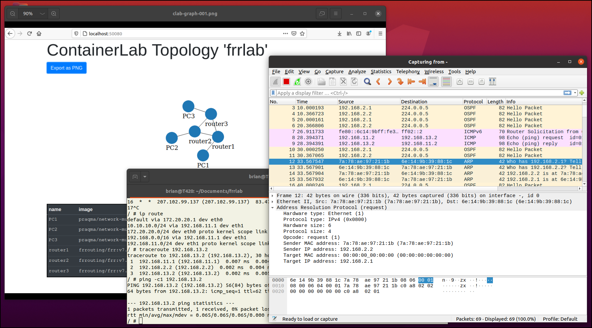
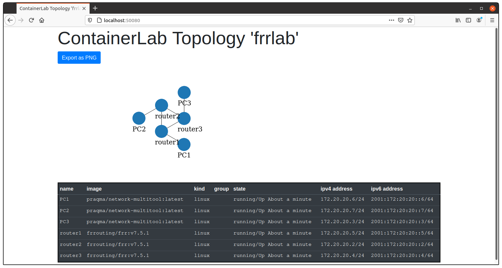
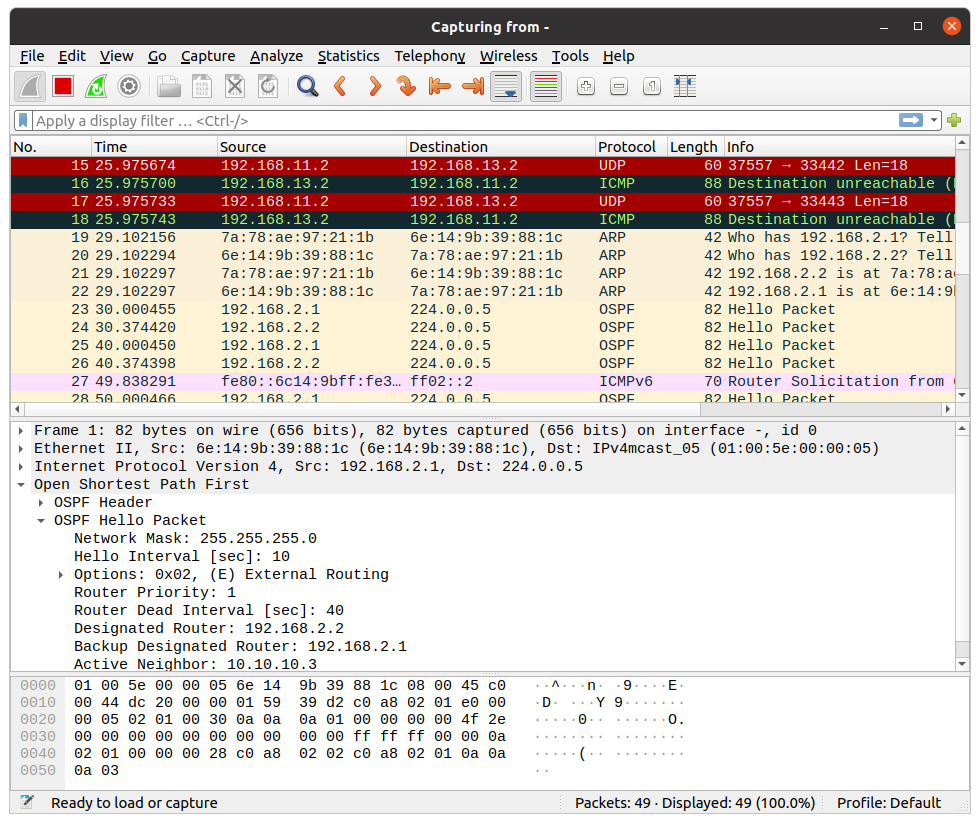

# Use Containerlab to emulate open-source routers

[Containerlab](https://containerlab.srlinux.dev/) is a new [open-source](https://github.com/srl-labs/containerlab) network emulator developed by [Nokia](https://www.nokia.com/) with contributions from volunteers. It provides a command-line-interface for orchestrating and managing container-based networking labs. It starts the containers, builds virtual wiring between them to create lab topologies, and manages labs lifecycle ((From Containerlab home page: https://containerlab.srlinux.dev)).



Containerlab supports open-source network operating systems that are published as container images and also supports many commercial router images. Containerlab [supports VM-based network devices](https://containerlab.srlinux.dev/manual/vrnetlab/) so users may run [selected commercial router images](https://containerlab.srlinux.dev/manual/vrnetlab/#supported-vm-products) in network emulation scenarios. 

Containerlab is intended to be a vendor-neutral network emulator that quickly builds test environments in a devops-style workflow. This post will review how Containerlab works with the [FRR open-source router](https://frrouting.org/).

!<--more-->

The Containerlab project provides [excellent documentation](https://containerlab.srlinux.dev/) so I don't need to write a tutorial. But, Containerlab does not yet document all the steps required to build an open-source router lab that starts in a pre-defined state. This post will cover that scenario so I hope it adds something of value.

While working through this example, you will learn about most of Containerlab's container-based features. I'll write about building and running VM-based labs in a future post.

### Install Containerlab

You may [install Containerlab](https://containerlab.srlinux.dev/install/) using your distribution's package manager or you may download and run an install script. Users may also manually install Containerlab because it's a [Go application](https://golang.org/) so users just need to copy the application binary to a directory in their system's path and copy some configuration files to *etc/containerlab*.

#### Prerequisites:

Containerlab runs best on Linux. It works on both Debian and RHEL-based distributions, and can even run in Windows Subsystem for Linux (WSL2). It's main dependancy is [Docker](https://www.docker.com/) so first you must [install Docker](https://www.digitalocean.com/community/tutorials/how-to-install-and-use-docker-on-ubuntu-20-04). I am running an Ubuntu 20.04 system.

```
sudo apt install apt-transport-https ca-certificates
sudo apt install -y curl software-properties-common
curl -fsSL https://download.docker.com/linux/ubuntu/gpg | sudo apt-key add -
sudo add-apt-repository "deb [arch=amd64] https://download.docker.com/linux/ubuntu focal stable"
sudo apt update
apt-cache policy docker-ce
sudo apt install -y docker-ce
```

#### Install Containerlab

To install Containerlab from its repository, run the Containerlab install script:

```
$ bash -c "$(curl -sL https://get-clab.srlinux.dev)"
```

See the [Containerlab installation documentation](https://containerlab.srlinux.dev/install/) for other ways to install Containerlab, including manual installation for distributions that do not use Debian or RHEL-based packaging tools. 

#### Containerlab files

The Containerlab installation script copies the Containerlab executable file to */usr/bin* and copies lab-example and template files to */etc/containerlab*. The latter directory is the most interesting because it contains the lab examples that users can use as models for lab development.
 
### Build a lab using FRR

Containerlab supports commercial containerized router appliances such as Nokia's SR Linux and Arista's CEOS. In each case, Containerlab takes into account the specific requirements of each device. If you wish to use commercial containerized network operating systems that are not listed among the [supported device types](https://containerlab.srlinux.dev/manual/kinds/kinds/), you may need to communicate with the Containerlab developers and request that support for your device be added or, better yet, offer to contribute to the project. 

However, Containerlab should be able to any use open-source network operating system, such as Free Range Routing (FRR), that runs on a Linux container. In this example, I will use the [network-multitool](https://hub.docker.com/r/praqma/network-multitool) container and the [FRR container from DockerHub](https://hub.docker.com/r/frrouting/frr) to create nodes in my network emulation scenario.

To build a lab, first create a new directory. In that directory, create a Containerlab topology file. You may optionally add any configuration files you wish to mount in the container and, as you will see below, you may need to write some simple shell scripts to ensure all the nodes in the lab start in a pre-defined state.

#### Create a Topology file 

Containerlab defines lab topologies in [topology definition files](https://containerlab.srlinux.dev/manual/topo-def-file/) that use a simple [YAML](https://yaml.org/) syntax. Look at the topology file examples in the */etc/containerlab/lab-examples* directory for inspiration. 

Create a directory for the network emulation scenario's files:

```
$ mkdir -p ~/Documents/frrlab 
$ cd ~/Documents/frrlab
```

The lab in this example will consist of three routers connected in a ring topology and each router will have one PC connected to it. You must plan the topology and determine which ports will connect to each other. 

Use your favorite text editor to create a file named *frrlab.yml* and add the following text to it:
 
```
name: frr01

topology:
  nodes:
    router1:
      kind: linux
      image: quay.io/frrouting/frr:master
      binds:
        - router1/daemons:/etc/frr/daemons
        - router1/frr.conf:/etc/frr/frr.conf
    router2:
      kind: linux
      image: quay.io/frrouting/frr:master
      binds:
        - router2/daemons:/etc/frr/daemons
        - router2/frr.conf:/etc/frr/frr.conf
    router3:
      kind: linux
      image: quay.io/frrouting/frr:master
      binds:
        - router3/daemons:/etc/frr/daemons
        - router3/frr.conf:/etc/frr/frr.conf
    PC1:
      kind: linux
      image: wbitt/network-multitool:latest
    PC2:
      kind: linux
      image: wbitt/network-multitool:latest
    PC3:
      kind: linux
      image: wbitt/network-multitool:latest

  links:
    - endpoints: ["router1:eth1", "router2:eth1"]
    - endpoints: ["router1:eth2", "router3:eth1"]
    - endpoints: ["router2:eth2", "router3:eth2"]
    - endpoints: ["PC1:eth1", "router1:eth3"]
    - endpoints: ["PC2:eth1", "router2:eth3"]
    - endpoints: ["PC3:eth1", "router3:eth3"]
```

The Containerlab topology file format is self-explanitary. The file starts with the name of the lab, followed by the lab topology. If you wish to run more than one lab at the same time, you must ensure each lab has a different name in the topology file. It defines each device and then it defines the links between devices. You also see it mounts a *daemons* configuration file to each router. We will create those files, next.

#### Add configuration files

The FRR network operating system must have a copy of the *daemons* file in its */etc/frr* directory or FRR will not start. As you saw above, Containerlab makes it easy specify which files to mount into each container. 

Each router needs its own copies of the configuration files. Make separate directories for each router:

```
$ mkdir router1
$ mkdir router2
$ mkdir router3
```

Copy the standard [FRR daemons config file](https://docs.frrouting.org/en/latest/setup.html#daemons-configuration-file) from the FRR documentation to the *frrlab/router1* directory. Edit the file:

```
$ vi router1/daemons
```

Change *zebra*, *ospfd*, and *ldpd* to "yes". The new *frrlab/router1/daemons* file will look like the listing below:

```
zebra=yes
bgpd=no
ospfd=yes
ospf6d=no
ripd=no
ripngd=no
isisd=no
pimd=no
ldpd=yes
nhrpd=no
eigrpd=no
babeld=no
sharpd=no
staticd=no
pbrd=no
bfdd=no
fabricd=no

vtysh_enable=yes
zebra_options=" -s 90000000 --daemon -A 127.0.0.1"
bgpd_options="   --daemon -A 127.0.0.1"
ospfd_options="  --daemon -A 127.0.0.1"
ospf6d_options=" --daemon -A ::1"
ripd_options="   --daemon -A 127.0.0.1"
ripngd_options=" --daemon -A ::1"
isisd_options="  --daemon -A 127.0.0.1"
pimd_options="  --daemon -A 127.0.0.1"
ldpd_options="  --daemon -A 127.0.0.1"
nhrpd_options="  --daemon -A 127.0.0.1"
eigrpd_options="  --daemon -A 127.0.0.1"
babeld_options="  --daemon -A 127.0.0.1"
sharpd_options="  --daemon -A 127.0.0.1"
staticd_options="  --daemon -A 127.0.0.1"
pbrd_options="  --daemon -A 127.0.0.1"
bfdd_options="  --daemon -A 127.0.0.1"
fabricd_options="  --daemon -A 127.0.0.1"
```

Save the file and copy it to the other router folders so each router has its own copy.

```
$ cp router1/daemons router2/daemons
$ cp router1/daemons router3/daemons
```

### Start the lab

To start a Containerlab network emulation, run the `clab deploy` command with the new *frrlab* topology file. Containerlab will download the docker images used to create the PCs and routers, start containers based on the images and connect them together.

Since we are using containers from Docker Hub, we need to first login to Docker.

```
$ sudo docker login
```

Enter your Docker userid and password.

Now, run the Containerlab command:

```
$ sudo clab deploy --topo frrlab.yml
``` 

Containerlab outputs logs to the terminal while it sets up the lab. If you have any errors in your configuration file, Containerlab outputs descriptive error messages. The lisitng below shows a normal lab setup, based on the *frrlab* tolopogy.

```
INFO[0000] Parsing & checking topology file: frrlab.yml 
INFO[0000] Pulling docker.io/praqma/network-multitool:latest Docker image 
INFO[0009] Done pulling docker.io/praqma/network-multitool:latest 
INFO[0009] Pulling docker.io/frrouting/frr:v7.5.1 Docker image 
INFO[0032] Done pulling docker.io/frrouting/frr:v7.5.1  
INFO[0032] Creating lab directory: /home/brian/Documents/frrlab/clab-frrlab 
INFO[0032] Creating docker network: Name='clab', IPv4Subnet='172.20.20.0/24', IPv6Subnet='2001:172:20:20::/64', MTU='1500'
INFO[0000] Creating container: router2                  
INFO[0000] Creating container: router1                  
INFO[0000] Creating container: Router3                 
INFO[0000] Creating container: PC1                      
INFO[0000] Creating container: PC2                      
INFO[0000] Creating container: PC3                      
INFO[0006] Creating virtual wire: router1:eth2 <--> router3:eth1 
INFO[0006] Creating virtual wire: router2:eth2 <--> router3:eth2 
INFO[0006] Creating virtual wire: PC1:eth1 <--> router1:eth3 
INFO[0006] Creating virtual wire: router1:eth1 <--> router2:eth1 
INFO[0006] Creating virtual wire: PC2:eth1 <--> router2:eth3 
INFO[0006] Creating virtual wire: PC3:eth1 <--> router3:eth3 
INFO[0006] Writing /etc/hosts file                      
+---+---------------------+--------------+---------------------------------+-------+-------+---------+----------------+----------------------+
| # |        Name         | Container ID |              Image              | Kind  | Group |  State  |  IPv4 Address  |     IPv6 Address     |
+---+---------------------+--------------+---------------------------------+-------+-------+---------+----------------+----------------------+
| 1 | clab-frrlab-PC1     | 3be7d5136a58 | praqma/network-multitool:latest | linux |       | running | 172.20.20.4/24 | 2001:172:20:20::4/64 |
| 2 | clab-frrlab-PC2     | 447d4a3fd09d | praqma/network-multitool:latest | linux |       | running | 172.20.20.5/24 | 2001:172:20:20::5/64 |
| 3 | clab-frrlab-PC3     | 146915d85bfe | praqma/network-multitool:latest | linux |       | running | 172.20.20.6/24 | 2001:172:20:20::6/64 |
| 4 | clab-frrlab-router1 | fa4beabef9e4 | frrouting/frr:v7.5.1            | linux |       | running | 172.20.20.2/24 | 2001:172:20:20::2/64 |
| 5 | clab-frrlab-router2 | c65b32cc2b46 | frrouting/frr:v7.5.1            | linux |       | running | 172.20.20.7/24 | 2001:172:20:20::7/64 |
| 6 | clab-frrlab-router3 | c992143448f7 | frrouting/frr:v7.5.1            | linux |       | running | 172.20.20.3/24 | 2001:172:20:20::3/64 |
+---+---------------------+--------------+---------------------------------+-------+-------+---------+----------------+----------------------+
```

Containerlab outputs a table containing information about the running lab. You can get the same information table later by running the `sudo clab inspect --name frrlab` command.

In the table, you see each node has an IPv4 address on the management network. If your newtwork nodes run an SSH server, you would be able to connect to them via SSH. However, the containers I am using in this example are both [based on Alpine Linux and do not have *openssh-server* installed](https://unix.stackexchange.com/questions/602646/content-of-etc-network-in-alpine-linux-image) so we will connect to each node using Docker. If you want lab users to have a more realistic experience, you could build new containers based on the *frrouting* and *network-mulitool* containers that also include *openssh-server*. 

### Configure network nodes

Currently, the nodes are running but the network is not configured. To configure the network, log into each node and run its native configuration commands, either in the shell (the *ash* shell in Alpine Linux), or in its router CLI (*vtysh* in FRR).

To configure PC1, run Docker to execute a new shell on the container, *clab-frrlab-PC1*.

```
$ sudo docker exec -it clab-frrlab-PC1 /bin/ash
```

Based on the network plan we creaed when we designed this network, configure PC1's eth1 interface with an IP address and static routes to the external data networks.

```
/ # ip addr add 192.168.11.2/24 dev eth1
/ # ip route add 192.168.0.0/16 via 192.168.11.1 dev eth1
/ # ip route add 10.10.10.0/24 via 192.168.11.1 dev eth1
/ # exit
```

Configure *PC2*  in a similar way:

```
$ sudo docker exec -it clab-frrlab-PC2 /bin/ash
```
```
/ # ip addr add 192.168.12.2/24 dev eth1
/ # ip route add 192.168.0.0/16 via 192.168.12.1 dev eth1
/ # ip route add 10.10.10.0/24 via 192.168.12.1 dev eth1
/ # exit
```

Configure *PC3* :

```
$ sudo docker exec -it clab-frrlab-PC3 /bin/ash
```
```
/ # ip addr add 192.168.13.2/24 dev eth1
/ # ip route add 192.168.0.0/16 via 192.168.13.1 dev eth1
/ # ip route add 10.10.10.0/24 via 192.168.13.1 dev eth1
/ # exit
```


Configure *Router1* by running *vtysh* in the Docker container *clab-frrlab-router1*.

```
$ sudo docker exec -it clab-frrlab-router1 vtysh
```

Enter the following FRR CLI commands to configure interfaces *eth1*, *eth2*, and *eth3* with IP address that match the network design.

```
configure terminal 
service integrated-vtysh-config
interface eth1
 ip address 192.168.1.1/24
 exit
interface eth2
 ip address 192.168.2.1/24
 exit
interface eth3
 ip address 192.168.11.1/24
 exit
interface lo
 ip address 10.10.10.1/32
 exit
exit
write
exit
```


Configure *Router2* in a similar way:

```
$ sudo docker exec -it clab-frrlab-router2 vtysh
```
```
configure terminal 
service integrated-vtysh-config
interface eth1
 ip address 192.168.1.2/24
 exit
interface eth2
 ip address 192.168.3.1/24
 exit
interface eth3
 ip address 192.168.12.1/24
 exit
interface lo
 ip address 10.10.10.2/32
 exit
exit
write
exit
```


Configure Router3:

```
$ sudo docker exec -it clab-frrlab-router3 vtysh
```
```
configure terminal 
service integrated-vtysh-config
interface eth1
 ip address 192.168.2.2/24
 exit
interface eth2
 ip address 192.168.3.2/24
 exit
interface eth3
 ip address 192.168.13.1/24
 exit
interface lo
 ip address 10.10.10.3/32
 exit
exit
write
exit
```

#### Some quick tests

After configuring the interfaces on each node, you should be able to ping from *PC1* to any IP address configured on *Router1*, but not to interfaces on other nodes.

```
$ sudo docker exec -it clab-frrlab-PC1 /bin/ash
```
```
/ # ping -c1 192.168.11.1
PING 192.168.11.1 (192.168.11.1) 56(84) bytes of data.
64 bytes from 192.168.11.1: icmp_seq=1 ttl=64 time=0.066 ms

--- 192.168.11.1 ping statistics ---
1 packets transmitted, 1 received, 0% packet loss, time 0ms
rtt min/avg/max/mdev = 0.066/0.066/0.066/0.000 ms
/ #
/ # ping -c1 192.168.13.2
PING 192.168.13.2 (192.168.13.2) 56(84) bytes of data.

--- 192.168.13.2 ping statistics ---
1 packets transmitted, 0 received, 100% packet loss, time 0ms

/ # 
/ # exit
```

#### Add OSPF

So that we can reach all networks in this example, set up a dynamic routing protocol on the FRR routers. In this example, we will set up a simple OSPF area for all networks connected to the routers. 

Connect to *vtysh* on Router1:

```
$ sudo docker exec -it clab-frrlab-router1 vtysh
```

Add a simple OSPF configuration to Router1:

```
configure terminal 
router ospf
 passive-interface eth3
 passive-interface lo
 network 192.168.1.0/24 area 0.0.0.0
 network 192.168.2.0/24 area 0.0.0.0
 network 192.168.11.0/24 area 0.0.0.0
 exit
exit
write
exit
```


Configure *Router2* in a similar way. 

Connect to *vtysh* on Router2:

```
$ sudo docker exec -it clab-frrlab-router2 vtysh
```

Configure OSPF:

```
configure terminal 
router ospf
 passive-interface eth3
 network 192.168.1.0/24 area 0.0.0.0
 network 192.168.3.0/24 area 0.0.0.0
 network 192.168.12.0/24 area 0.0.0.0
 exit
exit
write
exit
```

Connect to *vtysh* on Router3:

```
$ sudo docker exec -it clab-frrlab-router3 vtysh
```

Configure OSPF: 

```
configure terminal 
router ospf
 passive-interface eth3
 network 192.168.2.0/24 area 0.0.0.0
 network 192.168.3.0/24 area 0.0.0.0
 network 192.168.13.0/24 area 0.0.0.0
 exit
exit
write
exit
```

#### OSPF testing

Now, *PC1* should be able to ping any interface on any network node. Run the ping command on *PC1* to try to reach *PC3* over the network.


```
$ sudo docker exec clab-frrlab-PC1 ping -c1 192.168.13.2
PING 192.168.13.2 (192.168.13.2) 56(84) bytes of data.
64 bytes from 192.168.13.2: icmp_seq=1 ttl=62 time=0.127 ms

--- 192.168.13.2 ping statistics ---
1 packets transmitted, 1 received, 0% packet loss, time 0ms
rtt min/avg/max/mdev = 0.127/0.127/0.127/0.000 ms
```

A traceroute shows that the packets pass from *PC1* to *Router1*, then to *Router3*, then to *PC3*:

```
$ sudo docker exec clab-frrlab-PC1 traceroute 192.168.13.2
traceroute to 192.168.13.2 (192.168.13.2), 30 hops max, 46 byte packets
 1  192.168.11.1 (192.168.11.1)  0.004 ms  0.005 ms  0.004 ms
 2  192.168.2.2 (192.168.2.2)  0.004 ms  0.005 ms  0.005 ms
 3  192.168.13.2 (192.168.13.2)  0.004 ms  0.007 ms  0.004 ms
```

This shows that the OSPF protocol successfuly set up the routing tables on the Routers so that all nodes on this network can reach each other.


### Network defect introduction

To further demonstrate that the network configuration is correct, see what happens if the link between *Router1* and *Router3* goes down. If everything works correctly, the OSPF protocol will detect that the link has failed and reroute any traffic going from *PC1* to *PC3* through *Router1* and *Router3* via *Router2*.

But, there is no function in Containerlab that allows the user to control the network connections between nodes. So you cannot disable a link or introduce link errors using Containerlab commands. In addition, Docker does not manage the Containerlab links between nodes so we cannot use Docker network commands to disable a link.

[Containerlab links are composed of pairs of *veth* interfaces](https://containerlab.srlinux.dev/manual/wireshark/) which are managed in each node's network namespaces. We need to use Docker to run network commands on each container or use native Linux networking commands to manage the links in each node's network namespace..

One simple way to interupt a network link is to run the *ip* command on a node to shut down a link on the node. For example, to shut off *eth2* on *Router1*:

```
$ sudo docker exec -d clab-frrlab-router1 ip link set dev eth2 down
```

Then, run the traceroute command on *PC1* and see how the path to *PC3* changes:

```
$ sudo docker exec clab-frrlab-PC1 traceroute 192.168.13.2
traceroute to 192.168.13.2 (192.168.13.2), 30 hops max, 46 byte packets
 1  192.168.11.1 (192.168.11.1)  0.005 ms  0.004 ms  0.004 ms
 2  192.168.1.2 (192.168.1.2)  0.005 ms  0.004 ms  0.002 ms
 3  192.168.3.2 (192.168.3.2)  0.002 ms  0.005 ms  0.002 ms
 4  192.168.13.2 (192.168.13.2)  0.002 ms  0.007 ms  0.011 ms
```

We see that the packets now travel from *PC1* to *PC3* via *Router1*, *Router2*, and *Router3*.

Restore the link on Router1:

```
$ sudo docker exec clab-frrlab-router1 ip link set dev eth2 up
```

And see that the traceroute between *PC1* and *PC3*  goes back to its original path.

```
$ sudo docker exec clab-frrlab-PC1 traceroute 192.168.13.2
traceroute to 192.168.13.2 (192.168.13.2), 30 hops max, 46 byte packets
 1  192.168.11.1 (192.168.11.1)  0.004 ms  0.005 ms  0.003 ms
 2  192.168.2.2 (192.168.2.2)  0.004 ms  0.004 ms  0.002 ms
 3  192.168.13.2 (192.168.13.2)  0.002 ms  0.005 ms  0.003 ms
```

Links can also be managed by *ip* commands executed on the host system. Each node is in its own network namespace which is named the same as its container name. To bring down a link on *Router1* we first list all the links in the namespace, *clab-frrlab-router1*

```
$ sudo ip netns exec clab-frrlab-router1 ip link
1: lo: <LOOPBACK,UP,LOWER_UP> mtu 65536 qdisc noqueue state UNKNOWN mode DEFAULT group default qlen 1000
    link/loopback 00:00:00:00:00:00 brd 00:00:00:00:00:00
91: eth0@if92: <BROADCAST,MULTICAST,UP,LOWER_UP> mtu 1500 qdisc noqueue state UP mode DEFAULT group default 
    link/ether 02:42:ac:14:14:02 brd ff:ff:ff:ff:ff:ff link-netnsid 0
106: eth2@if105: <BROADCAST,MULTICAST,UP,LOWER_UP> mtu 65000 qdisc noqueue state UP mode DEFAULT group default 
    link/ether 16:36:c6:ca:4e:77 brd ff:ff:ff:ff:ff:ff link-netns clab-frrlab-router3
107: eth3@if108: <BROADCAST,MULTICAST,UP,LOWER_UP> mtu 65000 qdisc noqueue state UP mode DEFAULT group default 
    link/ether f2:4e:6d:f5:e9:01 brd ff:ff:ff:ff:ff:ff link-netns clab-frrlab-PC1
114: eth1@if113: <BROADCAST,MULTICAST,UP,LOWER_UP> mtu 65000 qdisc noqueue state UP mode DEFAULT group default 
    link/ether 42:ca:0d:5c:15:3c brd ff:ff:ff:ff:ff:ff link-netns clab-frrlab-router2
$
```

We see device *eth2* is attached to the network namespace *clab-frrlab-router1*. To bring down the device *eth2* in *clab-frrlab-router1* run the following command:

```
$ sudo ip netns exec clab-frrlab-router1 ip link set dev eth2 down
```

We see the traceroute from *PC1* to *PC3*  again passes through Router1, Router2, and *Router3* just like it did when we disabled Router2's *eth2* link from inside the conbtainer.

```
$ sudo docker exec clab-frrlab-PC1 traceroute 192.168.13.2
traceroute to 192.168.13.2 (192.168.13.2), 30 hops max, 46 byte packets
 1  192.168.11.1 (192.168.11.1)  0.007 ms  0.006 ms  0.005 ms
 2  192.168.1.2 (192.168.1.2)  0.006 ms  0.009 ms  0.006 ms
 3  192.168.3.2 (192.168.3.2)  0.005 ms  0.008 ms  0.004 ms
 4  192.168.13.2 (192.168.13.2)  0.004 ms  0.007 ms  0.004 ms
```

Then, bring the device back up:

```
$ sudo ip netns exec clab-frrlab-router1 ip link set dev eth2 up
```

```
$ sudo docker exec -it clab-frrlab-PC1 /bin/ash
```

Then, see that the traceroute from *PC1* to *PC3*  goes back to the normal route, passing through *Router1* and Router3.


```
$ sudo docker exec -it clab-frrlab-PC1 /traceroute 192.168.13.2
traceroute to 192.168.13.2 (192.168.13.2), 30 hops max, 46 byte packets
 1  192.168.11.1 (192.168.11.1)  0.008 ms  0.006 ms  0.003 ms
 2  192.168.3.2 (192.168.3.2)  0.005 ms  0.008 ms  0.005 ms
 3  192.168.13.2 (192.168.1377.2)  0.005 ms  0.006 ms  0.005 ms
```

So, we see we can impact network behavior using *ip* commands on the host system. 

### Stop the network emulation

To stop a Containerlab network, run the `clab destroy` command using the same topology file you used to deploy the network:

```
$ sudo clab destroy --topo frrlab.yml
```


### Persistent configuration

Containerlab will [import and save configuration files for some  kinds of nodes](https://containerlab.srlinux.dev/manual/conf-artifacts/), such as the [Nokia SR linux](https://containerlab.srlinux.dev/manual/kinds/srl/) kind. However, Linux containers only have access to standard Docker tools like volume mounting, although Containerlab facilitates mounting volumes by allowing users to specifify bind mounts in the lab topology file.

#### Persistent configuration for FRR routers

The routers in this example are based on FRR, which uses the configuration files */etc/frr/deamons* and *etc/frr/frr.conf*. 

Create an *frr.conf* file for each router and save each file in its lab folder's router directory.

##### Router1:

Create the configuration file for *Router1* and save it in *router1/frr.conf*.

```
frr version 7.5.1_git
frr defaults traditional
hostname router1
no ipv6 forwarding
!
interface eth1
 ip address 192.168.1.1/24
!
interface eth2
 ip address 192.168.2.1/24
!
interface eth3
 ip address 192.168.11.1/24
!
interface lo
 ip address 10.10.10.1/32
!
router ospf
 passive-interface eth3
 network 192.168.1.0/24 area 0.0.0.0
 network 192.168.2.0/24 area 0.0.0.0
 network 192.168.11.0/24 area 0.0.0.0
!
line vty
!

```

##### Router2:

Create the configuration file for *Router2* and save it in *router2/frr.conf*.

```
frr version 7.5.1_git
frr defaults traditional
hostname router2
no ipv6 forwarding
!
interface eth1
 ip address 192.168.1.2/24
!
interface eth2
 ip address 192.168.3.1/24
!
interface eth3
 ip address 192.168.12.1/24
!
interface lo
 ip address 10.10.10.2/32
!
router ospf
 passive-interface eth3
 network 192.168.1.0/24 area 0.0.0.0

 network 192.168.3.0/24 area 0.0.0.0
 network 192.168.12.0/24 area 0.0.0.0
!
line vty
!
```

##### Router3:

Create the configuration file for *Router3* and save it in *router3/frr.conf*.


```
frr version 7.5.1_git
frr defaults traditional
hostname router3
no ipv6 forwarding
!
interface eth1
 ip address 192.168.2.2/24
!
interface eth2
 ip address 192.168.3.2/24
!
interface eth3
 ip address 192.168.13.1/24
!
interface lo
 ip address 10.10.10.3/32
!
router ospf
 passive-interface eth3
 network 192.168.2.0/24 area 0.0.0.0
 network 192.168.3.0/24 area 0.0.0.0
 network 192.168.13.0/24 area 0.0.0.0
!
line vty
!
```

#### Modify the topology file

Edit the *frrlab.yml* file and add the mounts for the *frr.conf* files for each router:

```
name: frrlab

topology:
  nodes:
    router1:
      kind: linux
      image: frrouting/frr:v7.5.1
      binds:
        - router1/daemons:/etc/frr/daemons
        - router1/frr.conf:/etc/frr/frr.conf
    router2:
      kind: linux
      image: frrouting/frr:v7.5.1
      binds:
        - router2/daemons:/etc/frr/daemons
        - router2/frr.conf:/etc/frr/frr.conf
    router3:
      kind: linux
      image: frrouting/frr:v7.5.1
      binds:
        - router3/daemons:/etc/frr/daemons
        - router3/frr.conf:/etc/frr/frr.conf
    PC1:
      kind: linux
      image: praqma/network-multitool:latest
    PC2:
      kind: linux
      image: praqma/network-multitool:latest
    PC3:
      kind: linux
      image: praqma/network-multitool:latest

  links:
    - endpoints: ["router1:eth1", "router2:eth1"]
    - endpoints: ["router1:eth2", "router3:eth1"]
    - endpoints: ["router2:eth2", "router3:eth2"]
    - endpoints: ["PC1:eth1", "router1:eth3"]
    - endpoints: ["PC2:eth1", "router2:eth3"]
    - endpoints: ["PC3:eth1", "router3:eth3"]
```


#### Persistent configuration for PC network interfaces

To permanently configure network setting on an Alpine Linux system, one would normally save an *interfaces* configuration file on each PC in the */etc/network* directory, or save a startup script in one of the network hook directories such as */etc/network/if-up.d*.

However, Docker containers do not have permission manage their own networking with initialization scripts. The user must connect to the container's shell and run *ip* commands or must configure the container's network namespace. I think it is easier to work with each container using Docker commands.

To create a consistent initial network state for each PC container, create a script that runs on the host that will configure the PCs' *eth1* interface and set up some static routes. 

Create a file named *PC-interfaces* and save it in the lab directory. Make it executable. The file contents are shown below:


```
#!/bin/sh
sudo docker exec clab-frrlab-PC1 ip link set eth1 up
sudo docker exec clab-frrlab-PC1 ip addr add 192.168.11.2/24 dev eth1
sudo docker exec clab-frrlab-PC1 ip route add 192.168.0.0/16 via 192.168.11.1 dev eth1
sudo docker exec clab-frrlab-PC1 ip route add 10.10.10.0/24 via 192.168.11.1 dev eth1

sudo docker exec clab-frrlab-PC2 ip link set eth1 up
sudo docker exec clab-frrlab-PC2 ip addr add 192.168.12.2/24 dev eth1
sudo docker exec clab-frrlab-PC2 ip route add 192.168.0.0/16 via 192.168.12.1 dev eth1
sudo docker exec clab-frrlab-PC2 ip route add 10.10.10.0/24 via 192.168.12.1 dev eth1

sudo docker exec clab-frrlab-PC3 ip link set eth1 up
sudo docker exec clab-frrlab-PC3 ip addr add 192.168.13.2/24 dev eth1
sudo docker exec clab-frrlab-PC3 ip route add 192.168.0.0/16 via 192.168.13.1 dev eth1
sudo docker exec clab-frrlab-PC3 ip route add 10.10.10.0/24 via 192.168.13.1 dev eth1
```

Make the file executable:

```
$ chmod +x PC-interfaces.sh
```

After you start this lab using the Containerlab topology file, run the *PC-interfaces.sh* script to configure the PCs. The routers will get their initial configuration from each one's mounted *frr.conf* file.

Create a small script that starts everything. For example, I created an executable script named *lab.sh* and saved it in the lab directory. The script is shown below:

```
#!/bin/sh
clab deploy --topo frrlab.yml
./PC-interfaces.sh
```

Now, when I want to start the FRR lab in a known state, I run the command:

```
$ sudo ./lab.sh
```


### Get lab info

You can get some information about the lab using the *inspect* and *graph* functions.


```
$ sudo containerlab inspect --name frrlab
+---+-----------------+----------+---------------------+--------------+---------------------------------+-------+-------+---------+----------------+----------------------+
| # |    Topo Path    | Lab Name |        Name         | Container ID |              Image              | Kind  | Group |  State  |  IPv4 Address  |     IPv6 Address     |
+---+-----------------+----------+---------------------+--------------+---------------------------------+-------+-------+---------+----------------+----------------------+
| 1 | frrlab.clab.yml | frrlab   | clab-frrlab-PC1     | 02eea96ab0f0 | praqma/network-multitool:latest | linux |       | running | 172.20.20.4/24 | 2001:172:20:20::4/64 |
| 2 |                 |          | clab-frrlab-PC2     | 9987d5ac6bd9 | praqma/network-multitool:latest | linux |       | running | 172.20.20.6/24 | 2001:172:20:20::6/64 |
| 3 |                 |          | clab-frrlab-PC3     | 66c24d270c1a | praqma/network-multitool:latest | linux |       | running | 172.20.20.7/24 | 2001:172:20:20::7/64 |
| 4 |                 |          | clab-frrlab-router1 | 4936f56d28b2 | frrouting/frr:v7.5.1            | linux |       | running | 172.20.20.2/24 | 2001:172:20:20::2/64 |
| 5 |                 |          | clab-frrlab-router2 | 610563b7052a | frrouting/frr:v7.5.1            | linux |       | running | 172.20.20.3/24 | 2001:172:20:20::3/64 |
| 6 |                 |          | clab-frrlab-router3 | 9f501e040a65 | frrouting/frr:v7.5.1            | linux |       | running | 172.20.20.5/24 | 2001:172:20:20::5/64 |
+---+-----------------+----------+---------------------+--------------+---------------------------------+-------+-------+---------+----------------+----------------------+
```

The graph function, however, does not appear to work


Run:

```
$ sudo containerlab graph --topo frrlab.yml
```

Open a web browser to URL: `https://localhost:50080`. You will see a web page with a network diagram and a table with management information.



For small networks, this is not very useful because it does not show the port names on each node. I think it would be more useful in large network emulation scenarios with dozens or hundreds of nodes.

### Packet capture

To [capture network traffic on one of the containerlab network connections](https://containerlab.srlinux.dev/manual/wireshark/), one must again access interfaces in the network namespaces for each container.

For example, we know that traffic from *PC1* to *PC3* will, when all links are up, pass via the link between *Router1* and Router3. Let's monitor the traffic on one of the interfaces that make up that connection. 

We know, from our topology file, that interface *eth2* on *Router1* is connected to *eth1* on *Router3*. So, let's look at the traffic on *Router3* *eth1*. 

Router3's network namespace has the same name as the container that run Router3: *clab-frrlab-router3*. Follow the directions from the [Containerlab documentation](https://containerlab.srlinux.dev/manual/wireshark/) and run the following command to execute tcpdump and forward the tcpdump output to Wireshark: 

```
$ sudo ip netns exec clab-frrlab-router3 tcpdump -U -n -i eth1 -w - | wireshark -k -i -
```

In the above command, *tcpdump* will send an unbuffered stream (the *-U* option) of packets read on interface *eth1* (the *-i eth1* option) without converting addresses to names (the *-n* option) to standard output (the *-w -* option), which is piped to Wireshark which reads from standard input (the *-i -* option) and starts reading packets immediately (the *-k* option).

You should see a Wireshark window open on your desktop, displaying packets captured from Router3's *eth1* interface.



Stop the capture and Wireshark with the *Ctrl-C* key combination in the terminal window.

### Stopping a network emulation

To stop a Containerlab network, run the `clab destroy` command using the same topology file you used to deploy the network:

```
$ sudo clab destroy --topo frrlab.yml
```

### Contributing to Containerlab

If you create an interesting network emulation scenario, you may wish to [contribute it](https://gist.github.com/MarcDiethelm/7303312) to the lab examples in the Containerlab project.

In my case, I opened pull request #xxx on GitHub and hope it will be accepted.

### Conclusion

Containerlab is a new network emulation tool that can create large, complex network emulation scenarios using a simple topology file. It leverages the strengths of Docker and Linux networking to build a lightweight infrastructure in which the emulated nodes run. The Containerlab developers include strong integrations for the SR Linux network operating system and also built in basic support for other commercial network operating systems. 

Containerlab would be most interesting to network engineers who need to automate the setup of test networks as part of a development pipeline for network changes. The topology file for the test network can be included with the network configurations that need to be tested.

Containerlab does not abstract away all the complexity, however. Users may still need to have intermediate-level knowledge of Linux networking commands and Docker to emulate network failures and to capture network traffic for analysis and verification. 

### Appendix A: Debugging Docker networking isues

The following may be a corner case but I thought it was worth documenting. 

Containerlab does not have a command to stop individual nodes running in the lab. The only way to kill a node in a running lab is to use the *docker stop* command on that node's container.

If one stops a container in the network emulation scenario and then starts it again, the links that connect that node to other nodes will disappear and will not be restored when the container is restarted. And, the network namespace used by the container gets corrupted.

To demonstrate this issue, I stopped and then started a node *PC1* with `docker stop clab-frrlab-PC1` and `docker start clab-frrlab-PC1`. 

First, I review the existing state of *PC1*'s and *Router1*'s links:

```
$ sudo ip netns exec clab-frrlab-PC1 ip link
1: lo: <LOOPBACK,UP,LOWER_UP> mtu 65536 qdisc noqueue state UNKNOWN mode DEFAULT group default qlen 1000
    link/loopback 00:00:00:00:00:00 brd 00:00:00:00:00:00
95: eth0@if96: <BROADCAST,MULTICAST,UP,LOWER_UP> mtu 1500 qdisc noqueue state UP mode DEFAULT group default 
    link/ether 02:42:ac:14:14:04 brd ff:ff:ff:ff:ff:ff link-netnsid 0
108: eth1@if107: <BROADCAST,MULTICAST,UP,LOWER_UP> mtu 65000 qdisc noqueue state UP mode DEFAULT group default 
    link/ether ca:66:10:68:80:cf brd ff:ff:ff:ff:ff:ff link-netns clab-frrlab-router1

$ sudo ip netns exec clab-frrlab-router1 ip link
1: lo: <LOOPBACK,UP,LOWER_UP> mtu 65536 qdisc noqueue state UNKNOWN mode DEFAULT group default qlen 1000
    link/loopback 00:00:00:00:00:00 brd 00:00:00:00:00:00
91: eth0@if92: <BROADCAST,MULTICAST,UP,LOWER_UP> mtu 1500 qdisc noqueue state UP mode DEFAULT group default 
    link/ether 02:42:ac:14:14:02 brd ff:ff:ff:ff:ff:ff link-netnsid 0
106: eth2@if105: <BROADCAST,MULTICAST,UP,LOWER_UP> mtu 65000 qdisc noqueue state UP mode DEFAULT group default 
    link/ether 16:36:c6:ca:4e:77 brd ff:ff:ff:ff:ff:ff link-netns clab-frrlab-router3
107: eth3@if108: <BROADCAST,MULTICAST,UP,LOWER_UP> mtu 65000 qdisc noqueue state UP mode DEFAULT group default 
    link/ether f2:4e:6d:f5:e9:01 brd ff:ff:ff:ff:ff:ff link-netns clab-frrlab-PC1
114: eth1@if113: <BROADCAST,MULTICAST,UP,LOWER_UP> mtu 65000 qdisc noqueue state UP mode DEFAULT group default 
    link/ether 42:ca:0d:5c:15:3c brd ff:ff:ff:ff:ff:ff link-netns clab-frrlab-router2
```

Everything looks good.

Then, I stopped the *PC1* container:

```
$ sudo docker stop clab-frrlab-PC1
```

I checked the links again. Since I stopped *clab-frrlab-PC1*, I will check the network namespace:

First, check the available network namespaces:

```
$ sudo ip netns ls
clab-frrlab-router1 (id: 5)
clab-frrlab-PC1
clab-frrlab-router2 (id: 3)
clab-frrlab-PC3 (id: 2)
clab-frrlab-router3 (id: 1)
clab-frrlab-PC2 (id: 0)
```

It seems that the namespace *clab-frrlab-PC1* still exists. It should be deleted by Docker when the container stopped. I think that, because Containerlab creates network interfaces on the Docker container that are not managed by Docker, it fails to free up the network namespace completely.

But, running commands in the network namespace does not work:

```
$ sudo ip netns exec clab-frrlab-PC1 ip link
Cannot open network namespace "clab-frrlab-PC1": No such file or directory
```

So, even though I can still list the namespace, I cannot check the links in the namespace named *clab-frrlab-PC1*.

I checked the links on *Router1*:

```
$ sudo docker exec clab-frrlab-router1 ip link
1: lo: <LOOPBACK,UP,LOWER_UP> mtu 65536 qdisc noqueue state UNKNOWN mode DEFAULT group default qlen 1000
    link/loopback 00:00:00:00:00:00 brd 00:00:00:00:00:00
37: eth0@if38: <BROADCAST,MULTICAST,UP,LOWER_UP> mtu 1500 qdisc noqueue state UP mode DEFAULT group default 
    link/ether 02:42:ac:14:14:05 brd ff:ff:ff:ff:ff:ff link-netnsid 0
48: eth2@if47: <BROADCAST,MULTICAST> mtu 65000 qdisc noqueue state DOWN mode DEFAULT group default 
    link/ether 56:8e:93:fe:9c:fe brd ff:ff:ff:ff:ff:ff link-netnsid 1
50: eth1@if49: <BROADCAST,MULTICAST,UP,LOWER_UP> mtu 65000 qdisc noqueue state UP mode DEFAULT group default 
    link/ether 5e:35:b1:6f:bc:5a brd ff:ff:ff:ff:ff:ff link-netnsid 3
```

I see that *Router1*'s *eth3* interface disappeared. It looks like, when one container stops, both sides of the *veth* pair that make up the link get deleted.

I expect I should be able to restore the original state of the network by restarting the *PC1* container:

```
$ sudo docker start clab-frrlab-PC1
```

Then, I check the links on *PC1*:

```
$ sudo docker exec clab-frrlab-PC1 ip link
1: lo: <LOOPBACK,UP,LOWER_UP> mtu 65536 qdisc noqueue state UNKNOWN mode DEFAULT group default qlen 1000
    link/loopback 00:00:00:00:00:00 brd 00:00:00:00:00:00
55: eth0@if56: <BROADCAST,MULTICAST,UP,LOWER_UP> mtu 1500 qdisc noqueue state UP mode DEFAULT group default 
    link/ether 02:42:ac:14:14:06 brd ff:ff:ff:ff:ff:ff link-netnsid 0
```

I saw that *eth1* was not restored. And, if I check *Router1*, I see that *eth3* is not restored on that end.

So, I create link again with:

```
$ sudo containerlab tools veth create -a clab-frrlab-PC1:eth1 -b clab-frrlab-router1:eth3
```

It appears the link is successfully created:

```
INFO[0000] Creating virtual wire: clab-frrlab-PC1:eth1 <--> clab-frrlab-router1:eth3 
INFO[0000] veth interface successfully created!
```

Then, when I reconfigure  *eth1* on *PC1*, the connection works again:

```
$ sudo docker exec -it clab-frrlab-PC1 /bin/ash
/ # ip addr add 192.168.11.2/24 dev eth1
/ # ip route add 192.168.0.0/16 via 192.168.11.1 dev eth1
/ # ip route add 10.10.10.0/24 via 192.168.11.1 dev eth1
```

I can reach *PC3* again from *PC1*:

```
/ # ping 192.168.13.2
PING 192.168.13.2 (192.168.13.2) 56(84) bytes of data.
64 bytes from 192.168.13.2: icmp_seq=1 ttl=62 time=0.272 ms
64 bytes from 192.168.13.2: icmp_seq=2 ttl=62 time=0.056 ms
^C
--- 192.168.13.2 ping statistics ---
2 packets transmitted, 2 received, 0% packet loss, time 1004ms
rtt min/avg/max/mdev = 0.056/0.164/0.272/0.108 ms
/ # exit
```

But, I cannot access commands in the container's network namespace:

```
$ sudo ip netns exec clab-frrlab-PC1 ip link
Cannot open network namespace "clab-frrlab-PC1": No such file or directory
```

And, the namespace list still looks odd:

```
$ sudo ip netns ls
clab-frrlab-PC1
clab-frrlab-router2 (id: 4)
clab-frrlab-router3 (id: 3)
clab-frrlab-PC3 (id: 2)
clab-frrlab-PC2 (id: 1)
clab-frrlab-router1 (id: 0)
```


The host seems to have lost track of the network namespace *clab-frrlab-PC1*. So, *clab-frrlab-PC1* has no netnsid. It should have an netnsid of 5.

```
$ ip netns list-id
nsid 0 
nsid 1 
nsid 2 
nsid 3 
nsid 4 
nsid 5
```

But nsid 5 still exists so somehow there's a disconnect. I checked the *netns* directory:


```
$ ls -l /var/run/netns
total 0
lrwxrwxrwx 1 root root 17 May  4 18:25 clab-frrlab-PC1 -> /proc/5050/ns/net
lrwxrwxrwx 1 root root 17 May  4 18:25 clab-frrlab-PC2 -> /proc/4884/ns/net
lrwxrwxrwx 1 root root 17 May  4 18:25 clab-frrlab-PC3 -> /proc/4915/ns/net
lrwxrwxrwx 1 root root 17 May  4 18:25 clab-frrlab-router1 -> /proc/4801/ns/net
lrwxrwxrwx 1 root root 17 May  4 18:25 clab-frrlab-router2 -> /proc/4954/ns/net
lrwxrwxrwx 1 root root 17 May  4 18:25 clab-frrlab-router3 -> /proc/5012/ns/net
```

Everything looks OK, at first. But, what proc id does Docker think container *clab-frrlab-PC1* is using?

```
$ sudo docker inspect --format '{{.State.Pid}}' clab-frrlab-PC1
5851
```

But, in the *netns* directory, the container is really using proc 5050. But, only proc 5851 exists in the */proc* directory

```
$ ls /proc | grep 5851
5851
$
$ ls /proc | greo 5050
$
```

So, I needed to create a new symbolic link from *clab-frrlab-PC1* to proc 5851 to "reattach" the Docker container to its namespace.

```
$ sudo ln -sf /proc/5851/ns/net /var/run/netns/clab-frrlab-PC1
```

Then, when I list the namespaces, everythink looks OK:

```
$ sudo ip netns list
clab-frrlab-PC1 (id: 5)
clab-frrlab-router2 (id: 4)
clab-frrlab-router3 (id: 3)
clab-frrlab-PC3 (id: 2)
clab-frrlab-PC2 (id: 1)
clab-frrlab-router1 (id: 0)
```

And, the *ip* commands work again in the *clab-frrlab-PC1* network namespace. For example:

```
$ udo ip netns exec clab-frrlab-PC1 ip link
1: lo: <LOOPBACK,UP,LOWER_UP> mtu 65536 qdisc noqueue state UNKNOWN mode DEFAULT group default qlen 1000
    link/loopback 00:00:00:00:00:00 brd 00:00:00:00:00:00
31: eth0@if32: <BROADCAST,MULTICAST,UP,LOWER_UP> mtu 1500 qdisc noqueue state UP mode DEFAULT group default 
    link/ether 02:42:ac:14:14:06 brd ff:ff:ff:ff:ff:ff link-netnsid 0
34: eth1@if33: <BROADCAST,MULTICAST,UP,LOWER_UP> mtu 65000 qdisc noqueue state UP mode DEFAULT group default 
    link/ether 56:75:73:33:b3:e7 brd ff:ff:ff:ff:ff:ff link-netns clab-frrlab-router1
```

Then, I destroyed the topology:

```
$ sudo clab destroy --topo frrlab.yml
INFO[0000] Parsing & checking topology file: frrlab.yml 
INFO[0000] Destroying container lab: frrlab             
INFO[0000] Removed container: clab-frrlab-PC2           
INFO[0011] Removed container: clab-frrlab-PC1           
INFO[0011] Removed container: clab-frrlab-router2       
INFO[0011] Removed container: clab-frrlab-router1       
INFO[0012] Removed container: clab-frrlab-PC3           
INFO[0012] Removed container: clab-frrlab-router3       
INFO[0012] Removing container entries from /etc/hosts file 
INFO[0012] Deleting docker network 'clab'...     
```

And everything seemed to clean up corectly:

```
$ sudo ip netns list
$ sudo ip netns list-id
$ sudo ls -l /var/run/netns
total 0
```

This seems like a minor issue. Users would not notice it unless they were using *ip* comands on the host system to manage interfaces running on the network nodes. But, I wanted to document it because I speny a few hours figuring out what was happening.