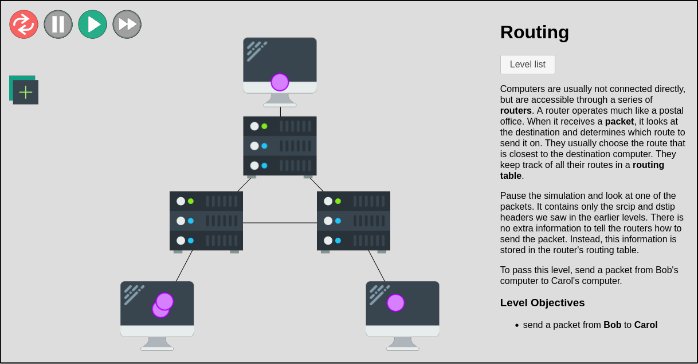
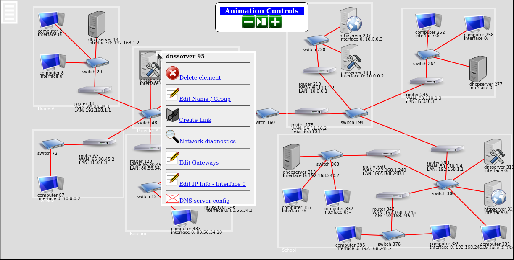
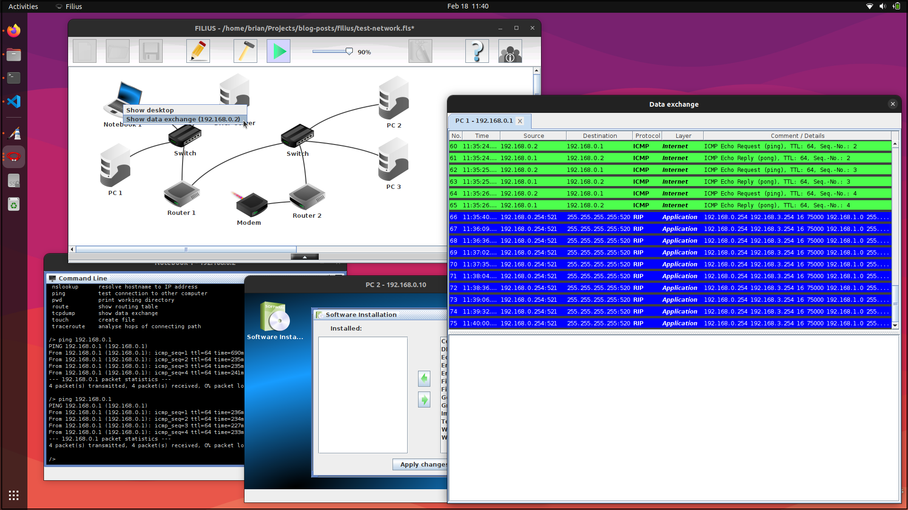
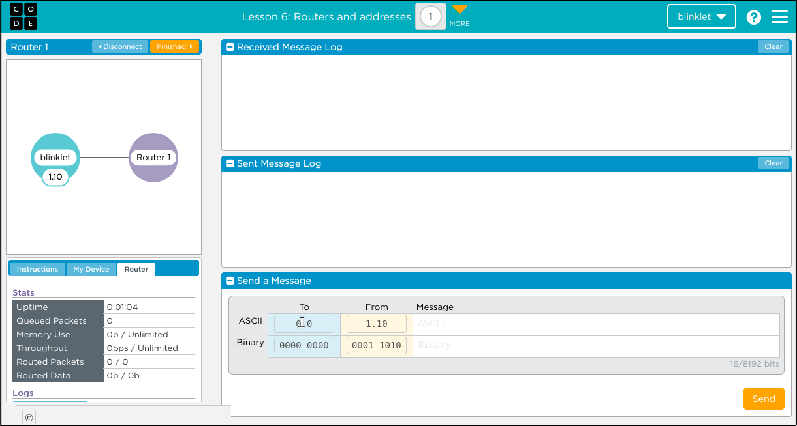
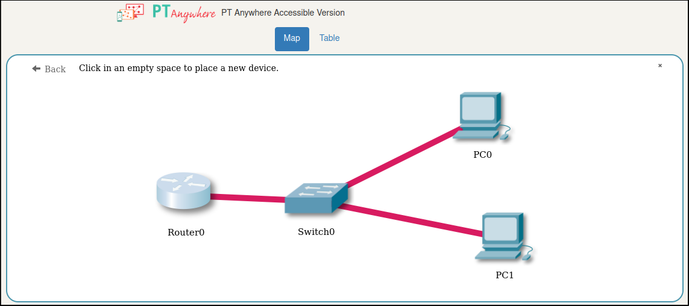
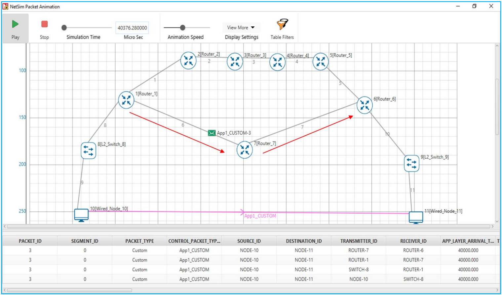

Educators in secondary schools, who teach students aged 14 to 18, have unique needs for a network simulator. Most would require a simulator or emulator that offers a web interface so students can access it from a web browser running on a Chromebook or iPad. Ideally, the simulator should enable educators to demonstrate fundamental networking topics without requiring students to spend too much time learning to use the tool or to configure virtual network appliances in the tool.

Most of the projects listed below animate the basic functions of a communications network in a way that is easier for young students to understand. While they may not be interesting to a networking professional, they solve problems that educators may have.

<!--more-->

# Free and open-source simulators

The following set of network simulators is free and open source. The first two projects, CS4G and ENS, are available via a web browser. 

## CS4G Network Simulator

[CS4G Netsim](https://netsim.erinn.io/) is a Web-based network simulator for teaching hacking to high schoolers. It demonstrates some basic security issues that Internet users should be aware of. 

The [source code](https://github.com/errorinn/netsim) is posted on GitHub. This seems to have been a university student's project, presented as a [conference paper](https://www.usenix.org/conference/ase17/workshop-program/presentation/atwater). 

The simulator demonstrates a set of [fixed scenarios](https://netsim.erinn.io/). It is not possible to build your own scenarios. Students build simplified packets that travers from one device in another in the scenario to demonstrate concepts like switching, routing, and network attacks like denial of service, spoofing, and man in the middle.

Teachers may adopt this tool to demonstrate selected network scenarios, but it is not flexible and will likely not be expanded.

## Educational Network Simulator

The [Educational Network Simulator](http://malkiah.github.io/NetworkSimulator/) (ENS) is a very simple educational network simulator intended to be used with 15-16 year old students. It has a [web interface](http://malkiah.github.io/NetworkSimulator/simulator01.html). It can be used to develop any network composed of PCs, servers, switches and routers. Routers support static routes.

The simulator demonstrates the required configurations for the various network devices and shows animated packets traversing the network. It seems to be a good way to illustrate the basics of computer networks to students.

The author provides a series of YouTube videos explaining [how to use the Educational Network Simulator](https://www.youtube.com/playlist?list=PLx8u37tswCijgs5fGrKyCzOQ78uFZ3SMO) to configure various network scenarios.

It is an open-source project and the [source code](https://github.com/malkiah/NetworkSimulator) is available on GitHub.

## Filius

[Filius](https://www.lernsoftware-filius.de/Herunterladen) is a program designed to teach students about the Internet and its applications. It is a standalone application for Windows, Mac and Linux. It can also be installed on [some Chromebooks](https://flatpak.org/setup/Chrome%20OS). 

Filius simulates many basic network functions. It seems to offer a lot of functionality while also keeping its operation fairly simple. If you can install software on student's PCs, Filius an excellent teaching tool.  

The project offers a [Filius introduction e-book](https://www.lernsoftware-filius.de/downloads/Introduction_Filius.pdf) and a [full set of learning resources](https://www.lernsoftware-filius.de/Begleitmaterial) that help teach students basic network knowledge. You can find videos on YouTube showing you [how to use Fililus](https://www.youtube.com/watch?v=1o7BUnAtwYA&list=PLp-hd7MmooQ1mccBeEB31MXVtg01RUs1y). 

The [source code](https://gitlab.com/filius1/filius) is available on GitLab. The latest version, 1.41, was releasein in May 2022.The author of Filius is actively working on Version 2, which has a new appearance and will offer additional simulation features.

# Registration required

The following list of simulators is available via a web browser, but they require student registration and they are attached to specific online curriculums and cannot be used to create custom network scenarios.

## Code.org

[Code.org's Internet Simulator](https://studio.code.org/s/netsim/) is free, web-based tool combined with a hosted [learning program](https://code.org/educate/csp) offered by [code.org](https://code.org/). It is not open-source. The simulator has a fixed set of built-in lessons and cannot be used to create new lessons. The lessons are very basic and the simulator does not allow students to configure their devices.

Teachers must create an account and each student must create their own account. This simulator is probably best suited for use by groups lead by a teacher who is following [code.org's Computer Science Principles course](https://code.org/educate/csp). The simlulated labs are group projects, with each student managing their own device in a connected network. Teachers may create new sessions for multiple groups of students. 

## PT Anywhere

[PT Anywhere](https://pt-anywhere.kmi.open.ac.uk/) is a network simulator based on Cisco Learning Academy's Packet Tracer and made available via a [free training course](https://www.open.edu/openlearn/digital-computing/discovering-computer-networks-hands-on-the-open-networking-lab/content-section-overview?active-tab=description-tab) offered by the [Open Networking Lab](https://onl.kmi.open.ac.uk/). It is not open-source. 

Students must follow the course to access the simulator so it is not suitable for teachers who are designing their own program.

# Commercial Simulators

## NetSim Academic

[NetSim Academic](https://tetcos.com/netsim-acad.html) is a commercial network simulator that requires a paid license. It is available as an application or as a [web-based service](https://tetcos.com/blog/2020/09/). If you need more functions than are currently supported in Filius, or if you must have a web interface, then NetSim may meet your needs.

NetSim offers a set of [learning resources](https://tetcos.com/netsim-acad.html) aimed at students. For example, the [NetSim Experiment manual](https://www.tetcos.com/downloads/v13.2/NetSim_Experiment_Manual.pdf) provides good examples of various network setups. 

NetSim is a full-featured tool that advanced secondary-school programs may find it usable, but it may be more suitable for universities, in year one or two of a network engineering curriculum. NetSim seems to be simple enough to use while allowing users to explore advanced topics as they progress in their studies. 

Normally, I would not feature a commercial product in my blog but I noticed that many educators were recommending NetSim to their peers. I felt that I should mention it to make this post complete. Unfortunately, you must contact a salesperson to find out the cost.

# Conclusion and recommendation

I surveyed six network simulators that would be of interest to educators who work with secondary-school students aged 14 to 18. Of these six options, three are open-source.

I currently recommend [Filius](https://www.lernsoftware-filius.de/Herunterladen) to secondary-school educators. It is free and open-source, it is easy to install on all major operating systems, it simulates most of the basic functions one would find in a home network and in a simplified model of the Internet, and it comes with supporting educational material (which can be translated into Englisg using Google).